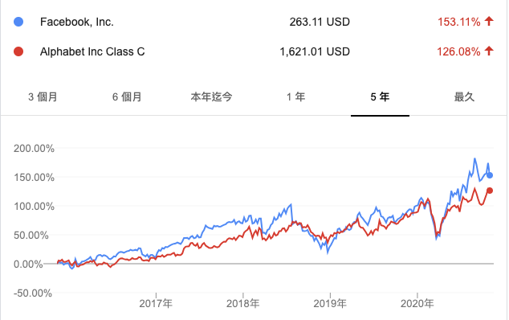
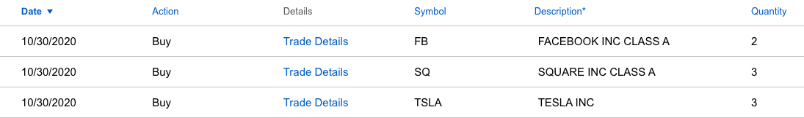

週四（10/29）盤後，美股四巨頭 (Amazon, Apple, Facebook, Google) 都發佈了 2020 Q3 的季報。這篇就來解析屬性較為接近的 Facebook 與 Google 的第三季季報。

Facebook 與 Google，雖然面向的群體不一樣，一個是社交，一個則是線上搜尋。但它們的收入都是來自線上廣告。藉由建立一個平台，增加使用者黏性，進而讓其他企業在這些平台上發佈廣告，與進行線上行銷活動。

下面我們就用營收年成長，營業利益率，EPS，及本益比這四點來評估它們的成長性及獲利能力。

 

## Facebook Q3 季報
[Facebook 2020 第三季財報](https://investor.fb.com/investor-news/press-release-details/2020/Facebook-Reports-Third-Quarter-2020-Results/default.aspx)

在季報中，我們可以看到 Facebook 在營收方面，年成長為 22%，而去年的年成長則為 28%，顯示 Facebook 的成長動能正在減緩。但也有可能是受疫情影響，廣告商們紛紛減少了廣告的投入所導致。

營業利潤率（Operating Margin）則是由去年的 41% 降到了 37%。這裡可以看出來，雖然營收比去年成長了不少，但相關的花費則上升得更快，導致了利潤率降低。
- 與去年 Q3 相比：研發費用成長了 34%，行銷費用成長了 11%，行政費用成長了 33%。研發費用支出較高很合理，畢竟這是為了增加企業的競爭優勢的必要花費，那行政費用怎麼也這麼高呢？

- 若在觀察今年 Q1-Q3 與去年 Q1-Q3 的支出費用相比：研發成長了 36%，行銷成長了 21%，行政則下降了 42.5%。則可看出 Facebook 本身也降低了在行銷費用的研發。而在行政方面降低的幅度則更大，推測去年應是為了符合主管機關的監管要求，因此增加了這部分的人力來審查貼文等。

EPS 年成長為 28%，去年同期的年成長則是 20%，表示 Facebook 的獲利能力仍很強勁。

值得注意的是，就算 Facebook 已稱霸了社交領域，但它的日活用戶（ daily active users ）及月活用戶（ monthly active users ）仍有著 12% 的年成長。
 

## Google Q3 季報
[2020 第三季財報來源](https://abc.xyz/investor/static/pdf/2020Q3_alphabet_earnings_release.pdf?cache=514fb58)

在 Google 方面，營收的年成長為 14%，去年則為 20%。表示 Google 的成長動能比 Facebook 更為趨緩。

營業利潤率（Operating Margin）是 24%，跟去年（23%）差不多。因為 Google 的營收來源不像 Facebook 主要集中在線上廣告，Google 還有雲服務、手機及一些尚未盈利的部門，因此營業利潤率比 Facebook 低，不代表 Google 在廣告方面，利潤比 Facebook 差（但 Google 的廣告收入仍佔了整體營收的 80%）。

EPS 年成長達到驚人的 62%，去年同期的 EPS 年成長則是 -22.5%，算是一掃先前大家對於 Google 是否能持續成長的隱憂。
 

## 比較
下表是財報數據的比較，目前 Facebook 的市值約為 Google 的 68%，因此各項數據的成長速度都比 Google 快。畢竟 Google 從成立（ 1998 年）到現在已經 23 歲了，而 Facebook 才只有 17 歲（成立於 2004 年）。
之所以會選這三項數值來比較是因為：
- 營收成長率：可看出企業每年是否能持續賺更多錢
- 營業利潤率：則是看企業是否因為要讓營收成長，而降價促銷，犧牲了利潤
- EPS：觀察企業的獲利能力是否持續成長 

<table style="width:100%">
  <tr>
    <th align="center"></th>
    <th align="center">Facebook</th>
    <th align="center">Google</th>
  </tr>
  <tr>
    <td align="center">市值（截至10/30/2020）</td>
    <td align="center">7495.5 億</td>
    <td align="center">1.1 兆</td>
  </tr>
  <tr>
    <td align="center">營收成長率（2020）</td>
    <td align="center">22%</td>
    <td align="center">14%</td>
  </tr>
  <tr>
    <td align="center">營收成長率（2019）</td>
    <td align="center">28%</td>
    <td align="center">20%</td>
  </tr>
    <tr>
    <td align="center">營業利潤率（2020）</td>
    <td align="center">37%</td>
    <td align="center">24%</td>
  </tr>
    <tr>
    <td align="center">營業利潤率（2019）</td>
    <td align="center">41%</td>
    <td align="center">23%</td>
  </tr>
  <tr>
    <td align="center">EPS 成長率（2020）</td>
    <td align="center">28%</td>
    <td align="center">62%</td>
  </tr>
  <tr>
    <td align="center">EPS 成長率（2019）</td>
    <td align="center">20%</td>
    <td align="center">-22.5%</td>
  </tr>
</table>

 

接著，我們用本益比來觀察 Facebook 與 Google 目前誰的股價位於近 5 年內的相對低點。本益比的時間區間為 3/31/2016 到 10/30/2020。因為科技股的變動及成長性較快，因此取近 5 年的資料較能準確反應現在股價的相對位置。

本益比公式為：股價 / EPS，若公司股價的漲幅超過 EPS 的成長速度，表示企業的獲利追不上股價漲的速度，因此有股價過熱的疑慮。

Facebook 與 Google 的平均本益比都比中位數高，表示它們都有一段時間處於高本益比的狀態（通常是那時的 EPS 大幅下降而股價卻仍維持高檔），導致整體的平均本益比被拉高。

而現在 Facebook 的本益比剛好處於近 5 年本益比排名的 50% 左右。相比之下，現在 Google 在近五年的本益比排名為 77.78%。表示 Google 現在的本益比，比 3/4 的時間還高（ 5 年內的 3/4，約是 3.75 年）

<table style="width:100%">
  <tr>
    <th align="center"></th>
    <th align="center">Facebook</th>
    <th align="center">Google</th>
  </tr>
  <tr>
    <td align="center">現在本益比（截至 10/30/2020）</td>
    <td align="center">32.13</td>
    <td align="center">35.65</td>
  </tr>
  <tr>
    <td align="center">平均本益比</td>
    <td align="center">34.06</td>
    <td align="center">32.7</td>
  </tr>
    <tr>
    <td align="center">本益比中位數</td>
    <td align="center">32.13</td>
    <td align="center">29.43</td>
  </tr>
    <tr>
    <td align="center">現在本益比處於歷史百分位</td>
    <td align="center">50%</td>
    <td align="center">77.78%</td>
  </tr>
</table>

這次本益比歷史資料及的統計結果可參考這篇：[如何用 Python 進行統計分析
](https://ycjhuo.gitlab.io/2020/11/01/Statistics-In-Python/)

 

## 後記
本次季報中，Facebook 除了營業利益率下降了 4% 之外，營收及 EPS 都有 20% 以上的成長。很難想像季報公佈後會有 6.31% 的跌幅。而 Google 因為 EPS 大幅成長了 62%，因此在週五成為了四巨頭 (Amazon, Apple, Facebook, Google)唯一上漲的股票。

透過上面的比較，Facebook 在財報的各項數值都比 Google 好，且目前本益比也不算高，我認為是比 Google 更好的投資標的。

若我們觀察 Facebook 與 Google 在近五年的報酬率，Facebook 為 153.11%，Google 則為 126.08%。
- 一年內：：Facebook 35.12%，Google 25.53%。
- 六個月內：Facebook 28.18%，Google 22.17%。
- 三個月內則是 Google 唯一勝過 Facebook 的時間區間：Facebook 5.52%，Google 10.65%。

因為最近股價的波動較大，若一次重倉 Facebook 風險較高。因此還是採用分批買入的方法，星期五先買入 2 股，後續若股價持續下跌的話，再繼續加碼。

特斯拉則是因為 Q3 財報表現不錯，難得有股價有跌到 400 以下，也在加碼一些。
Square 難得有單日下跌 10% 的時候，且即將在 11/05 公布 Q3 財報，先在這時買一點，若財報公布後不如預期，則會再加碼。
