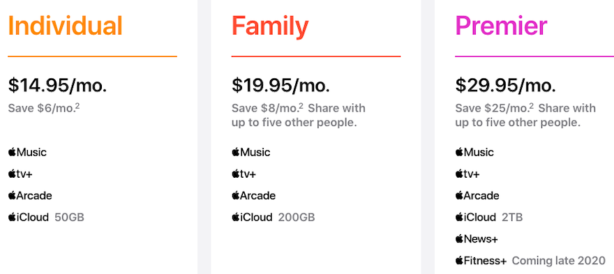

在上一篇（[半年漲了六倍的特斯拉（Tesla），是否該考慮賣出](https://ycjhuo.gitlab.io/2020/08/30/How-Tesla-Soar-600-in-6-month/) ）提到：
```
蘋果 (AAPL) 於 07/30 宣佈了拆股計劃（以一股拆四股的方式 4-for-1 stock split），
讓蘋果在八月份股價從 $367.08 (07/30) 漲到了 $499.23 (08/28)，漲幅約為 36%。
```
蘋果拆股(08/31) 後到本週五 (09/18) 這段時間，股價從 $127.58 到 $106.84，約下跌了 16% 左右，這段時間納斯達克指數（Nasdaq Index）下跌 8.3%。現在就來看看蘋果在經過了 2020 發布會之後，在這段時間，股價有什麼影響吧。

### Apple Watch
- 09/15 的秋季發布會，蘋果在硬體方面，推出了二款 Apple Watch (Series 6 與 SE) 以及二款 iPad，至於大家期待的 iPhone 12 並沒有現身在這場發表會中。
 - 軟體方面：在作業系統方面推出了 iOS 14 以及 watch OS 7
 - 服務則是推出了 Apple One，整合了 Apple 旗下的服務，以及新推出的 Fitness+ 。

其中 watch OS 7 吸引了我的注意，這版作業系統，大大強化了 Apple Watch 的獨立使用性，能夠讓沒有 iPhone 的人也可以使用。若我們是 iPhone 使用者，可以透過『家人共享設定』這個功能，用我們的 iPhone 來綁定其他支 Apple watch，讓我們能定位以及聯繫 Apple watch 的使用者。
- 這點真的打動了不少人的心，不僅可以脫離 iPhone 單獨使用，涵蓋了常用功能，更具備了更低的價格（跟 iPhone 相比）也讓不少人認為是時候幫家庭成員添購這項設備了。相信 Apple Watch 會成為人們比起手機，更加不可或缺的攜帶式裝置（畢竟小孩及長輩常用的功能 Apple Watch 幾乎都涵蓋了）。

### Apple One 的衝擊
- 一直以來，雖然蘋果致力發展各種服務，但好像都沒有一個必要性或是誘因讓我們非使用不可。聽音樂的話，我們可以用 Spotify，電視影集的話我們選擇 Netflix，雲端空間的話則是 Google Drive。
- 目前 Spotify 個人版是 $9.99/month，Netflix 基礎版 $8.99/month，Google Drive 100G 為 $1.99/month，加起來總共是 $20.97/month。
- 相比 Apple One 的個人方案 $14.95/month，Apple One 大概是前者加起來的七折。我們甚至可以選擇 Apple One 的家庭版（$19.95/month），不僅 iCloud 容量增加四倍，變為 200GB，價格方面仍低於前者（$20.97/month）。
- 目前 Apple One 雖然有價格上的優勢，但 tv+ 上的節目相比 Netflix 之下，選擇性太少，將會成為人們選擇 Apple One 的阻力。但依據蘋果一貫的高品質，在豐富了 tv+ 的節目後，Apple One 將會開始蠶食訂閱市場的份額。<br/>


### 現在的蘋果還能買嗎？
- 雖然蘋果在這二個星期股價較為低迷，但若扣除了宣佈拆股後的漲幅，蘋果還是上漲了 11%。而這次發表會也能看出 Apple watch 的用途大幅提升，未來有望成為除了 iPhone 之外在營收方面的的另一推力。
- 蘋果的所有服務都是基於使用者要有 iPhone 才能感受到這些服務的便利性。近幾年可以看出，蘋果已經不像之前一樣每年只推出一款 iPhone，而是都推出二款（基本＆進階），基本款通常還有二個尺寸可以選擇。可看出蘋果藉由提供給使用者更多的選擇性。來獲取更多的 iPhone 使用者，也更有機會吸引更多人使用蘋果的服務。
- 蘋果股價在 2018 下半年短暫的走了一段下坡後，就一路扶搖直上。若從本益比來看的話，2018 年底時只有 12.9 左右，而現在已經到 32.5 了（股價約漲了 270%）。但蘋果在近五年，從高點跌落的最大幅度為 -33%（2018/09 - 2019/01）。第二高的則是今年的疫情期間（2020/02 - 2020/03）-30%。
- 現在的價格約是高點的 -15% 左右，我認為是可以小幅買入一點，後續若跌到 -20% ~ -25% 再繼續加碼。畢竟以蘋果這種優質股，且目前生態圈也越來越完整的情況下，有 -15% 的跌幅已經算是少見了。更別說後續 5G 成熟以後，不少應該會有一波換機潮（現在的 iPhone 型號皆不支援 5G），那時蘋果應該有機會再創新高。