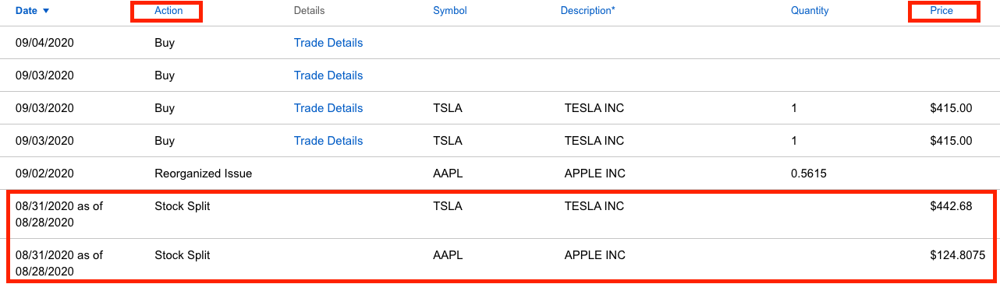
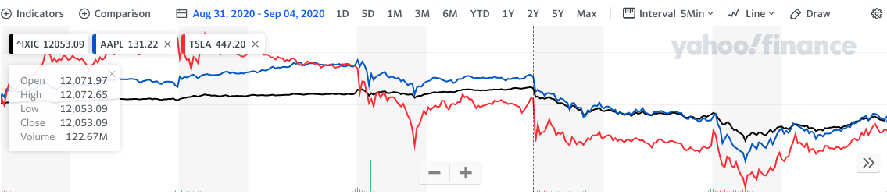

- 上週一（08/31/2020），特斯拉（一股拆成四股）與蘋果（一股拆成四股）分別完成[拆股](https://ycjhuo.gitlab.io/2020/08/30/How-Tesla-Soar-600-in-6-month/)，拆股後的價格分別是 $442.68（特斯拉）與 $124.8075（蘋果）。而我的特斯拉買入成本也降到 $67，蘋果則是在 $43 左右。

### 拆股後的一週
- 在拆股後的第一天（08/31/2020），特斯拉在週一迎來了股價的最高點（$498.32），蘋果則是在拆股後的第二天（09/01/2020）達到最高點（$134.18）。與拆股前相比，分別上漲了 12.57%（特斯拉）與 7.51%（蘋果）。
- 隨後因為週四＆週五（09/03-09/04）的美股大跌，用週五的收盤價與週一時開盤價相比，特斯拉在這週的表現為 -6.35%，蘋果為 -5.6%，而以科技股為主的納斯達克指數（Nasdaq Index）這週則是 -3.59%。
- 若是只算週四週五這二天的表現：特斯拉股價變動的幅度為 -6.94%，蘋果 -8.63%，納斯達克指數（Nasdaq Index）-6.54%

### 拆股可以讓股價上漲？
- 在拆股的前後，的確可以讓股價短期的上漲，但持續時間卻不可預估。若是短線投資人，上週在拆股前買入的短線投資者，若沒在週一或週二賣出，就會在後面三天馬上面臨到虧損。在週四＆週五的盤中，特斯拉與蘋果的跌幅更是超過 9% 。在當時的恐慌情況下，要賣出持股或是趁機加碼，都不是個容易的決定。

### 大跌時的操作
- 週四＆週五這二天的跌幅想必讓很多人回想起三月初疫情在美國爆發時造成的股市大跌。週四開盤時，APP 就不斷跳出持股已下跌了 5%, 8%, 10% 的通知。看著這些通知。心裡很掙扎是否該趁機加碼持股，畢竟從疫情減緩到現在，股市漲了很多，一直沒有機會加碼。但又無法知道現在進場了，週五是否又會續跌。
- 最後我在 $415 的時候買入 2 股特斯拉，那時是覺得特斯拉已經從高點跌了 16.7%，就算是從拆股時的價格來看，也有 6.25% 的跌幅，以特斯拉最近幾個月的漲勢，有這樣的跌幅並不多見。結果在週四買了後，週五跌幅再來到最低點（$382.29），距離我的買入價（$415）又跌了 7.88%。

### 買入前的規劃
- 要判斷股票會跌到哪個價位才會回升，是不太可能的事。因此，我認為藉由分批進場，可以買到下跌期間的平均價位是較為安全的做法。
- 週四在買入前，我先將資金分為三份，現在先買1/3，後來又設定了買入價的九折，也就是到了 $373.5 （415 x 90%）時再買 1/3，最後 1/3 則會在 $336.15 的價位進場。
- 而特斯拉在週五的最低點為 $328.29，因此並沒觸發我的第二個買入價。不過在星期六時 S&P 500 公佈了將在 09/21 新加入三隻股票進入指數，很可惜的其中並沒有特斯拉。消息公佈後，目前特斯拉的盤後價格跌了 6.41%，來到了 $391.51。畢竟特斯拉在前段時間很大程度的上漲原因是因為大家預期它可以在這季被納入 S&P 500，隨後就可以因為各大追蹤 S&P 500 指數的 ETF 買入特斯拉而繼續推升股價。
- 沒想到這個預期，在星期六破滅。下週一（09/07）為美國勞動節，休假一天，星期二美股市場才會開盤，應該可以看到特斯拉在星期二繼續下跌。雖然特斯拉沒成功被納入 S&P 500 這個消息讓人覺得可惜，但並不會影響我繼續買入特斯拉的想法。相反的，我可以利用這個壞消息，以更低的價格買入特斯拉。

### 股票已經漲高了，還能買嗎？
- 以 $415 買入特斯拉時，其實心情是有點複雜的，畢竟在拆股前，我的買入價都在 $400 以內，但現在卻要花到 $415 才能買到特斯拉股票，而且還是拆股後的，價值只有之前的 1/5，但其實特斯拉目前的狀況跟買入那時候相比，已經改善很多了。不僅現金流越來越強勁，毛利率跟營業利潤率也逐漸增強。
- 短期來看，09/22 的電池日（Battery Day）可以一窺目前特斯拉的電池進展，若推出更強的電池不僅可以增加汽車的續航力，還可降低電池生產成本，二者皆有助於增加我們購買電動車的意願。
- 長期來說，隨著更多的交車量，特斯拉也可藉由 Model 系列創造出與 iPhone 一樣的生態圈，將營收來源從單純的車輛銷售 & 自動駕駛拓展到更多樣的軟體服務，以及透過龐大的客戶資料來加強汽車保險領域的影響力。說不定再過三年，我又會像現在一樣後悔的想，應該在當初多加碼一些特斯拉股票。