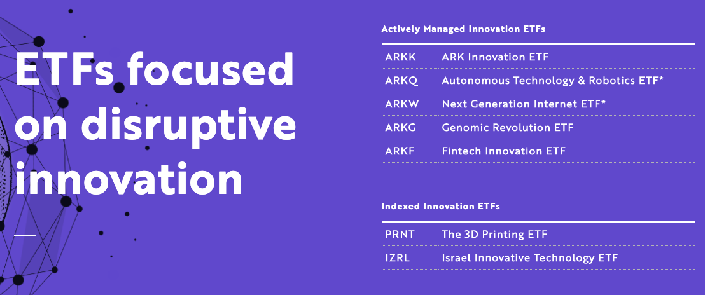
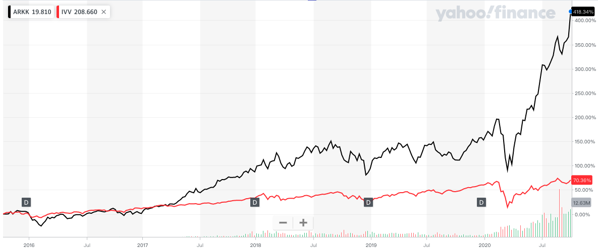

在前篇，我們了解到什麼是 [ETF](https://ycjhuo.gitlab.io/2020/09/13/What-Is-An-ETF/)，知道了 ETF 分為主動型及被動型二種。接著在這篇[追蹤美股三大市場的指數型 ETF ](https://ycjhuo.gitlab.io/2020/09/26/U.S.-Stock-Markets-Index-ETF/)中，我們精選了幾隻不錯的被動型的 ETF，做為大家選擇被動式 ETF 時的參考。

這篇我們來介紹一下主動式 ETF，下面這段擷取自 [ETF 是什麼？投資新手的入門首選
](https://ycjhuo.gitlab.io/2020/09/13/What-Is-An-ETF/)。
```
主動型（Active ETF）：是由 ETF 的管理者，透過他們的研究，主動選擇要將哪支股票加入到 ETF，以及將哪支股票踢出 ETF 組合。
何時買進股票及賣出，都由管理者決定。因為當中涉及人員的研究，所以收取的手續費較高。

目前我個人較看好的就屬由 Catherine Wood 所領導的方舟投資（Ark Invest）底下管理的方舟創新 ETF（ ARK INNOVATION ETF）
，股票代號 ARKK，每年的費用率為 0.75%，目前淨資產為 48 億，近一年的報酬率為 48.99%，近五年為 29.11%。
```

### 方舟投資（Ark Invest）
由 Catherine Wood 在 2004 年創立，他們的投資標的均集中在具備破壞式創新（Disruptive Innovation）的企業上。也因此，他們的投資標的目前幾乎都仍未獲利，處在燒錢階段。不像傳統的基金公司通常會選擇已穩定盈利多年的優質企業。<br/>
在[ Ark Invest 官網](https://ark-funds.com/)中可看到目前他們旗下共運營了 7 支 ETFs（ 5 支主動型，2 支被動型）。

這 5 支主動式 ETFs，分別為：
- ARKK（ ARK Innovation ETF ）：與公司同名的招牌基金。
 - 成立於 2014/10/31，目前規模為 48 億美金，每年管理費為 0.75%。
- ARKQ（ Autonomous Technology & Robotics ETF ）：著重於自動化科技與機器人產業。
 - 成立於 2014/09/30，目前規模為 3.17 億美金，每年管理費為 0.75%。
- ARKW（ Next Generation Internet ETF）：主要投資於下一代的新網路科技。
 - 成立於 2014/09/30，目前規模為 13 億美金，每年管理費為 0.76%。
- ARKG（ Genomic Revolution ETF ）：著重於基因改良等醫療類股。
 - 成立於 2014/10/31，目前規模為 13 億美金，每年管理費為 0.75%。
- ARKF（ Fintech Innovation ETF ）：投資金融科技創新產業。
 - 成立於 2019/02/04，目前規模為 2.21 億美金，每年管理費為 0.75%。

從這 5 支 ETFs 可以看出，Ark 對他們所運營的 ETF，做出了明確的區隔，除了 ARKK，算是綜合版之外，其他 4 支我們都可以容易地看出他們主要是投資在哪個產業。也方便我們從中選擇喜歡的產業作為投資標的。<br/>
這裡我們回顧一下被動式基金的資料，來做個對比。
```
追蹤 S&P500 的被動型 ETF（ IVV ），每年管理費為 0.03%，每日平均成交量約為 459 萬，資產規模約 2122 億。
```

相比之下，可看出 Ark 的這五支 ETF 規模都不算大，最大的 ARKK 資產規模也只佔了 IVV 的 2.3% 左右而已。但資產規模並不能代表投資績效。下面我們來看看 Ark 這 5 支基金的表現如何。

### 投資績效
下表整理了 5 支方舟投資的主動型 ETFs 截至 2020/06/30 的投資績效：

<table style="width:100%">
  <tr>
    <th align="center">ETF</th>
    <th align="center">3 Months</th>
    <th align="center">1 Year</th>
    <th align="center">3 Years</th>
    <th align="center">5 Years</th>
    <th align="center">Since Inception (成立至今)</th>
  </tr>
  <tr>
    <td align="center">ARKK（著重於破壞式創新企業）</td>
    <td align="center">62.00%</td>
    <td align="center">49.12%</td>
    <td align="center">37.23%</td>
    <td align="center">29.09%</td>
    <td align="center">26.73% (2014/10/31)</td>
  </tr>
  <tr>
    <td align="center">ARKQ（著重於自動化科技及機器人）</td>
    <td align="center">41.94%</td>
    <td align="center">40.05%</td>
    <td align="center">20.66%</td>
    <td align="center">20.35%</td>
    <td align="center">17.23% (2014/09/30)</td>
  </tr>
  <tr>
    <td align="center">ARKW（著重於下一代網路科技）</td>
    <td align="center">62.82%</td>
    <td align="center">63.04%</td>
    <td align="center">40.78%</td>
    <td align="center">34.16%</td>
    <td align="center">32.35% (2014/09/30)</td>
  </tr>
  <tr>
    <td align="center">ARKG（著重於基因改良及醫療）</td>
    <td align="center">66.65%</td>
    <td align="center">55.87%</td>
    <td align="center">35.39%</td>
    <td align="center">19.22%</td>
    <td align="center">19.76% (2014/10/31)</td>
  </tr>
  <tr>
    <td align="center">ARKF（著重於金融創新科技）</td>
    <td align="center">54.73%</td>
    <td align="center">41.03%</td>
    <td align="center">X</td>
    <td align="center">X</td>
    <td align="center">39.44% (2019/02/04)</td>
  </tr>
  <tr>
    <td align="center">IVV（追蹤 S&P500 的被動型 ETF）</td>
    <td align="center">20.34%</td>
    <td align="center">7.63%</td>
    <td align="center">10.62%</td>
    <td align="center">10.65%</td>
    <td align="center">39.44% (2019/02/04)</td>
  </tr>
</table>

從上表可看出，Ark 的 5 支主動型基金，在這近五年投資績效均遠遠超過了 S&P 500 指數，即使 Ark 的管理費 ( 0.75% ) 相較於 IVV  ( 0.03% ) 貴了 25 倍。最後得出的績效仍彌補了管理費較貴的缺點。

但這是否代表，我們應該拋棄追蹤大盤指數的被動型基金，而轉投主動型基金呢？先來看看 Ark 這 5 支 ETFs 都投資了哪些公司。

### Ark ETFs 前三大持股
以下是 Ark ETFs 佔比前三大的持股：
- ARKK：TSLA（10.03%），NVTA（9.34%），SQ（6.62％），前三大持股共佔了整個 ETF 的 25.99%
- ARKQ：TSLA（10.14%），MTLS（7.58%），TWOU（6.34％），前三大持股共佔了整個 ETF 的 24.05%
- ARKW：TSLA（10.28%），ROKU（7.01%），SQ（6.63％），前三大持股共佔了整個 ETF 的 23.92%
- ARKG：NVTA（11.73%），CRSP（8.17%），PACB（6.66％），前三大持股共佔了整個 ETF 的 26.56%
- ARKF：SQ（12.05%），MELI（4.68%），SE（4.16％），前三大持股共佔了整個 ETF 的 20.89%

可看出，Ark 在這 5 支 ETFs 中，前三大持股就佔了整個 ETF 大約 1/4 的比重。因此只要這幾支股票有一定程度的漲幅，即可大幅增加整支 ETF 的報酬率。

### 是否該投資 Ark
目前我並沒無持有 Ark 的這 5 支基金，原因有二：
1. 近五年股票市場是走強的趨勢，也經濟也處在成長階段，因此 Ark 投資這些尚未營利的企業並不會有立即性的風險。但若景氣反轉，走向衰退階段時，這些公司是否仍能持續靠融資來存活下去。這個風險仍有待商榷。
2. 從 Ark ETFs 的持股來看，他們最為看好的股票為特斯拉（TSLA）及 Square（SQ），而這二支剛好也在我的持股中。截至今天，特斯拉在我的佔了我的投資組合的 17.5%，Square 則是 5.5%。因此，若我再持有 Ark 的 ETF，則特斯拉及 Square 在我的投資組合中的比重則會變得更加重要。


最後，若我們在 2016 年時投資了 Ark 的 ARKK，到了今天將會帶給我們 418% 的報酬率，而投資追蹤 S&P500 指數的 IVV，則會帶給我們 70% 的報酬率。二者報酬率差了將近 6 倍。
但從圖中可以看出在疫情這段期間，ARKK 跌了 36%，而 IVV 則跌了 30％ 左右。證明了大盤指數在市場悲觀的確是較為抗跌的，但在市場樂觀的情況下，表現就不會像 ARKK 這麼好。或許在下次景氣衰退時，我會將 ARKK 也加入我的投資組合中。

