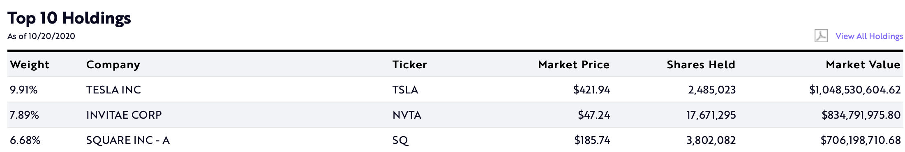
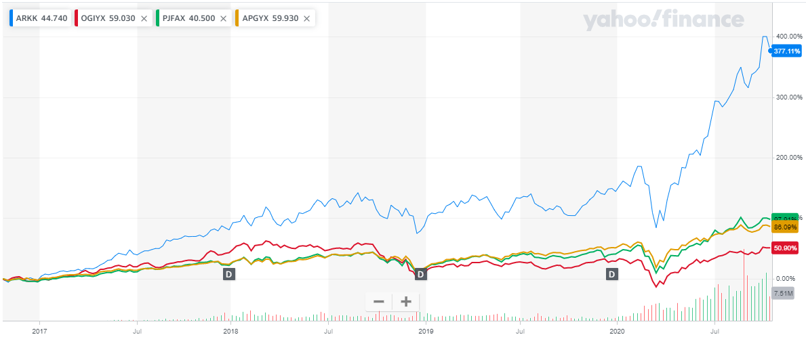
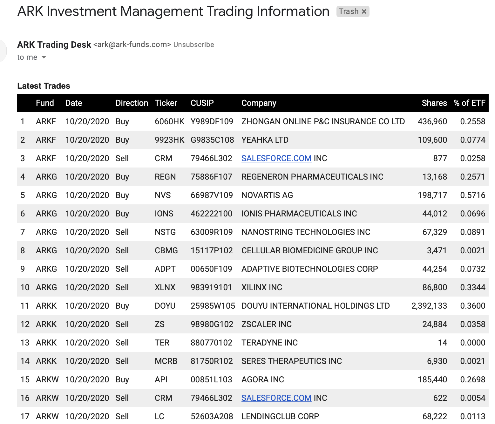

在上一篇 [方舟投資（ARK Invest），著重於破壞式創新的主動型 ETF](https://ycjhuo.gitlab.io/2020/10/10/Ark-Invest/) 跟大家介紹了方舟投資（Ark Invest）這家有著破壞式創新風格的基金公司，旗下的 5 支主動型基金，在近一年的報酬率全都超過 40%。
與此同時，標普 500 (S&P500) 的報酬率約為 7.63%。 

是什麼原因讓方舟投資的報酬率可以遠遠的超過大盤指數呢？讓我們先從方舟投資的創辦人開始說起。

P.S. 下表為方舟投資的主動型 5 支 ETFs 截至 2020/06/30 的投資績效：
<table style="width:100%">
  <tr>
    <th align="center">ETF</th>
    <th align="center">3 Months</th>
    <th align="center">1 Year</th>
    <th align="center">3 Years</th>
    <th align="center">5 Years</th>
    <th align="center">Since Inception (成立至今)</th>
  </tr>
  <tr>
    <td align="center">ARKK（著重於破壞式創新企業）</td>
    <td align="center">62.00%</td>
    <td align="center">49.12%</td>
    <td align="center">37.23%</td>
    <td align="center">29.09%</td>
    <td align="center">26.73% (2014/10/31)</td>
  </tr>
  <tr>
    <td align="center">ARKQ（著重於自動化科技及機器人）</td>
    <td align="center">41.94%</td>
    <td align="center">40.05%</td>
    <td align="center">20.66%</td>
    <td align="center">20.35%</td>
    <td align="center">17.23% (2014/09/30)</td>
  </tr>
  <tr>
    <td align="center">ARKW（著重於下一代網路科技）</td>
    <td align="center">62.82%</td>
    <td align="center">63.04%</td>
    <td align="center">40.78%</td>
    <td align="center">34.16%</td>
    <td align="center">32.35% (2014/09/30)</td>
  </tr>
  <tr>
    <td align="center">ARKG（著重於基因改良及醫療）</td>
    <td align="center">66.65%</td>
    <td align="center">55.87%</td>
    <td align="center">35.39%</td>
    <td align="center">19.22%</td>
    <td align="center">19.76% (2014/10/31)</td>
  </tr>
  <tr>
    <td align="center">ARKF（著重於金融創新科技）</td>
    <td align="center">54.73%</td>
    <td align="center">41.03%</td>
    <td align="center">X</td>
    <td align="center">X</td>
    <td align="center">39.44% (2019/02/04)</td>
  </tr>
  <tr>
    <td align="center">IVV（追蹤 S&P500 的被動型 ETF）</td>
    <td align="center">20.34%</td>
    <td align="center">7.63%</td>
    <td align="center">10.62%</td>
    <td align="center">10.65%</td>
    <td align="center">39.44% (2019/02/04)</td>
  </tr>
</table>
 

### 方舟投資創辦人

Catherine Wood，1956 年生（現年 65 歲），提倡只投資於那些針對人類未來有重大改變或影響的企業，並於 2013 年創辦了方舟投資。

她最知名的事蹟是在 2018/08/22，以特斯拉股東的身份發了一封 [公開信](https://ark-invest.com/market-commentary/tesla-private/) 給馬斯克，表示將特斯拉私有化不是個好主意，並堅信特斯拉的股價能在五年內達到 $140 - $800。 那時特斯拉股價僅為 $64.564（以拆股後計算）。

P.S. 馬斯克曾在推特上表示要將特斯拉進行私有化下市 2018/08/08，隨後被 SEC (美國證券交易委員會)  罰款 2000 萬美金，並強制解除馬斯克身為特斯拉董事長的職位。

這個事件就可看出 Catherine Wood 從特斯拉在載浮載沉的時期就已看好特斯拉。方舟投資目前所管理的 ARKK 基金 (目前規模 59 億)，其中特斯拉就佔了總基金約 9.91％ 的比重（截至 10/20/2020 的資料），就可觀察出 Catherine Wood 是多看好特斯拉未來的前景，且身體力行的將特斯拉列為權重最大的第一持股。

P.S.: 方舟投資在另外二支 ETF (ARKQ 及 ARKW) 中，特斯拉也佔了最大的比例，分別為 9.93% 與 9.68%。

假設 Catherine Wood 從發公開信的那天就一直持有特斯拉股票到現在，以特斯拉今天 ( 2020/10/20 ) 的收盤價 $421.94 來算，報酬率約為 554%。
 

### 方舟投資 V.S. 其他主動型基金
在上一篇，我們已比較過，若將 ARK 的 ARKK ETF 與 IVV（追蹤 S&P 500 指數的被動型 ETF ）做投資報酬率的比較，從 2016 年到現在 IVV 漲了 70%，而 ARKK 更是漲了 418%，ARKK 達成了超越大盤將近 6 倍的報酬率。

那若是將 ARKK 拿來跟其他的主動型基金比較的話呢？這邊我從我們公司在 401k 中可選擇的基金裡面選擇了近一年報酬率最高的三支基金出來比。
對於 401k 有疑問的，可參考這篇文章 [401 (k) 是什麼，美國稅率真的高嗎？
](https://ycjhuo.gitlab.io/2020/07/13/Explore%20401k%20and%20Does%20Tax%20High%20in%20the%20U.S/)

這三支主動型基金分別為：
- Oppenheimer Global Opportunities Y（OGIYX）：資產規模為 75 億，每年管理費為 0.84%，主要投資於全世界的中小型股（52%為非美國，44%為美國境內）
- PGIM Jennison Growth A（PJFAX）：資產規模為 70 億，每年管理費為 1.03%，專注投資於美國境內的股票（90%為美國境內，9%為非美國公司），科技股佔 36％，景氣循環股 24%，金融服務股 13%
- AB Large Cap Growth Advisor（AOGYX）：資產規模為 140 億，每年管理費為 0.64%，專注投資於美國境內的大型股（91%為美國境內，9% 為現金），科技股佔 34％，醫療股 21%，景氣循環股 14%

<table style="width:100%">
  <tr>
    <th align="center"></th>
    <th align="center">從 2019/10/20 投資</th>
    <th align="center">從 2018/10/20 投資</th>
    <th align="center">從 2016/10/20 投資</th>
    <th align="center">Expense Ratio 管理費</th>
  </tr>
  <tr>
    <td align="center">ARKK（著重於破壞式創新企業）</td>
    <td align="center">133.6%</td>
    <td align="center">137.05%</td>
    <td align="center">377.11%</td>
    <td align="center">0.75%</td>
  </tr>
  <tr>
    <td align="center">OGIYX（投資於全世界的中小型股）</td>
    <td align="center">25.82%</td>
    <td align="center">10.31%</td>
    <td align="center">50.9%</td>
    <td align="center">0.84%</td>
  </tr>
  <tr>
    <td align="center">PJFAX（專注投資於美國境內的股票） </td>
    <td align="center">46.15%</td>
    <td align="center">51.3%</td>
    <td align="center">97.91%</td>
    <td align="center">1.03%</td>
  </tr>
  <tr>
    <td align="center">APGYX （投資於美國境內的大型股）</td>
    <td align="center">29%</td>
    <td align="center">38.78%</td>
    <td align="center">88.09%</td>
    <td align="center">0.64%</td>
  </tr>
</table>
 

 

### ARK 是如何達到這個績效

看了上面的比較，大家一定很想知道，ARK 到底是做了什麼投資，能夠讓報酬率遠遠超過其它基金。一般來說基金經理人並不會公開他們的交易紀錄，且交易紀錄可說是自己的秘密，誰會將自己每天買了什麼，賣了什麼給別人知道呢？

但 ARK 可是一間專注於破壞式創新的基金公司，他們不只公開自己的交易紀錄，還每天將自己的交易紀錄寄給你。

只要點擊下面這個連結就可以到 ARK 官網，填上自己的 Email 等資料。每天晚上六點左右，就可以收到 ARK 寄的交易紀錄了。

[訂閱 ARK 每天交易的紀錄](https://ark-funds.com/trade-notifications)

從紀錄裡面可以看到，他們在哪支基金中買了哪支股票，買了幾股，這次購買的數量佔整個 ETF 的比重是多少。

而你會發現，這個表中並沒有交易價格。那我們該到哪邊看到購買價格呢？

只要到 Yahoo Finance 或其他財金網站就可以查到每天的開盤價 / 最高價 / 最低價 / 收盤價。利用這個資料，我們就可以大略估算出 ARK 的交易價格了。

之後，我們就可以透過觀察 ARK 每天的交易紀錄，來學習他們的投資方式了。