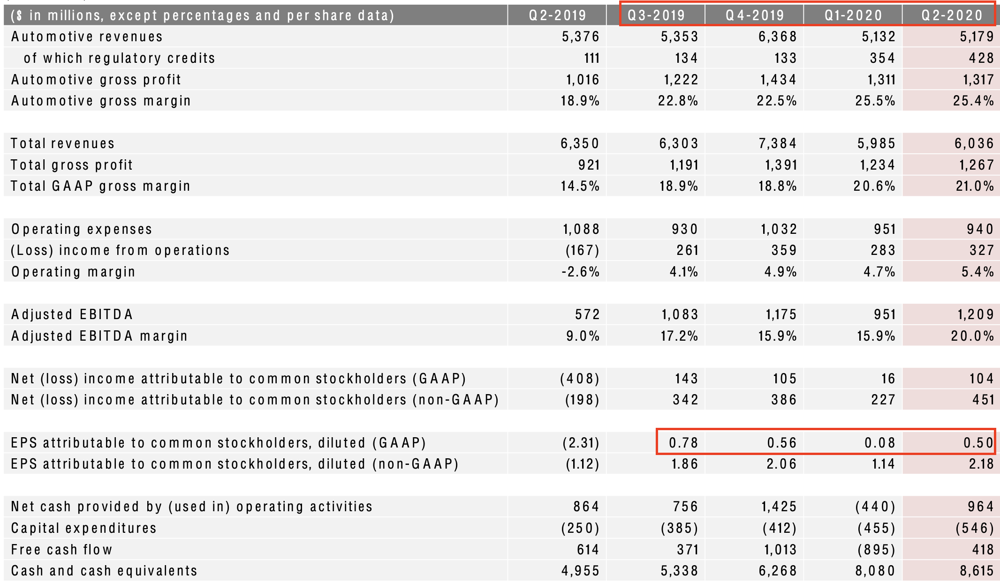
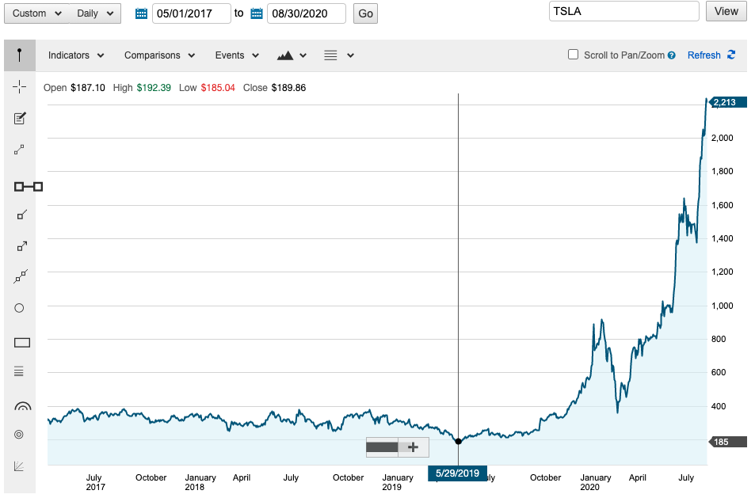
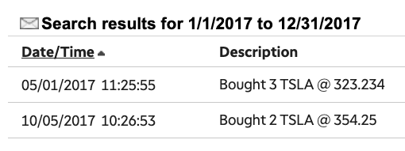
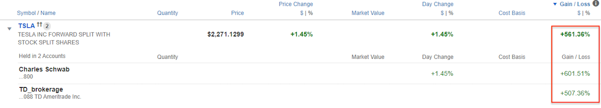

- 明天（08/31/2020）是特斯拉（Tesla，美股代號 TSLA）以及蘋果（AAPL）完成拆股的日子。在這段期間，每天打開新聞及報紙，都會看到特斯拉又漲了多少的新聞。
- 特斯拉在三個星期前宣布將進行拆股之後（以一股拆五股的方式 5-for-1 stock split），短短的 20 天內，股價就從 $956 (08/11) 躍升到 $2213 (08/28)，漲幅約 231%。拆股真的對股價影響這麼大嗎？
P.S. 蘋果 (AAPL) 比特斯拉早了二個星期 (07/30) 宣佈了拆股計劃（以一股拆四股的方式 4-for-1 stock split），在這一個月股價也從 $367.08 (07/30) 漲到了 $499.23 (08/28)，漲幅約為 36%。
  
### 何謂拆股
- 拆股，也就是股票分割，可以想成一個 Pizza 本來切成 8 片，但現在我們將它切成 12 片，讓原本買不起一片 (1/8) Pizza 的人，可以用更低的價格買到更小片 (1/12) 的 Pizza。但本質上還是同一個 Pizza。拆股的好處是增加股票的流動性，讓更多的人可以買的起特斯拉股票。
P.S. 台股的單位是一張 (1000股)，因此買不起一張股票的人還可以買零股。但美股的最小單位是一股，絕大多數的券商也只接受最低數量為 1 股的交易。因此拆股之後，可以讓更多人也買得起特斯拉。

### 半年內漲了 600%
- 特斯拉在這次疫情之下，仍成功的達到獲利目標，並在 07/22 公佈 Q2 財報後，成功繳出了連續四季獲利 (Q3-2019 ~ Q2-2020) 的成績單，也讓多數投資者注意到特斯拉已經達成納入 S&P500 指數的標準，若被納入S&P500指數，像是 SPY, IVV, VOO 這些追蹤 S&P500 的指數型 ETF 就必須買入特斯拉，以達到追蹤指數的目的。但特斯拉的漲勢並不是從公佈 Q2 財報才開始，而是早在疫情尚未明朗前就已顯現，最後在這半年內總共漲了 600%。
- 回想三月初時，因為油價大跌以及新冠肺炎的影響，二個星期內就看到了四次的美股熔斷（當日跌幅超過 7%）。對比五個月後的現在，應該讓不少人扼腕沒有趁這個機會買入，買太少，或是太早賣出吧。
 - 03/18 - 07/22： 特斯拉在這天，股價來到 2020 年的最低價 ($369)，這期間漲幅為 341%
 - 07/22 - 08/28：從公佈財報到現在也漲了 39%

### 持有特斯拉的三年
- 我是在 05/01/2017 買入特斯拉的，那時股價只有 $323 左右，在我買入後，股價一直維持在300左右，一直到過了31個月之後（ 2019 的 12 月），股價才突破了 $400。
- 這期間特斯拉經歷了一連串的負面消息，從執行長馬斯克 (Elon Musk) 在推特上宣布要將特斯拉私有化 (08/07/2018)，以及他在接受直播訪談時抽大麻 (09/08/2018)，這些事件都被媒體拿來大作文章，質疑馬斯克的領導力，以及特斯拉是否有轉虧為盈的一天。股價一路走低，並在 05/29/2019 時，股價來到從我買入後的最低價 ($185)。那時，在我的未實現損益，大約為 -45%。
- 下圖為我買入當天到現在的股價走勢圖：

### 買入的動機
- 一開始決定買入，是因為看到了特斯拉的電動車，那時就有種像看到 iPhone 4 的感覺，覺得它很有潛力，之後肯定會像 iPhone 變成人手一機的產品。但其實在那個時間點 Model 3 還無法成功量產。隨後特斯拉也陸續面臨了生產及交車的各種狀況，被媒體一路唱衰。不僅公司虧損擴大，自由現金流一直是負的 (Q2-2019 才開始穩定轉正)，帳上現金也越來越少，塑造出彷彿隔天就會倒閉的悲觀氛圍。雖然在諸多不利條件的影響下，那時倒也沒想說要賣出，反而在 2019 又加買了一些。
- 在買入 TSLA 時，並沒有想過會漲的這麼快，只是因為在看過馬斯克的傳記後，認同他的理念以及想做就做的行動力，而想成為特斯拉的股東之一，默默地支持他，因此將一個多月的薪水都拿去買特斯拉（其實也只夠買 5 股）。
- 後來研究了財報後，看著各項指標逐漸轉差，曾猶豫是否還要繼續買進特斯拉。但因為在買入前就有這個心理準備了，後續就繼續加倉（但還是有理智的將特斯拉控制在佔總投資組合的 5%），心想就算特斯拉沒能挺過這個難關，股票變成廢紙，也不會對我造成太大的影響（結果因為這半年漲得太快，目前已經佔了我的投資組合的 15%）。 

### 是否該賣出
- 我在每次買入股票時，都會寫下買入的原因，或是當時的想法（都在 50 字以內），有時也會寫發生什麼事 或 哪些指標轉差 時要賣出。從一開始進入美股到現在也三年多了，這期間都沒有賣過股票。
- 巴菲特 ( Warren Buffett ) 在 1996 年給股東的建議書上說過，投資就像棒球，不需要頻繁的揮棒，每球都想打。只需專注在幾個好球就好。買入股票就像是成為該公司的股東之一，目的是隨著公司一起成長，而不是賣出股票來賺取差價。
- 在疫情期間，我只買入了 1 股特斯拉，目前我的報酬率也在 600%。在持有的這段期間，可說是前面 83% 都是考驗耐心，最後這 17% 才是股價成長的爆發期，若是太晚買入或是太早賣出都會錯過這一整段的報酬。雖然現在股價已經很高，但未來有機會的話，我還是會繼續買入特斯拉。
