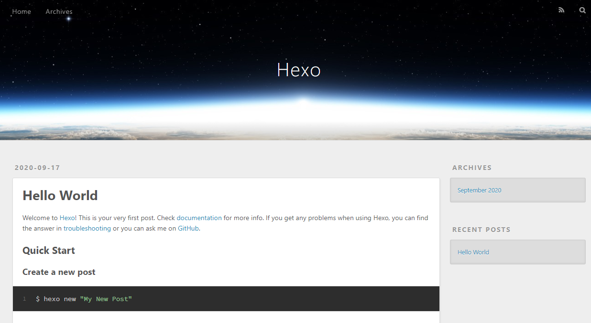
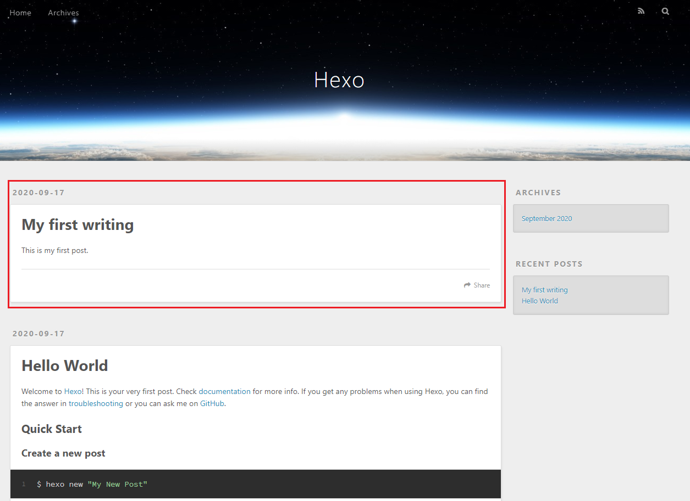

HEXO 一個熱門的 Blog 框架，並且支援 Markdown。這邊來分享一下如何用 5 個步驟就能完成在本機端 架好 HEXO。
### 安裝 Node.js
1. 先到[ Node.js 官網 ](https://nodejs.org/zh-tw/)安裝 Node.js，安裝好後可以用下面指令來看有沒有安裝成功。
 - Node.js 是一個能夠在 Server 端執行的 Javascript 環境
 - npm 是一個套件管理工具 (安裝了 node.js 後，npm 也會一起被安裝起來)。可以把它想成 Apple Store，需要什麼 package 都可以用這個下載，並集中管理。

```powershell 
# 查詢安裝的 node 版本
$ node -v

# 查詢安裝的 npm 版本
$ npm -v
```

### 利用 npm 下載 Hexo
2. 安裝完 node 後，我們就可以用 npm 來下載 Hexo 了
 - 首先我們要先建立一個空的資料夾，並進到那個資料夾裡面，這裡我用 hexoblog 做為資料夾名稱
 - 在執行完第二個指令後，看到 terminal 顯示 ```INFO  Start blogging with Hexo!```，就表示已經安裝成功了。

```powershell 
# 先進入我們新建的資料夾
$ cd hexoblog

# 安裝 hexo
$ npm install hexo-cli -g

# 執行 hexo 初始化
$ hexo init

# 若出現此錯誤訊息，reason: self signed certificate in certificate chain
# npm ERR! request to https://registry.npmjs.org/hexo-cli failed, reason: self signed certificate in certificate chain
# 可用這個指令關閉 SSL 驗證
$ npm config set strict-ssl false
```

### 在自己的電腦上啟動 Hexo
3. 輸入以下指令來啟動 Hexo
```powershell
# 也可以直接打 hexo s 來啟動 Server
$ hexo server
```
 - 執行指令後，若有看到這行字的話，就表示我們安裝成功了 <br/> 
```powershell
INFO  Hexo is running at http://localhost:4000 . Press Ctrl+C to stop
```

 - 之後我們打開瀏覽器 (Chrome, Firefox)，在網址列輸入 http://localhost:4000/ 就可以看到 Hexo 的畫面了 (如下圖)。



### 開始寫第一篇文章
4. 成功啟動 HEXO 後，我們就可以來寫文章了。
 - 要建立新文章的話，在這個資料夾底下 hexoblog\source\_posts 建立 MD file 即可。
 - 也可以用這個指令 ```hexo new "XXX" ``` 來建立 MD file (XXX 為文章的標題)
 - 文章範例如下：
```xml 
---
title: My first writing
date: 2020-09-17 21:18:00
---

This is my first post.
```
 - 其中 - - - 包起來的區塊內放我們文章會用到的屬性，文章的內容則會寫在 - - - 下面
 - 文章有多種屬性，以下是我常用的：
```xml
---
# 文章的標題
title: '五分鐘用 Hexo 建立 Blog'

# 發布文章的時間
date: 2020-09-17 21:23:27

# 這個文章的標籤，可以有多個，類似關鍵字
tags: [Hexo, Blog]

# 文章的分類，只能有一個
categories: Hexo

# 隱藏文章在文章列表中顯示的內容，只顯示標題
description: ' '
---
```


 - 寫好後，重新整理瀏覽器就可以看到了 (紅框為我們剛剛發佈的文章)。



### Blog 常見設定
5. 所有的設定都在主資料夾的這個檔案 _ _config.yml_ ，可依自己的需求做更改
 - 這裡列了比較常見的部分
```xml
# Blog 的名字
title: YC's Weekly Journal

# 子標題
# 在預設主題(landscape)沒有作用
subtitle: '紐約工程師的分享週記'

# Blog 的描述
# 在預設主題(landscape)沒有作用
description: ''

keywords:

# 作者
author: YC Jhuo

# Blog 語言 預設值為 en
# language: en
language: zh-tw
```

- 想了解更多細節可參考[ HEXO 官網](https://hexo.io/zh-tw/docs/)的介紹