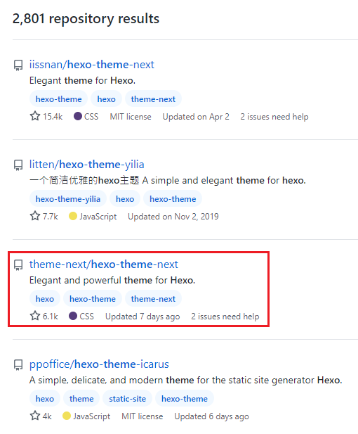
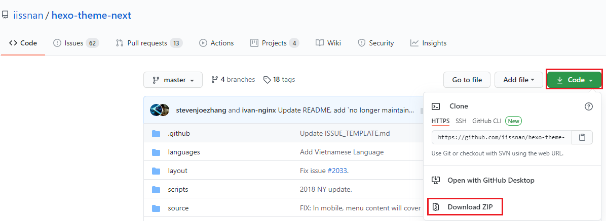
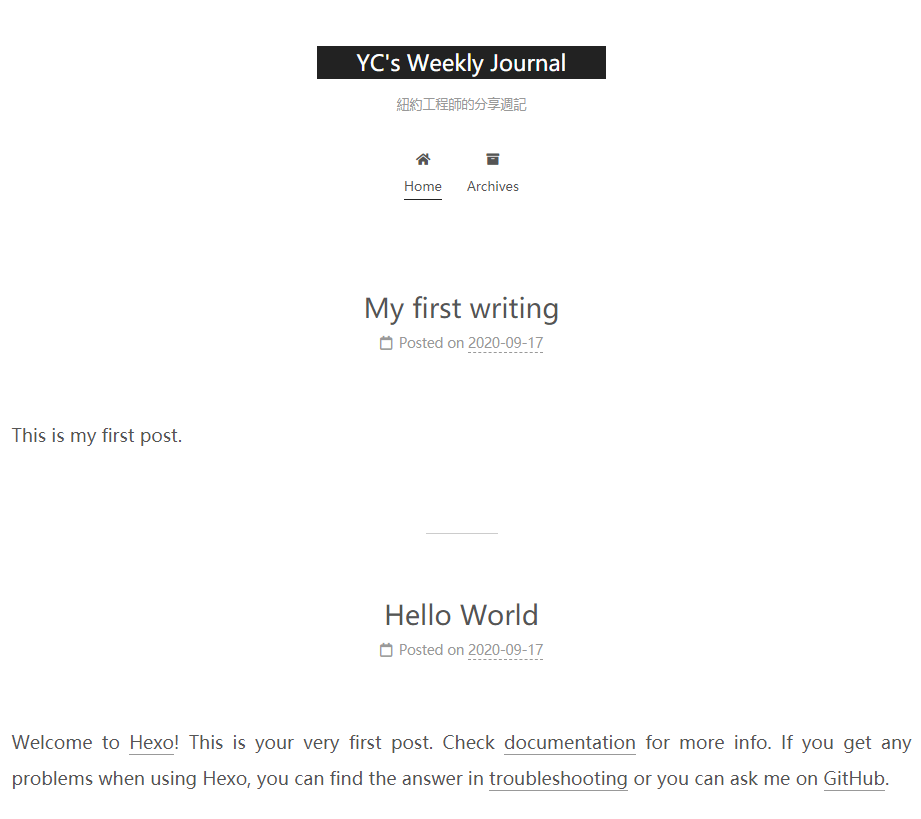
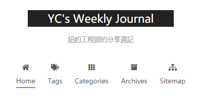
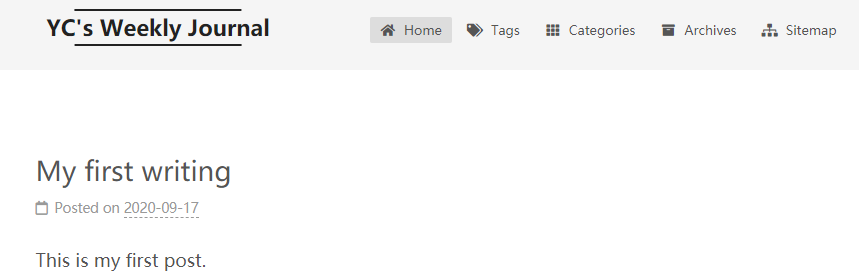
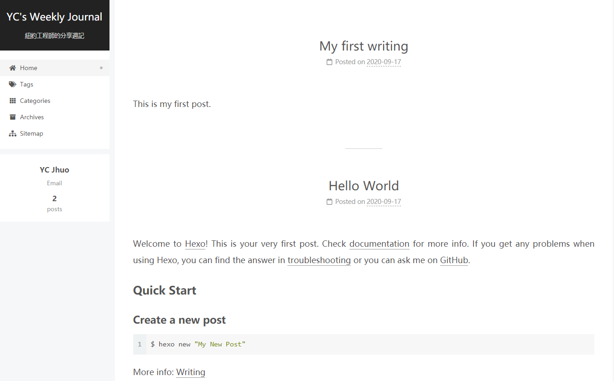
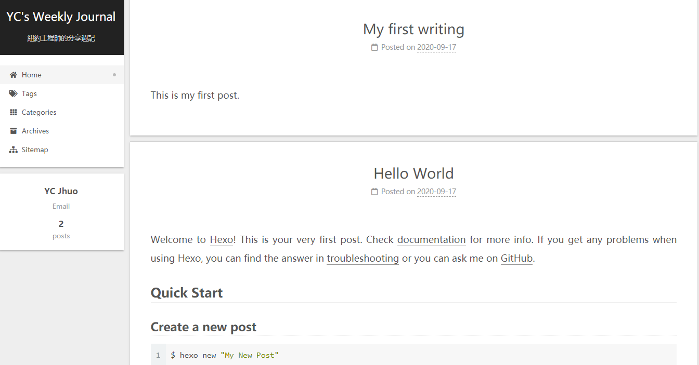

在上一篇：[五分鐘用 Hexo 建立 Blog](https://ycjhuo.gitlab.io/2020/09/18/How-To-Build-A-Blog-With-Hexo/)，分享了如何用 Hexo 架設部落格後，這篇要來介紹要怎麼在 Hexo 更改佈景主題。
- Hexo 除了預設主題 landscape 之外，還有很多不錯的主題。我們來介紹在 Github 上搜尋 Hexo theme 排行第一的主題 NexT。
 - P.S. 第一個是舊版的 NexT 主題，現在已沒在維護，大家可以選擇第三個來下載。


### 套用 NexT 主題
1. 到 [Next 的 GitHub](https://github.com/theme-next/hexo-theme-next)，點擊綠色的 Code 按鈕，選擇 Download ZIP，下載完後解壓縮到 hexoblog 資料夾的 themes 底下 ( hexoblog\themes )
<br/>
2. 再來我們打開 hexoblog 資料夾的 _ _config.yml_ ，將主題從預設的 landscape 改為我們剛剛解壓縮的 hexo-theme-next-master
 - P.S: _ _config.yml_ 裡面的主題( theme )是參照該主題的資料夾名稱。因此若將這個資料夾 hexo-theme-next-master 改名成 next，則我們只要輸入 ```theme:next``` 就好了
```xml
# Extensions
## Plugins: https://hexo.io/plugins/
## Themes: https://hexo.io/themes/
# theme: landscape
theme: hexo-theme-next-master
```
3. 回到 Terminal 案 Ctrl +C 停止 Hexo Server，再重新啟動 Hexo Server```$ hexo s``` 就可以看到 NexT 主題已經被套用上去了。


### NexT 主題的相關設定
#### 增加部落格屬性

- 在 NexT 主題裡面，可以在資料夾 themes 該主題裡面找到這個檔案 _config.yml_  修改主題的相關設定。
 - 路徑為： hexoblog\themes\hexo-theme-next-master

- 一開始套用 NexT 主題時，部落格的屬性只會有首頁 (Home) 跟 發文紀錄 (Archives)，我們可以在 menu 這裡將 tag, categories 跟 sitemap 的註解解除，來為部落格增加這三個屬性。 <br/>


 - 使用下面三個指令，在資料夾 (hexoblog\source) 裡面產生相對應的三個資料夾。
 - 之後在這三個資料夾裡面的 index.md 檔案，分別加上 type: "tags", type: "categories" 與 type: "archives"

```powershell
$ hexo new page tags
$ hexo new page categories
$ hexo new page archives
```
- 再來到主題 (themes) 裡面的_ _config.yml_ 修改 menu 區塊

```xml
# 預設值
menu:
  home: / || fa fa-home
  #about: /about/ || fa fa-user
  #tags: /tags/ || fa fa-tags
  #categories: /categories/ || fa fa-th
  archives: /archives/ || fa fa-archive
  #schedule: /schedule/ || fa fa-calendar
  #sitemap: /sitemap.xml || fa fa-sitemap
  #commonweal: /404/ || fa fa-heartbeat

  # 我的設定
menu:
  home: /|| home
  #about: /about/ || user
  tags: /tags/|| tags
  categories: /categories/|| th
  archives: /archives/|| archive
  #schedule: /schedule/ || calendar
  sitemap: /sitemap.xml || sitemap
  #commonweal: /404/ || heartbeat
```
- 這邊要注意，解除註解後，tag 後面的 /|| 之間不能有空格，不然在頁面跳轉時會因找不到該頁面，而顯示下列訊息：

``` xml
  Cannot GET /tags/
  Cannot GET /categories/
  Cannot GET /sitemap.xml
```

#### NexT 的四種佈景主題
- 在 NexT 裡面還有四種佈景主題，畫面都不太一樣，預設值是 Muse，我則是選擇 Pisces。
- 而下方的 Dark Mode 則是要不要開啟暗色模式，總共有 false, true, auto 可以選擇，auto 會依據使用者的瀏覽器設定自行決定要不要開啟暗色模式
```xml
# Schemes
scheme: Muse
#scheme: Mist
#scheme: Pisces
#scheme: Gemini

# Dark Mode
darkmode: false
```
- 這裡列出其他三種 Schemes 的畫面，大家可以自由選擇喜歡的。
 - scheme: Mist 的畫面是：


 - scheme: Pisces


 - scheme: Gemini



#### 程式碼呈現主題
- 這部份則是可以選擇要用哪種顏色配置來顯示程式碼，我是選擇 highlight_theme: night eighties。若部落格上不會寫到程式碼的可以跳過這段。
```xml
codeblock:
  # Code Highlight theme
  # Available values: normal | night | night eighties | night blue | night bright | solarized | solarized dark | galactic
  # See: https://github.com/chriskempson/tomorrow-theme
  highlight_theme: normal
```

#### GA & Firestore
- 若有在用 Google Analytics 以及 firestore 的，可以將 tracking ID 跟 帳號 寫在這裡。
```xml
google_analytics:
  tracking_id: UA-XXXXXXXXXXXX


firestore:
  enable: true
  collection: articles # Required, a string collection name to access firestore database
  apiKey: XXXX
  projectId: XXXX
```

#### Google AdSense
- 若想在 Blog 內加入 Google AdSense 的，可到 head.swig (路徑：themes\next\layout\_partials\head )加入 Google AdSense 提供給我們的這段程式碼。
- 之後若通過 Google AdSense 審核，可以到 sidebar.swig (路徑為：themes\next\layout\_macro) 貼上顯示廣告的代碼。
```xml
<script data-ad-client="ca-pub-XXXXXX" async src="https://pagead2.googlesyndication.com/pagead/js/adsbygoogle.js"></script>

<!-- Global site tag (gtag.js) - Google Analytics -->
<script async src="https://www.googletagmanager.com/gtag/js?id=UA-XXXX"></script>
<script>
  window.dataLayer = window.dataLayer || [];
  function gtag(){dataLayer.push(arguments);}
  gtag('js', new Date());
```

#### 增加 LikeCoin 按鈕
- 若要加入 LikeCoin 到 Hexo 的話，可到這個[網址](https://embed.ly/code?url=https%3A%2F%2Fbutton.like.co%2Fycjhuo54702)，將 //button.like.co 後面改為自己的 LikeCoin ID，按下 EMBED，就可以自己的 LikeCoin 嵌入代碼產生出來了。
- 產生出來後再將代碼放到 post.swig (路徑為：\themes\next\layout\_macro\post.swig)
 - 放的位置為：POST BODY 跟 END BODY 的中間的 post.content 下面
 - 這個區段有二個 post.content，二個下面都要貼上 LikeCoin 嵌入代碼


```xml
          {{ post.content }}
        <!-- likecoin -->
        <blockquote class="embedly-card" data-card-controls="0" data-card-theme="dark">
        <h4><a href="https://button.like.co/ycjhuo54702">ycjhuo54702 (ycjhuo54702)</a></h4>
        <script async src="//cdn.embedly.com/widgets/platform.js" charset="UTF-8"></script>
        
      
        {{ post.content }}
        <!-- likecoin -->
        <blockquote class="embedly-card" data-card-controls="0" data-card-theme="dark">
        <h4><a href="https://button.like.co/ycjhuo54702">ycjhuo54702 (ycjhuo54702)</a></h4>
        <script async src="//cdn.embedly.com/widgets/platform.js" charset="UTF-8"></script>
      
```