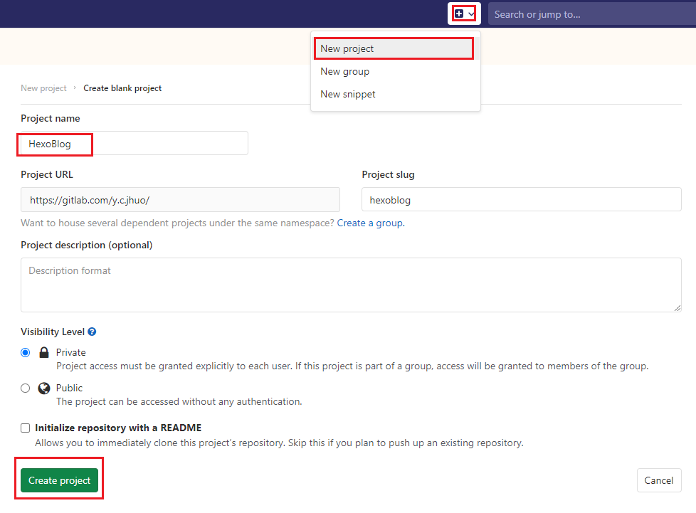
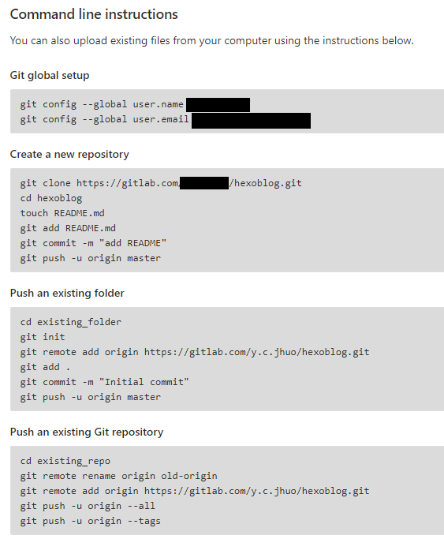
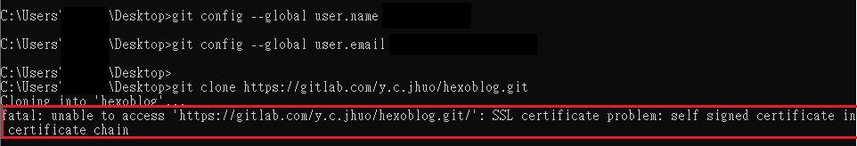
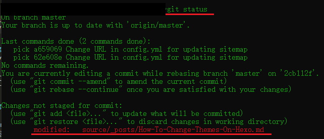

在前二篇 [五分鐘用 Hexo 建立 Blog](https://ycjhuo.gitlab.io/2020/09/18/How-To-Build-A-Blog-With-Hexo/) 與 [HEXO 如何修改主題 (NexT 為例)](https://ycjhuo.gitlab.io/2020/09/18/How-To-Change-Themes-On-Hexo/)。我們已經在本機建立好了 Blog。
這篇來介紹該如何將 Blog 放在網路上讓其他人可以搜尋的到。我們選擇 GitLab 作為 Blog 的儲存空間。
選擇 GitLab 而不是 GitHub 的原因為：目前 GitHub 的容量上限為 1GB，若超過就須付費。 而 GitLab 則是提供 10GB 的儲存空間給我們。

### 註冊 GitLab
1. 先到 GitLab 註冊帳號，註冊完後 Create 一個新 Project。
 - Project Name 要跟 _ _config.yml_ ( 路徑是主資料夾下面的 _config.yml_，而不是 themes 裡面的那個 ) 裡面的 url 一樣
 - 例如：在建立新 Project 時，Project Name 是 HexoBlog，那_ _config.yml_ 的設定就要跟下面一樣。
 - 之後建立好的 Blog 網址也會是這個。
```xml
# URL
## If your site is put in a subdirectory, set url as 'http://yoursite.com/child' and root as '/child/'
url: https://HexoBlog.GitLab.io
```

 - Visibility level 可以設定為 Private <br/>

### 建立 GitLab Project
2. 建立完 Project 後，到 [Git 官網](https://git-scm.com/downloads)下載 Git，並安裝。
 - 這是為了等一下要在 terminal 執行 Git 指令用的，如果已經有安裝過可以跳過這個步驟
 - Git 頁面在 Project 建立後，會出現跟下面一樣的指令


### 在本機設定 GitLab 
3. 打開 Terminal ，將 Git global setup 這個部分的指令打進去 (這步驟設定 Git 要連接到哪個帳號)
 - 輸入完指令後，會看到放 Blog 的資料夾內出現一個隱藏資料夾 ( .git )，資料夾裡面的 config 檔會儲存我們要連接 git 的網址
 - 打錯 Git 帳號的話，可以用這個指令來刪除電腦上的 Git 原先設定
 - ```git config --system --unset credential.helper```

### 下載 GitLab Project 到本機
4. 設定好 Git 後，我們就可以輸入 Create a new repository 這個部分的第一行 git clone，來將我們剛建立的 Project 下載到本機。
 - 接著 cd 到 Project 資料夾內 (也就是 Create a new repository 的第二行)
 - 若出現 fatal: unable to access ... SSL certificate problem 這個錯誤，可以用這個指令來關閉 SSL驗證
 - ```$ git config --global http.sslVerify false```


### 上傳檔案到 GitLab 上
5. 到了這邊就已完成 Git 的設定了。下面是寫好一篇文章後，要如何上傳文章到 GitLab 上
 1. 先用 git status，來確認本機上是不是有檔案還沒加入本機的 Git 裡面。
  - 下圖顯示我的這個檔案(How-To-Change-Themes-On-Hexo-md)是被修改過的狀態，且還沒加入本機的 Git 裡面

 2. 確認有未加到 git 裡面的檔案後，用 git add /XXX/XXX/XXX 來將檔案加到 git
   - 以上面那個例子的話，就要輸入 ```$ git add soruce/_posts/How-To-Change-Themes-On-Hexo-md```
  - 要一次加入所有未加入 Git 的檔案到 Git 的話，可以輸入：```$ git add .```
 3. 將檔案加入 Git 後，再用這個指令來加入註解 ```$ git commit -m "Initial commit"```
  - 雙引號裡面的 Initial commit 可以自由打入自己想要的註解。
 4. 最後再用這個指令將檔案推送到 GitLab 上面去就完成了。```$git push -u origin master```