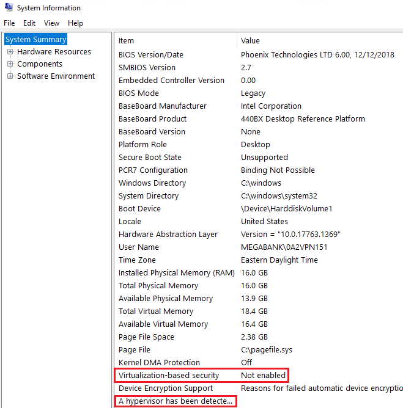
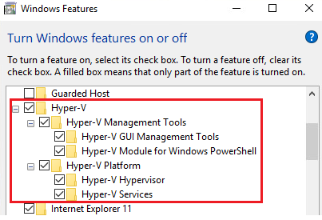
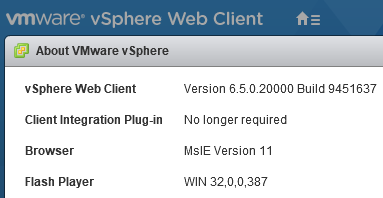
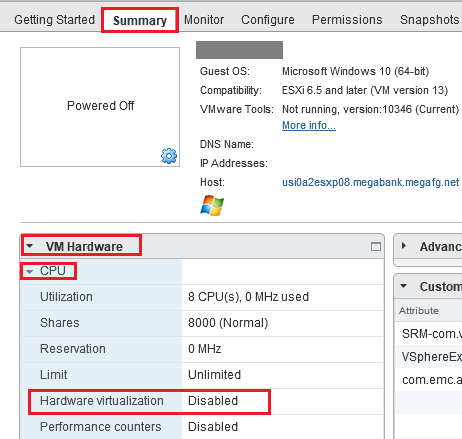
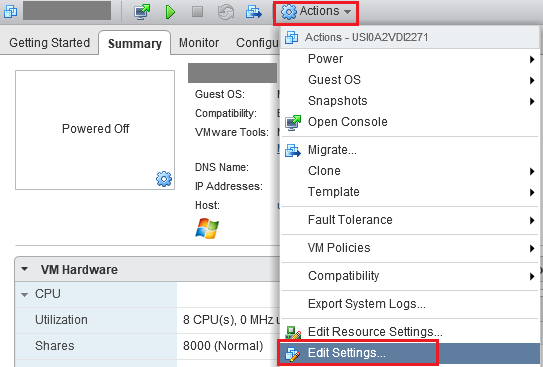
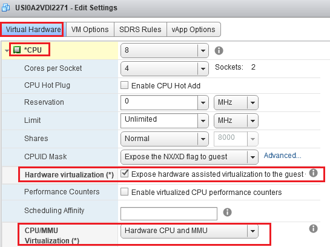
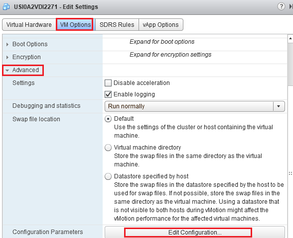
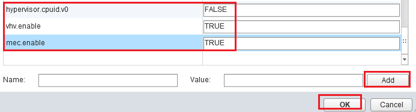
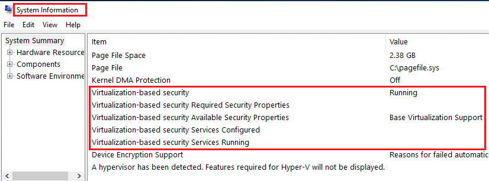

在上一篇 [如何在 Windows 10 安裝 Docker](https://ycjhuo.gitlab.io/2020/09/11/How-To-Install-Docker-On-Windows-10/) 中，我們提到如何在 Windows 10 上安裝 Docker 以及啟用 Hyper-V。這篇我們來看一下如何將安裝在 VM 裡面的 Win10 也啟用 Hyper-V。 

- 一開始，我們可以先在下圖看到：目前在 System Information 裡面的 Virtualization-based security 還是處於 Not enabled 的狀態。  

- 之後，我們打開控制台裡面的 Windows Features，可以看到 Hyper-V 已經有被勾起來了。但實際上，Virtualization-based security 還是沒有啟用。所以目前我們打開 Docker 時，還是會顯示需要 enable Hyper-V。  

- 接著，我們到 VMware vSphere Web Client (我的 vSphere Web Client 版本是 6.5)。  

- 在 VM 的 Summary，我們點開 VM Hardware，看到 CPU 的 Hardware virtualization 是 Disabled，接著我們就要來 enable 它  

1. 點開 Actions 的 Edit Settings：  

2. 在 Edit Settings 裡面，先到 Virtual Hardware 分頁，點開 CPU，接著將 Hareware Virtulization 打勾，並將下面的 CPU/MMU Virtulization 選到 Hareware CPU and MMU  

3. 接著到 VM Option 的分頁，點開 Advanced，選擇 Edit Configuration  

- 加上下面這三個設定：
 - hypervisor.cpuid.v0 : FALSE  
 - 	vhv.enable : TRUE  
 - 	mec.enable : TRUE  

4. 之後我們就可以將 VM 裡面的 Windows 打開，並在 System Information 裡面看到 Virtualization-based security 已經是 running 的狀態了。  

