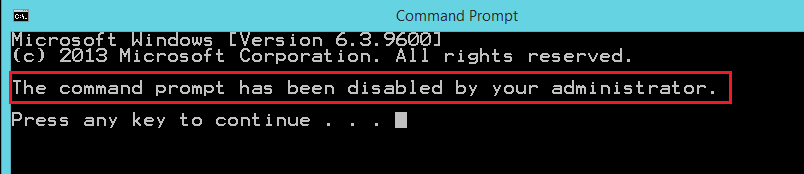
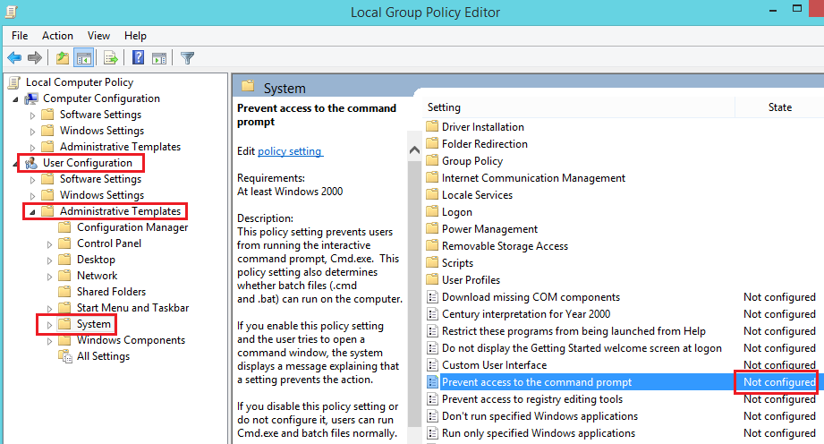
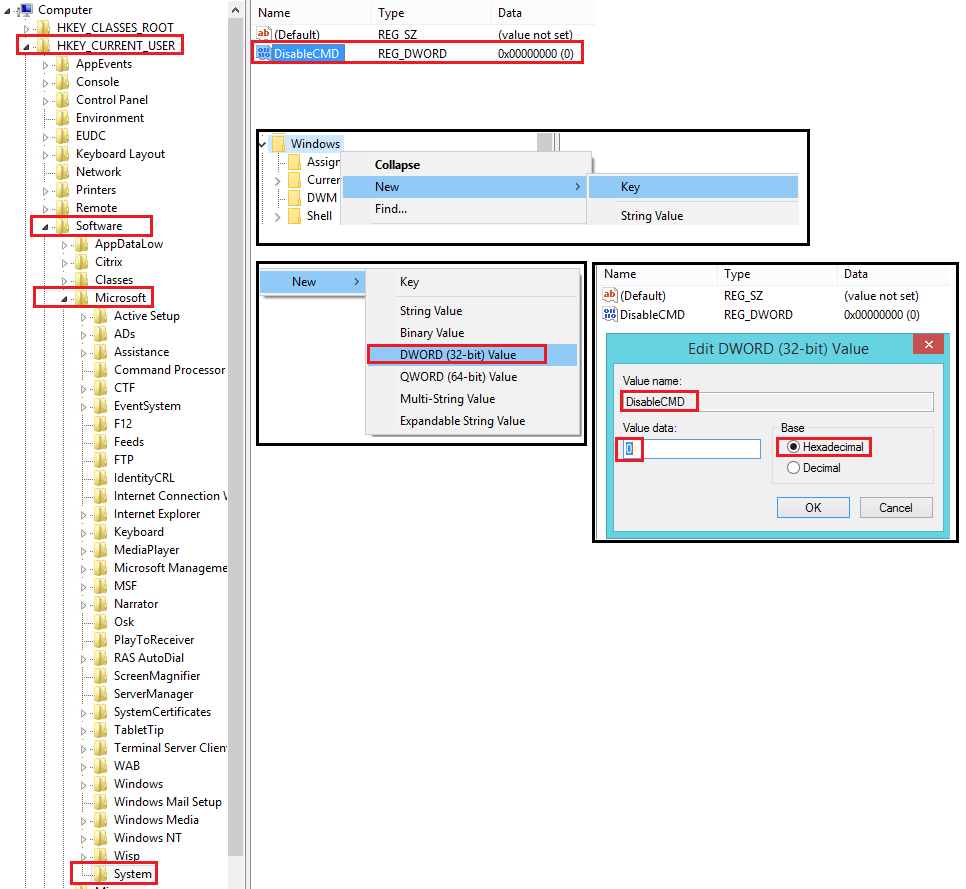
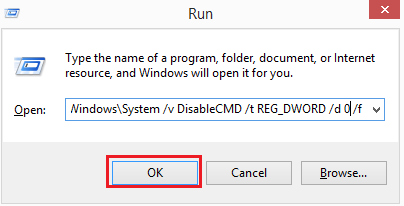

今天在登入 Windows Server 2012 R2 時，發現 Command 突然無法使用了，開起來都會顯示 The command prompt has been disabled by your administrator. ，但我自己用的就是 administrator 的帳號，如果有一樣問題的人，可以試試以下這五個步驟。 <br/>
 <br/>

解決方法如下：
 1. 在搜尋打上 gpedit.msc 來打開 Local group policy editor <br/>
 
 2. 依序進到 Configuration -> Administrative Templates -> System 之後會看到右邊有 Prevent access to the command prompt. 目前的狀態應該會是  enable 的，我們先把它改成 Not configured <br/>
 
 3. 再到搜尋打 regedit 叫出 Registry editor <br/>
  
 4. 依照這個路徑 HKEY_CURRENT_USER -> Software -> Microsoft -> Windows -> System 建立一個 DWORD (32-bits)，名字取作 DisableCMD，Value Date 設為 0，Base 選 Hexadecimal <br/>
P.S. 若找不到這個路徑就在空白處案右鍵，自己 new 一個 key 出來
 
 5. 最後一步是按下鍵盤的 Windows 鍵 + R 叫出 執行 視窗，輸入下面這行指令，接著按確定就會看到一個視窗一閃而過。之後就能正常使用 Command 了
```powershell
REG add HKCU\Software\Policies\Microsoft\Windows\System /v DisableCMD /t REG_DWORD /d 0 /f
```
