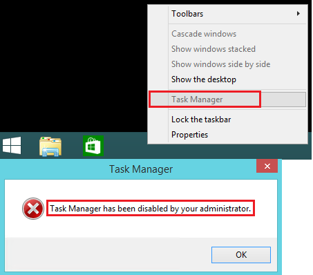
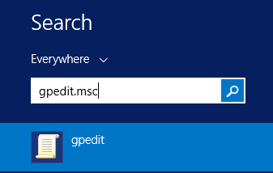
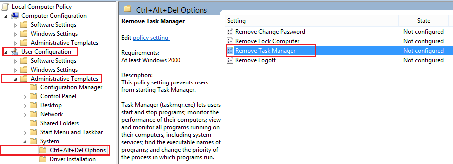
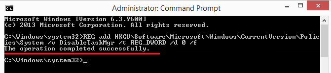
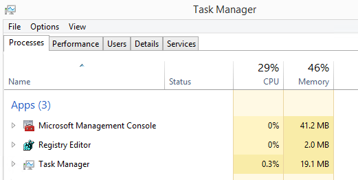

今天在登入 Windows Server 2012 R2 時，Task Manager 突然呈現反灰的狀態，用搜尋的方式直接開啟 Task Manager 也會出現這個訊息 Task Manager has been disabled by your administrator ，若也遇到問題的人，可以試試這四個步驟。


解決方法如下：<br/>
 1. 在搜尋打上 gpedit.msc 來打開 Local group policy editor <br/>
 

 2. 依序進到 Configuration -> Administrative Templates -> System -> Ctrl + Alt + Del 後，會看到右邊有 Remove Task Manager item 目前的狀態應該是  enable 的，我們先把它改成 Not configured <br/>
 

 3. 再打開 Terminal 輸入下面這行指令，就會看到 The operation completed successfully. <br/>
 ```powershell
 REG add HKCU\Software\Microsoft\Windows\CurrentVersion\Policies\System /v DisableTaskMgr /t REG_DWORD /d 0 /f
 ```
  

 4. 之後就可成功打開 Task Manager 了 <br/>
 