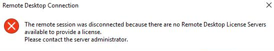
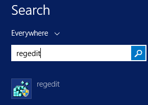
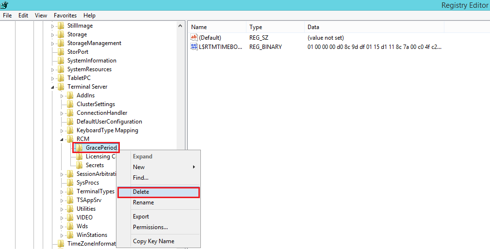

- 今天要用 RDP (Remote Desktop Connection) 登入 Windows Server 2012 R2 時，會跳出以下這個視窗，並顯示 The remote session was disconnected because there are no remote desktop license servers available，找了一下，網上的解法後發現有很多種，以下這個是我實測成功的方法：
P.S. 我的這台 Server 是 VM，因此用 RDP 無法進入時，還可直接從 VM 裡面進去。 

- 解決方法如下： 
 1. 在搜尋這邊打上 regedit 來打開 Registry editor 

 2. 依序進到 HKEY_LOCAL_MACHINE -> SYSTEM -> CurrentControlSet -> Control
    -> Terminal Server -> RCM -> GracePeriod

 3. 接著對著 GracePeriod 按下右鍵，選擇刪除。
 4. 刪除後會發現 GracePeriod 這個資料夾還在，但右邊的資料都會消失。
 5. 之後再將 Server 重開機就可以了 ( 重開後會看到右邊的資料又回來了 )。