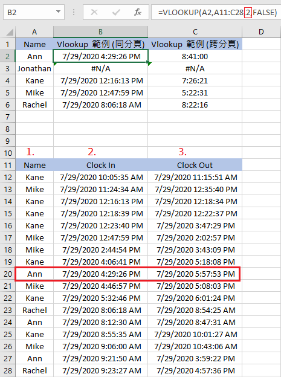
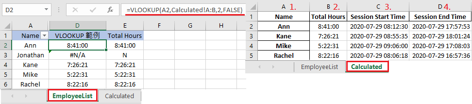
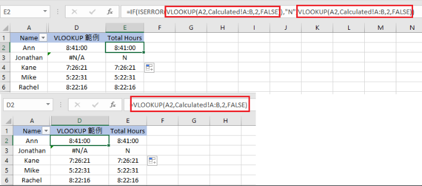

上一篇介紹了 [Match 函數](https://ycjhuo.gitlab.io/2020/08/03/How-To-Search-Data-What-You-Need-in-Excel-Introduce-MATCH-Function/)，可以幫我們在 Excel 中搜尋特定的值是否有出現過，以及出現在哪個位置。

那找到了那個值之後，是不是能直接將那個值貼到我們想要的位置上呢？這時候我們就會需要 VLOOKUP 這個函數來達成。

### VLOOKUP 函數

VLOOKUP 可以想成如 Google 搜尋，用特定欄位作為關鍵字去 其他欄位 或是 分頁 找跟 該欄位 相同 或 有關連 的資料。如果沒搜尋到的話，則會顯示 #N/A

```python
# 資料在同一頁的 VLOOKUP 函數 用法
# = VLOOKUP( 索引值, 搜尋範圍 : 搜尋範圍, 想取得值與索引值的相對欄位, VLOOKUP 類型)
# 中間的 搜尋範圍:搜尋範圍 (A11:C28) 表示搜尋 A11:C28 這個範圍
=VLOOKUP(A2,A11:C28,2,FALSE)

# 跨分頁 VLOOKUP 函數 用法
# 要搜尋其他分頁的話，只要在搜尋範圍 前面加上 分頁名稱!
# = VLOOKUP( 索引值, 分頁名稱 ! 該分頁的搜尋範圍 : 該分頁的搜尋範圍,  想取得值與索引值的相對欄位, VLOOKUP 類型)
=VLOOKUP(A2,Calculated!A:B,2,FALSE)
```

- 索引值：可以想成你要用來搜尋想要資料的關鍵字
- 分頁名稱；要搜尋資料的那個分頁名稱
- 搜尋範圍：要查找資料的範圍，通常是用該分頁的全部範圍，也可只單獨設定一列
    - 在同一頁的這個例子，我查詢的是 A11:C28 這個範圍
        - =VLOOKUP(A2,A11:C28,2,FALSE)
    - 在跨分頁的這個例子，查詢的範圍是 Calculated 這個分頁的 A, B 這二行
        - =VLOOKUP(A2,Calculated!A:B,2,FALSE)
- 想取得值與索引值的相對欄位：這個參數是用來判斷我們想要拿到的數值跟我們用來當作索引值的相對位置
    - 以下圖的例子來說：
        1. 我們在 B2 這欄使用 VLOOKUP 函數，將 A2 的 Ann 作為搜尋的關鍵字，在下面的這個範圍 ( A11 : C28 ) 找 Ann 這個值
        2. 找到後，因為我們真正想要的是 Ann 右邊的這一欄 ( Clock In ) 的數值，而這個欄位是在 Ann 的右邊一欄，因此 Ann 這欄就被當作 1, 而它右邊這欄就是 2
        3. 如果我們要取得的是 Clock Out 這個欄位的值，那這個參數，我們要打的值就是 3



- VLOOKUP 類型：分為 True 與 False，不打的話默認值是 True，通常都是設定成 False
    - True  ：近似搜尋，搜尋最接近的值
    - False：精確搜尋，要完全一模一樣才會顯示，若有多個以上的值，則以第一個找到的為主

### VLOOKUP 範例

- 下圖可以看到在右邊的 EmployeeList 分頁的 D 行，我們用了下面的函數，取得了 Calculated 分頁的B 欄 ( 每位員工的打卡總時數 )
- 若有找到該員工的資料的話，就傳回該欄位相對應的數值。在這邊因為我們函數的參數是設定 2 ，因此就會帶回第二欄 ( B 欄 ) 的數值，並存在 EmployeeList 分頁的 D2 中
- 在指定的範圍內 ( Calculated!A:B )，若找不到資料的話，則會顯示 #N/A

```python
# 在 EmployeeList 分頁的 B 行 我們用了下面的 Match 函數
# 來搜尋 Calculated 分頁中是否有 A2 - A6 的資料
# 有的話，則取這些欄位右邊的那個值 ( B 欄 )
# 用來搜尋的索引值從上到下分別為 A2 - A6

=VLOOKUP(A2,Calculated!A:B,2,FALSE)
=VLOOKUP(A3,Calculated!A:B,2,FALSE)
```




### VLOOKUP 配合 IF 使用

如果我們不想要傳回的值是 #N/A 的話，可以在 VLOOKUP 函數的外層加上 IF ( ISERROR )

- 它的意思是：假如我們裡面的 VLOOKUP 函數不成立 ( IS ERROR )的話，就顯示 N，反之如果是有找到資料的話就顯示我們想要的值
- 為了配合 ISERROR，我們必須在 ISERROR 裡面加上二個 VLOOKUP 函數，並在中間加上 "N"，或是任何你想要在找不到值的時候出現的字

```python
# 以上面的例子，將原本的 VLOOKUP 外面加上一層 IF ( ISERROR ) 整個公式會變成
# IF(ISERROR (原先的 VLOOKUP 函數), "N", (原先的 VLOOKUP 函數))
=IF(ISERROR(VLOOKUP(A2,Calculated!A:B,2,FALSE)),"N",VLOOKUP(A2,Calculated!A:B,2,FALSE))

# 因為 IF 裡面放的是 ISERROR，所以 VLOOKUP 找不到的話，表示條件成立，會顯示 N
# 當 ISERROR 條件不成立時，就會顯示我們想要的值
# 因此在整個函數裡面 我們才需要加上二個 VLOOKUP

```


