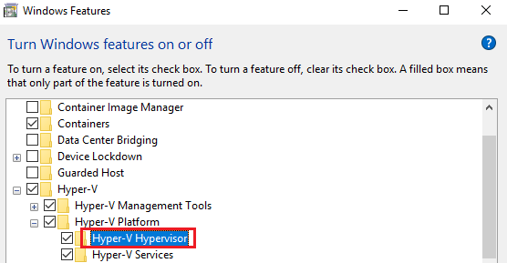

- 通常在 Windows 上安裝 Docker 都會遇到二個問題：
 1. You are not allowed to use docker you must be in the docker-users group
 2. Required Windows feature(s) not enabled: Hyper-V

### 將使用者加入 docker-users

- 在 Windows 上安裝完 Docker，要啟動時，若出現這個訊息的話：<br/>
```shellpoint
You are not allowed to use docker you must be in the docker-users group
```


- 是因為我們有針對電腦個別設定 User 權限，在安裝 Docker 時我們使用管理者權限。因此，我們須要先到 Computer Management 將目前使用的 Windows 帳戶加入 docker-users 裡面。
<font size=2>P.S. 在加入 docker-users 時，會要求 administrator 權限，加入帳號後須重開機才會生效</font>

<br/>

### 如何確認是否已啟用了 Hyper-V

- 若沒啟用 Hyper-V，在開啟 Docker 時會出現需要啟用 Hyper-V 的視窗。


- 以下步驟為如何在 Windows 中查看是否已啟用 Hyper-V：
 1. 先到 System Information 裡面去確認目前 Hyper-V 的狀態，從下圖可以看到 Virtualization Enabled in Firmware 是未啟用的狀態

 2. 接著我們到 Control Panel (控制台) -> Program -> Windows Features 裡面，可以看到 Hyper-V Hypervisor 是反灰的，無法勾選。因此下一步我們須到 BIOS 去啟用 Hyper-V <br/>
<br/>

### 如何進入 BIOS ( Windows 10 )
- 在 Windows 的 Settings -> Update & Security -> Recovery -> Advanced startup，就可以進入 BIOS。<br/>

- 在 BIOS 裡面我們需啟用 Virtualization Technology (VTx)，下圖是我的 BIOS 畫面，每個人的 BIOS 都不太一樣，但通常可以在 Security 或 Advanced 裡面找到。
 找到 Virtualization Technology (VTx) 後，將它勾選起來，儲存後離開 BIOS。


### 啟用 Hyper-V 後
- 在啟用了 BIOS 裡面的 Virtualization Technology (VTx) 之後，我們再回到 System Information 就可以看到原本沒有的 Virtualization-based 的這些項目現在已經都出現，且是 Running 的狀態。

- 之後我們再到 Control Panel (控制台) -> Program -> Windows Features 裡面，也可以看到 Hyper-V Hypervisor 已經變成可以勾選的狀態，並且可成功啟動 Docker 了。 <br/>


