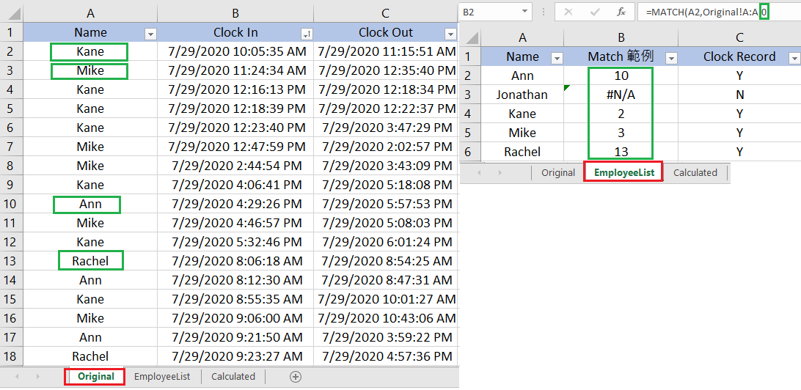
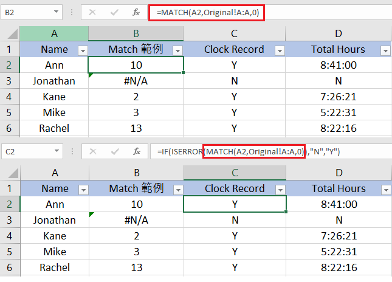

在 Excel 中，若要用一個特定欄位的值來搜尋那個值是否在 Excel 中有出現過，除了用 Ctrl + F 外，還有沒有其他的方法呢？或是我們想取得跟特定欄位在同一列的值，該如何做呢？

有二個函數可以容易的幫我們達成這個目標：Match 與 Vlookup，這篇就先來介紹 Match 函數的用法

### Match 函數

Match 可用來幫助我們在 Excel 上搜尋想要的資料有沒有在 Excel 中，可以想成如 Google 搜尋一樣，用特定欄位作為關鍵字去其他分頁找跟該欄位相同的資料。如果沒搜尋到的話，則會顯示 #N/A
```python
# 資料在同一頁的 Match 函數 用法
# = MATCH( 索引值, 搜尋範圍 : 搜尋範圍, Match 類型 )
# 中間的 搜尋範圍:搜尋範圍 (A:A) 表示搜尋 A 行

=MATCH(E2,A:A,0)

# 跨分頁 Match 函數
# 要搜尋其他分頁的話，只要在搜尋範圍 前面加上 分頁名稱!
# = MATCH( 索引值, 分頁名稱 ! 該分頁的搜尋範圍 : 該分頁的搜尋範圍,  Match 類型)

=MATCH(A2,Original!A:A,0)
```
- 索引值：可以想成你要用來搜尋想要資料的關鍵字
- 分頁名稱；要搜尋資料的分頁名稱
- 搜尋範圍：要查找資料的範圍，通常是用該分頁的全部範圍，也可以只設定搜尋一列
    - 在這個例子，我查詢的是 Original 這個分頁的 A 這一整行 ( Original!A:A )
    - 若要搜尋同一分頁的 A 到 C 這三行則是 A:C
    - 若要搜尋該 Original 分頁的 A 到 C 這三行則是 Original!A:C
- Match 類型：這個參數可打可不打，沒打的話預設是 1
    - 0 ：是傳回第一個找到的值
    - 1：取得最大值
    - -1：取得最小值


### Match 範例

下圖可以看到在右邊的 EmployeeList 分頁的 B 行，我們用了下面的函數，取得了 Original 分頁的各個員工是否有打卡紀錄。

有的話就顯示該員工第一次打卡的資料位置，例如 Ann 第一次打卡的位置是 A10，在 EmployeeList 分頁的 B2 欄位就顯示 10，若是找不到則顯示 #N/A

```python
# 在 EmployeeList 分頁的 B 行 我們用了下面的 Match 函數
# 來搜尋 Original 分頁中是否有 A2 - A6 的資料
# 用來搜尋的索引值從上到下分別為 A2 - A6

=MATCH(A2,Original!A:A,0)
=MATCH(A3,Original!A:A,0)
```


### Match 配合 IF 使用

如果我們只想知道該員工有沒有打卡的紀錄，而不在乎出現的位置的話，那我們可以在 Match 函數的外層加上 IF ( ISERROR )

- 它的意思是：假如我們裡面的 Match 函數不成立 ( IS ERROR )的話，就顯示 N，反之如果是有找到資料的話就顯示 Y
- 如此一來，我們就可以將原本 Match 顯示對應資料的索引值，直接改成顯示 Y 與 N，方便我們之後使用篩選功能

```python
# 以上面的例子來說，將原本的 Match 外面加上一層 IF(ISERROR (原先的 MATCH 函數), "N", "Y")
=MATCH(A2,Original!A:A,0)

# 因為 IF 裡面放的是 ISERROR，所以 Match 找不到的話，表示條件成立，會顯示 N
# 條件不成立時，才顯示 Y
# 這裡的 N 與 Y，可以自己打想要它成立時顯示的文字
=IF(ISERROR(MATCH(A2,Original!A:A,0)),"N","Y")

# 如果是以下面這串函數的話
# 則在下圖的 C 欄會顯示 沒來上班 ( 原本的 N )，以及 有來上班 ( 原本的 Y )
=IF(ISERROR(MATCH(A2,Original!A:A,0)),"沒來上班","有來上班")

```
