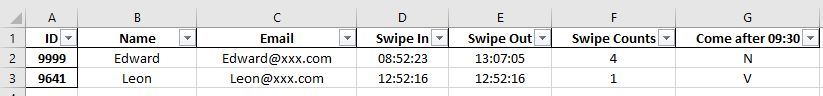
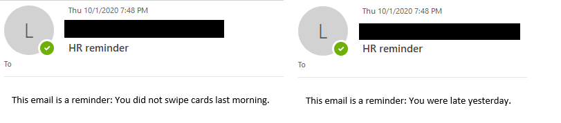

上一篇 [在 Pandas 中，如何使用 lambda 以及客制化 boolean 值](https://ycjhuo.gitlab.io/2020/08/21/How-to-use-lambda-customize-boolean-value-in-Pandas/) 我們提到可以利用 lambda 來將 boolean 值的 True, False 改成自己想顯示的方式。

這一篇跟大家介紹如何用 Python 寄信，配合 Pandas 篩選出來的條件，就可達成寄發通知信的效果。

### 從 dataframe 篩選名單
下圖是這次要讀取的 dataframe，裡面包含 ```Name, Email, 打卡時間 ( Swipe In )，下班時間 ( Swipe Out )，打卡次數 ( Swipe Counts ) 以及是否遲到 ( Come after 09:30 )``` 這幾個欄位。


```python
# Get file
readFile = r'C:\Users\009641\Desktop\Dairy Access Report\Access Report_9999.xlsx'
df = pd.read_excel(readFile)

# Get employee's emails who swipe less than twice
swipeLess2List = df.Email[df['Swipe Counts'] < 2].tolist()

# Get employee's emails who come late
comeLateList = df.Email[df['Come after 09:30'] == "V"].tolist()
```
- 第 6 行，用來篩選出刷卡次數 < 2 次的員工，取得 email 後存成 list，作為等等的收件者
- 第 9 行，用來篩選出遲到的員工，獲取 email 後存成 list，作為等等的收件者

- 若要取得刷卡次數 < 2 次的員工姓名則可用下面這行
```python
# Get employee's emails who swipe less than twice
swipeLess2List = df.Name[df['Swipe Counts'] < 2].tolist()
```
<br/>

### 設定郵件伺服器參數與寄信
上個步驟我們取得收件者後，設置好郵件伺服器後就來寄出郵件。

```python
### Mail Server Settings 
smtp_server = "mail.XXX.com"
port = 25
sender = "HR@XXX.com"

### Mail Messages
message1 = """\
Subject: HR reminder

This email is a reminder: You did not swipe cards last morning.
"""

message2 = """\
Subject: HR reminder

This email is a reminder: You were late yesterday.
"""

try:
    # Get mail server settings
    server = smtplib.SMTP(smtp_server, port)
    
    # Send mails
    server.sendmail(sender, swipeLess2List, message1)
    server.sendmail(sender, comeLateList, message2)

except Exception as e:
    # Print any error messages to stdout
    print(e)
finally:
    server.quit()
```
- 前 4 行，用來設定 mail server 的參數，port 一律都是 25。
- 7 - 11 行，為郵件的內容。
 - 第 8 行為信件主旨，第 10 行為信件內容。這裡要注意，主旨跟信件內容中間要空一格。否則信件內容將會無法顯示。
- 18 行幫我們將信件寄出，```server.sendmail``` 內的參數分別為：寄件者, 收件者, 信件內容

下圖為收件者會看到的內容，收件者無法看到是否有其他收件者也收到通知信。
 


 ### Source Code
 ```python
import pandas as pd
import smtplib

# Get file
readFile = r'C:\Users\009641\Desktop\Dairy Access Report\Access Report_9999.xlsx'
df = pd.read_excel(readFile)

# Get employee's emails who swipe less than twice
swipeLess2List = df.Email[df['Swipe Counts'] < 2].tolist()

# Get employee's emails who come late
comeLateList = df.Email[df['Come after 09:30'] == "V"].tolist()

<br/>

### Mail Server Settings 
smtp_server = "mail.XXX.com"
port = 25
sender = "HR@XXX.com"

<br/>

### Mail Messages
message1 = """\
Subject: HR reminder

This email is a reminder: You did not swipe cards last morning.
"""

message2 = """\
Subject: HR reminder

This email is a reminder: You were late yesterday.
"""

try:
    # Get mail server settings
    server = smtplib.SMTP(smtp_server, port)
    
    # Send mails
    server.sendmail(sender, swipeLess2List, message1)
    server.sendmail(sender, comeLateList, message2)

except Exception as e:
    # Print any error messages to stdout
    print(e)
finally:
    server.quit()
 ```
 