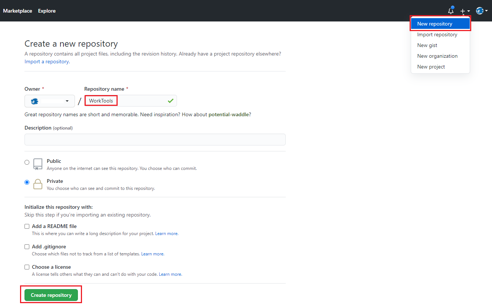
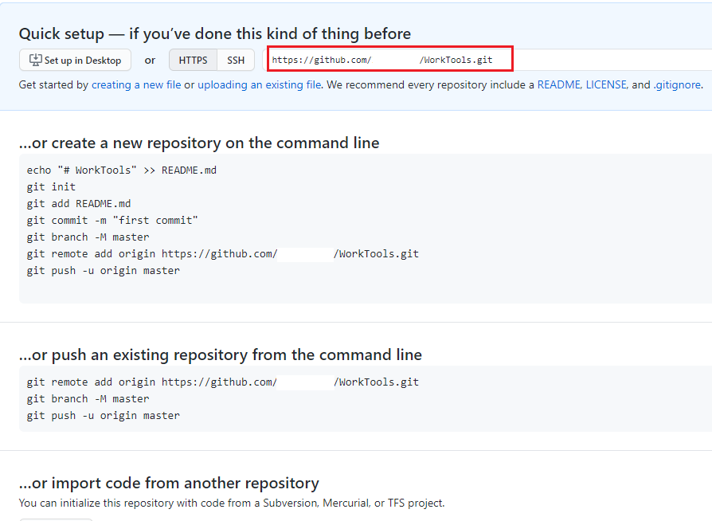
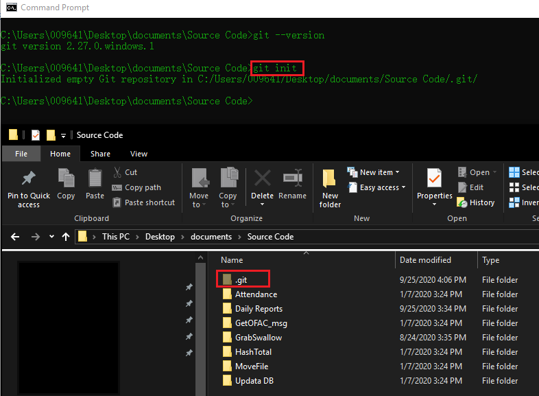
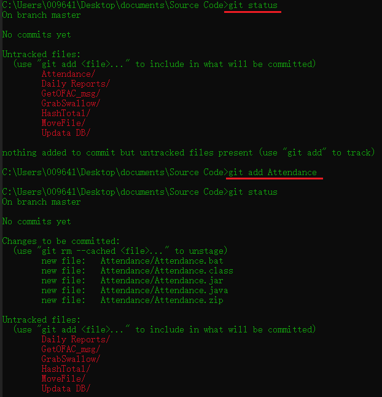
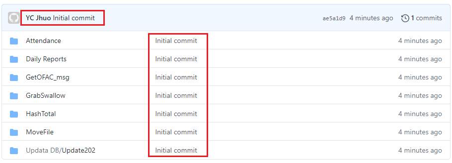

在上一篇 [如何建立自己的 Blog (3) 佈署 HEXO 到 GitLab 上](https://ycjhuo.gitlab.io/2020/09/21/How-To-Deploy-Blog-To-Gitlab/) 介紹了如何在 GitLab 上架設自己的部落格。這篇來介紹如何利用 GitHub 來備份自己的檔案。

### 下載 & 設定 Git
1. 要使用 Git 的第一步，我們先到[ Git 官網 ](https://git-scm.com/downloads)下載並安裝完成後，再使用這個指令來看看是否有安裝成功。
```powershell
$ git --version
```
 - 若成功的話則會顯示 Git 的版本
 - 失敗的話則顯示：

```
'git' is not recognized as an internal or external command, operable program or batch file.
```

2. 接著設定 git 的 user name &  email。若不確定之前有沒有設定過的話，可先用前二個指令查看目前設定
 - 之後若上傳檔案到 GitHub 的話，上傳者會顯示這個名字
 - email 可設可不設

```powershell
# Checking the config
$ git config --global user.name
$ git config --global user.email

#
$ git config --global user.name "XXXX"
$ git config --global user.email "XXXX"
```

### 申請 GitHub 帳號

1. 在 [Github](https://github.com/) 上建立帳號後，選擇右上角的 + 號，來建立一個新的 repository。
 - 這邊可以自己選擇 repository 的名稱，以及類型。( 這裡我是選擇 Private)

 <br />
2. 建立好 repository 後，頁面會跳轉到這裡，紅框的這部分為 repository 的位址。
 <br />

### 連接本機端的 Git 與 GitHub 上的 repository 

1. 接著我們到準備要上傳到 Github 的資料夾，輸入 ``` $ git init ```，就會看到資料夾裡面多了一個隱藏資料夾 .git。

 - 點進去 .git 資料夾後，打開 config 後會看到目前的設定值 ( 如下圖 )。
```powershell
[core]
	repositoryformatversion = 0
	filemode = false
	bare = false
	logallrefupdates = true
	symlinks = false
	ignorecase = true
```

2. 輸入下面的指令來將 GitHub 上的 repository 位址設定到本機的 Git 中。
```powershell
$ git remote add origin https://github.com/XXXX/WorkTools.git
```
 - origin 是這個 repository 的代名詞，可以換成自己喜歡的字
 - XXX 為 GitHub 的帳號

3. 設定好後，會看到 Git 資料夾的 config 中已經加上了 repository 的位址
 ```powershell
[core]
	repositoryformatversion = 0
	filemode = false
	bare = false
	logallrefupdates = true
	symlinks = false
	ignorecase = true
[remote "origin"]
	url = https://github.com/XXXX/WorkTools.git
	fetch = +refs/heads/*:refs/remotes/origin/*
 ```

### 將檔案到加進 Git 本機端
1. 建立好 config 後，我們可以用下面這行指令來查看現在資料夾底下，有多少檔案還沒被加進本機端的 Git 中。
```powershell
 $ git status
 ```
2. 接著用這個指令來將檔案加入本機端的 Git 中
 - XXX 表示 要加入 Git 的檔案
 - add . 表示將所有未加入 Git 的檔案一次加入進去
```powershell
 # Add file XXX
 $ git add XXX

 # Add all files
 $ git add .
 ```


3. 下面這個指令則是將這次的異動做個備註，這裡用 Initial commit 當作備註。
```powershell
$ git commit -m "Initial commit"
```
- git log 則可以看到本機的 git commit 紀錄。
 ```powershell
 $ git log
 ```
<br />

### 將本機端的 Git 上傳到 Github
最後，我們可以用下面這個指令將檔案上傳到 Github。上傳後回到 GitHub 網頁，就可以看到檔案都已上傳成功。
```powershell
 $ git push -u origin master
 ```

下圖可以看到，在 下載 & 設定 Git 這個步驟設定的 ```git config --global user.name "XXXX"``` 名稱出現在左上角。
中間的部分則是我們這次上傳的備註。 ```git commit -m "Initial commit"```

 

若要將檔案從 GitHub 下載到本機端的話，則可用 Pull 指令。
```powershell
$ git pull origin master 
```