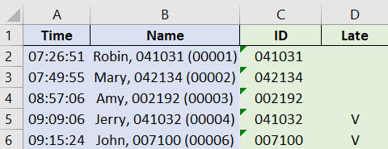
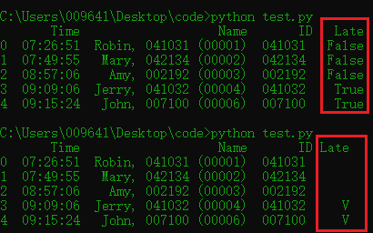

- 這次要來介紹如何在 dataframe 裡面，擷取欄位中的特定字元 ( 運用 lambda )，以及如何將 boolean 值的 true, false 改成自己想顯示的客製化字元

- 成果如下圖：A, B 欄為現有的 dataframe，我們的目標是產出 C, D 欄
 - C 欄是從 B 欄 (Name) 中單獨取出員工編號 ( ID )
 - D 欄則是用 A 欄 (Time) 來判斷哪位員工遲到




### Lambda

- Lambda ，又稱為匿名函數。通常只會用一次 ( 不像 def 做為多次使用 )，使用時要具備以下三點：

 1. 以 Lambda  作為開頭
 2. 後面接著要代入的參數 ( 可以有多個參數，用逗號隔開 )
 3. 要執行的判斷式 ( 只能有一個 )，前面要加冒號 ( : )

- 在這個例子中，我想在 Name 這一欄： Robin, 041031 (00001) ，取得員工編號 ( 中間的 6 碼數字 )，因此我在 apply 後面加上了 lambda ，並將 x 做為 name 欄位的參數，並用左括號做為基準，取得左括號前面七個字元到左括號這中間的值，也就是員工編號

```python
# 1. 以 Lambda  作為開頭
# 2. 後面接著要代入的參數：用 x 做為參數取得 name 欄位的值
# 3. 要執行的判斷式：x[x.index("(")-7 : x.index("(")]，來取得中間的員工編號
# Robin, 041031 (00001) -> 041031

# Get employee ID
eid = df['Person Name'].apply(lambda x:x[x.index("(")-7 : x.index("(")])
df['ID'] = eid
```
<br/>

### 轉換時間格式

- 在取得了員工編號後，我們想將 Time 欄位的時間格式從 12 小時制改為 24 小時制，在 pandas 中可以很容易的用一行達成
```python
# Convert time formal from 12 AM/PM to 24 hours
# 原本的 Time 格式 會從 8/20/2020  9:26:51 PM 自動轉為 8/20/2020  21:26:51
df['Time'] = pd.to_datetime(df['Time'], format='%Y-%m-%d %H:%M:%S').dt.strftime('%H:%M:%S')
```
<br/>

### 客制化 boolean 值

- 若我們將上班時間訂為 09:00，簡單的用以下這行就能找出所有超過 09:00 才打卡的員工，並將結果存到 Late 這欄。在 Late 這欄可以看到，若員工在 09:00 前打卡，就會顯示 False ( 表示沒有遲到 )。但若是超過 09:00 ，則會顯示 True ( 遲到 )

- 隨著員工人數增多，會讓表格變的較難一眼就判斷出來。因此我們可以用 ```getBoolean``` 這個變數來取得 dataframe 中的 True 與 False，再用 ```changeBoolean``` 變數將 Ture 改為 'V' ( 遲到 ), False 則用空白表示 ( 沒有遲到 )

```python
# Get who's late
df['Late'] = df['Time'] >= '09:00:00'

# Change True false to 'V' and ''
getBoolean = df.select_dtypes(include=[bool])
# 若你想將 True 和 False 改為其他的值，可以在這裡設定
changeBoolean = {True : 'V', False : ''}
for column in getBoolean:
    df[column] = df[column].map(changeBoolean)
```

- 下圖可看到自訂 boolean 值前後的差別：</br>

<br/>

### 完整程式碼

```python
import pandas as pd
from datetime import datetime, timedelta
from openpyxl import load_workbook

# Get files
# 這邊要改成放 excel 檔案的路徑
readFile = r"C:\Users\009641\Desktop\Clock\test.xlsx"
df = pd.read_excel(readFile)

# Get ID
eid = df['Name'].apply(lambda x:x[x.index("(")-7 : x.index("(")])
df['ID'] = eid

# Convert time formal from 12 AM/PM to 24 hours
df['Time'] = pd.to_datetime(df['Time'], format='%Y-%m-%d %H:%M:%S').dt.strftime('%H:%M:%S')

df['Late'] = df['Time'] >= '09:00:00'

# Convert True false to 'V' and ''
getBoolean = df.select_dtypes(include=[bool])
changeBoolean = {True : 'V', False : ''}
for column in getBoolean:
    df[column] = df[column].map(changeBoolean)

print(df)
```