在上週五（10/09），全美最大的美國運通百夫長貴賓室（The Centurion Lounge）在美國紐約的 JFK 機場開幕了！
在目前疫情仍未結束的時期，大多數的貴賓室都已暫時關閉。美國運通在這時開幕了這間貴賓室，真的造福了許多在這時期還須搭機的旅客。

JFK 機場為紐約周邊最大的機場，共有 6 個航廈（分別為第 1, 2, 4, 5, 7, 8），航廈之間依靠 AirTrain 串連。

### JFK 百夫長貴賓室
而百夫長貴賓室則座落在以國際線為主的第 4 航廈，過了安檢後，直走即可看到。

目前貴賓室的開放時間為早上 6 點到晚上 8 點。這麼長的開放時間滿足了大部分旅客的需求，可惜從 JFK 回台灣的長榮航空起飛時間是凌晨一點，看來回台灣時無法體驗到百夫長貴賓室了。 
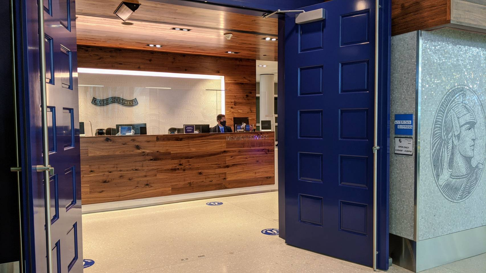
過海關就看得到的大門
 

百夫長貴賓室分為上下二樓，剛進來時是在樓上，往內走則有樓梯可以下樓。每樓都有供應食物，咖啡，酒。最近可能因為旅客較少而只在樓上有供應食物酒水，樓下則是純休息區。 

### 貴賓室樓上區域
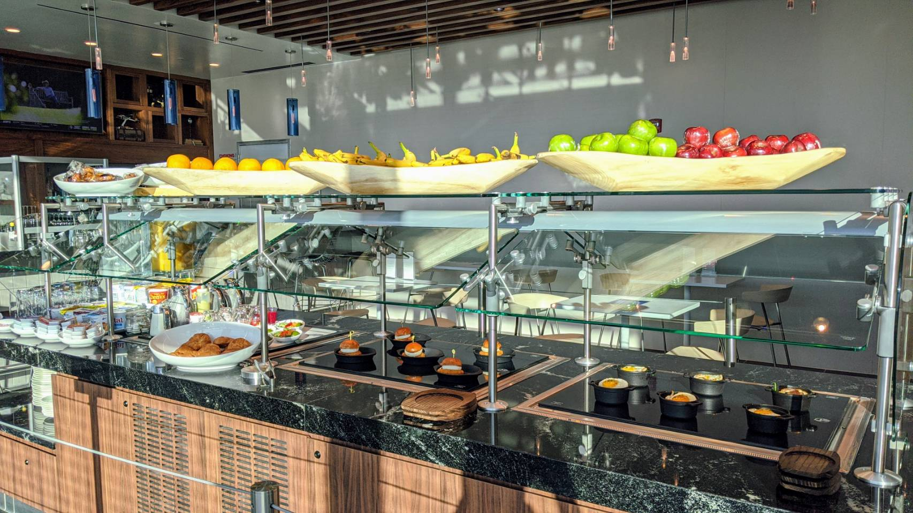
樓上的取餐區

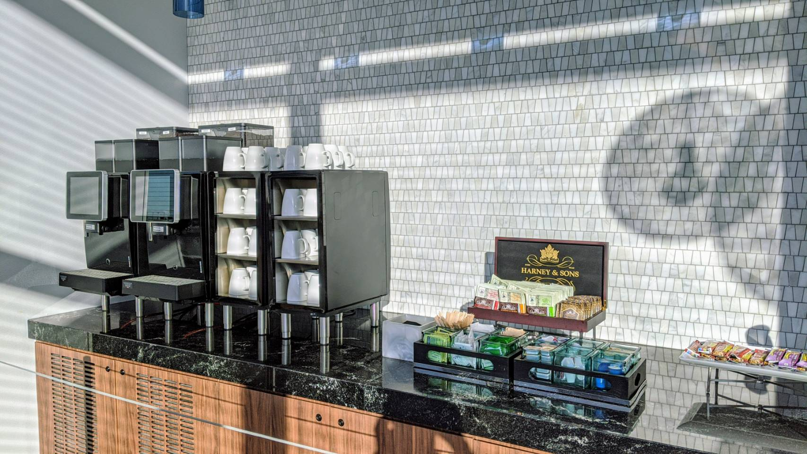
樓上的咖啡機

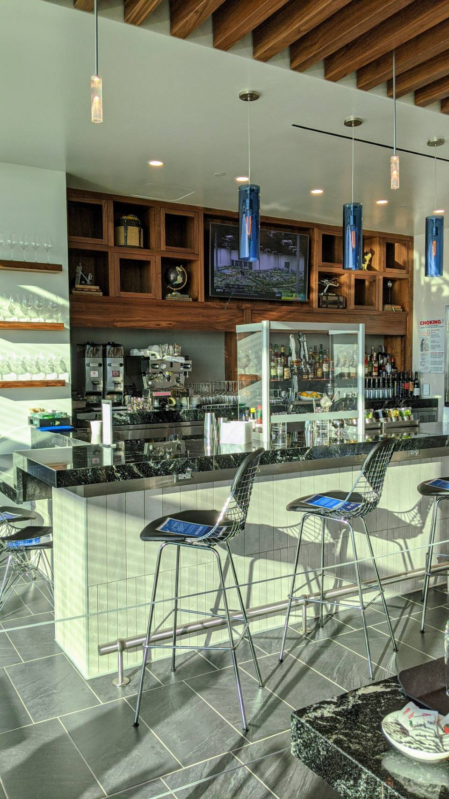
樓上的吧台區

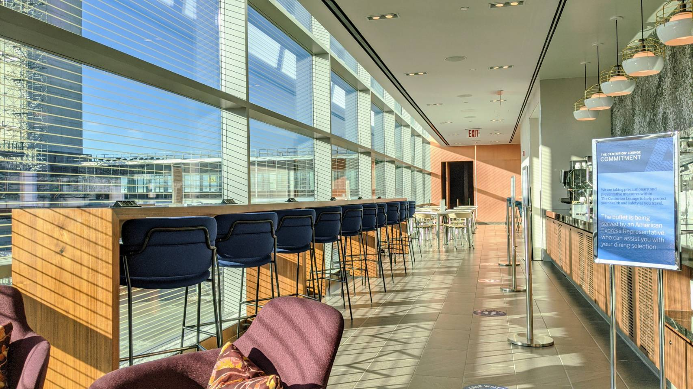
取餐區旁的座位

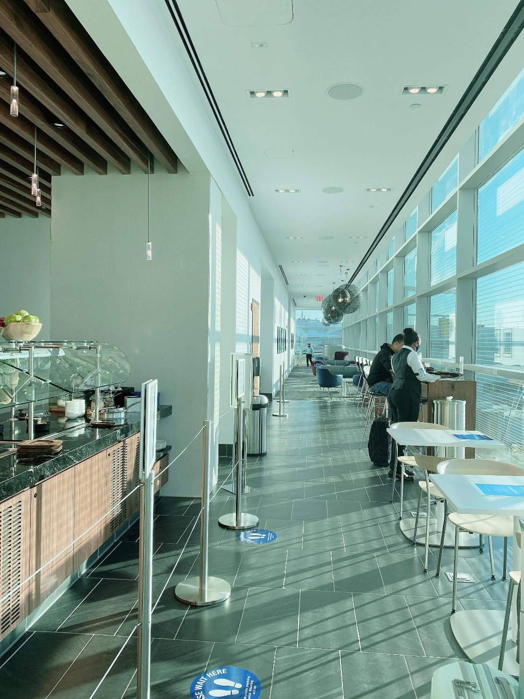
另一個角度的取餐區座位

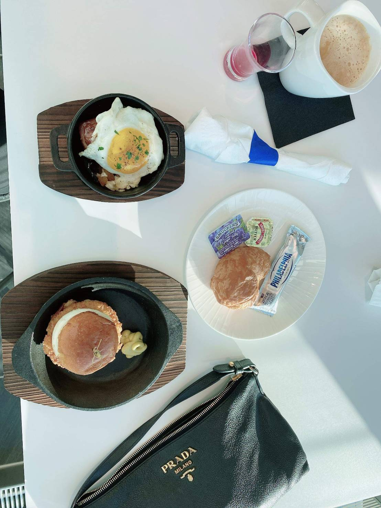
當日的餐點

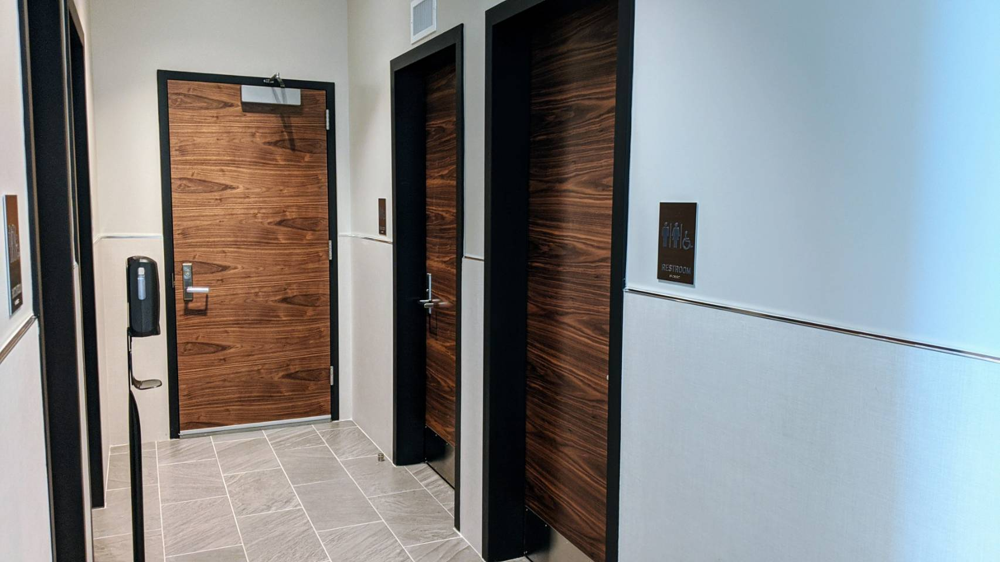
樓上化妝室共五間

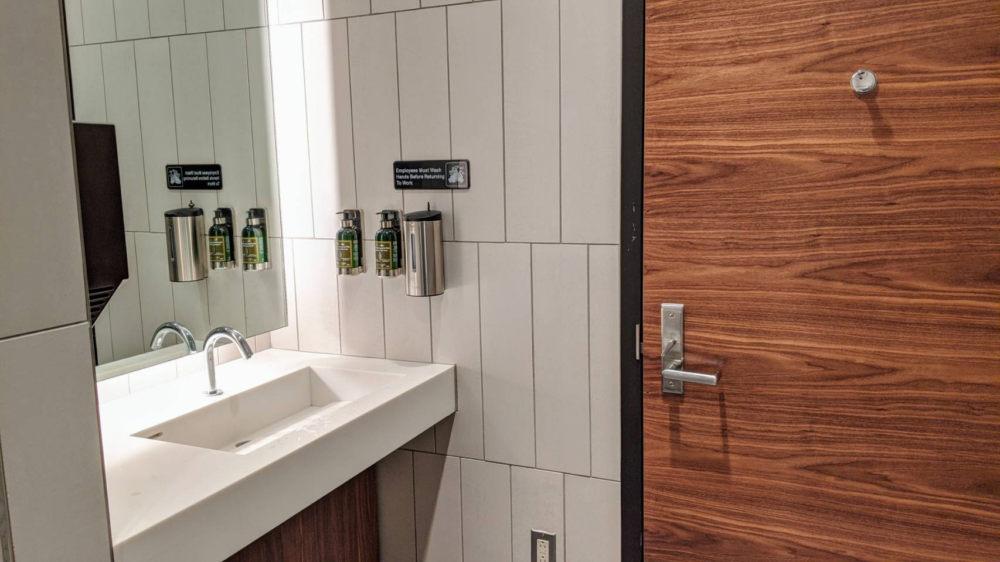
化妝室內部，空間很大，就算是輪椅進來也還很寬敞

### 貴賓室樓下區域
當天因為旅客很少，到了貴賓室樓下幾乎是沒有人的狀態，因為食物酒水在樓下都沒開放，所以就沒拍了。
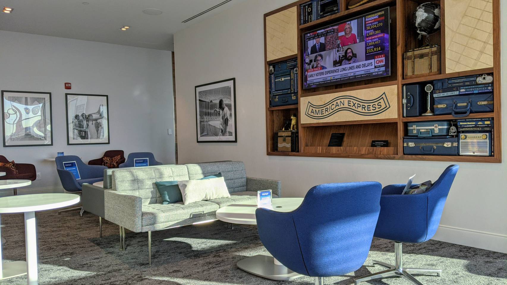
樓下休息區

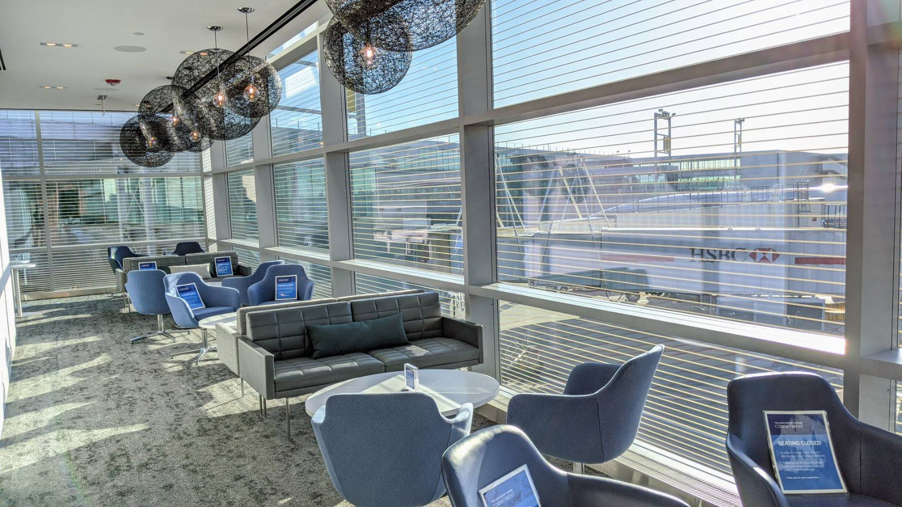
樓下休息區

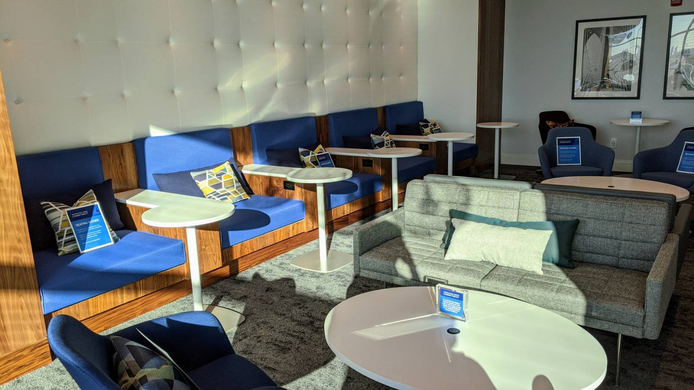
樓下休息區

### 不同航廈也能進入
這次有機會體驗百夫長貴賓室是因為要到西雅圖旅遊個幾天，剛好在出發前的一星期看到了百夫長貴賓室開幕的消息。在這多數貴賓室都暫時停止營業的情形下，讓我們對於這次旅行又多了一份期待。

我們這次是搭乘阿拉斯加航空前往西雅圖，阿拉斯加航空是位於第七航廈。一開始還很擔心不同航廈是否會在過海關時會被攔下，但事實證明是多慮了。

在前 24 小時，我們先透過手機 CHECK IN，到達機場後直接到第 4 航廈進行出關的安檢，海關人員實際上只檢查了護照，完全沒看手機上的 Boarding Pass ，就讓我們通過了。因為疫情期間，機場的旅客不多，讓我們大概只花了 10 分鐘就通過檢查。

通過安檢後，在進入百夫長貴賓室時，櫃臺人員會要求出示護照，Boarding Pass 以及美國運通的白金卡，並紀錄我們這次攜帶幾位旅客進入貴賓室。
檢查完畢後，還須先到旁邊的體溫偵測器量體溫，確保沒發燒情形才可進入。且不知道是不是剛開幕的關係，櫃檯人員還送了我一個美國運通的吊牌。
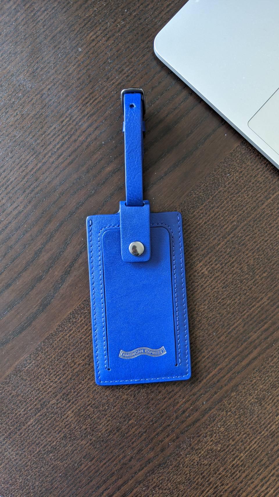
美國運通吊牌正面

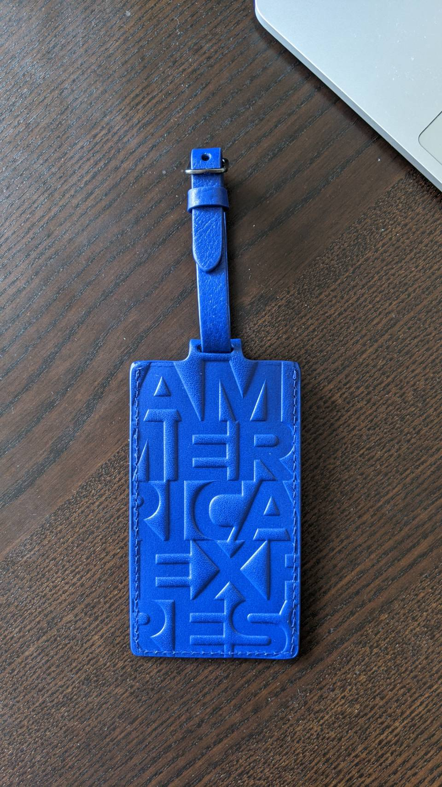
美國運通吊牌背面

### 後記
可能是早上八點的關係，整個貴賓室旅客不到五人，因此有專門的服務人員提供個別的全程服務。可直接在桌邊點餐，再由服務人員送上來。另外她們也很熱心的詢問我們是否須要來一趟貴賓室的導覽，並在一入座時就拿了一張貴賓室的名片給我們，上面印有貴賓室的 WiFi 密碼，對於網路只有 3G 流量的我，真的感到很貼心。

這次在 JFK 百夫長貴賓室的體驗非常的好，本來想說目前 JFK 的貴賓室都受疫情影響，暫時關閉，縱使有 PP 卡，也無用武之地。好在美國運通在我們出發前開幕了這家貴賓室。

因為後續還要趕到第 7 航廈登機，因此只待了 40 分鐘便匆匆離開。離開時大約是 9 點左右，搭乘 AirTrain 經過 2 站，就到了第 7 航廈。因為已有在手機上先行 Check IN，因此就可直接到進行安檢的地方。

沒錯，雖然我們在第 4 航廈已經安檢過了一次，但更換航廈還是須再安檢一次。所幸我們都只各帶一個 Carry on 行李箱，且第 7 航廈空無一人，我們在 5 分鐘以內就通過安檢。距離我們 10 點的飛機還有至少半小時的緩衝時間。

本次達成阿拉斯加航空時，服務人員在機上還發放信用卡申請書給有興趣的旅客。

三個月內刷滿 $2000，即可得到 $100 Statement Credit 跟 42k 阿拉斯加哩程，對比目前官網上的 $100 + 40k，只也多了 2k 哩程，沒有特別的吸引力。況且現在還有機會刷出 65k Mile 的 offer（ 但前三個月須消費 $8000+ ）。

