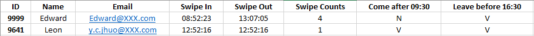

上一篇 [如何用 Python 寄送郵件 ( Email )
](https://ycjhuo.gitlab.io/2020/10/01/How-To-Send-Mails-By-Python/) 提到了如何利用 Python 寄送通知信。 那如果要寄給多個人，且信件內容要依據收件人的不同來客制化的話，該怎麼做呢？
<br/>

### 取得 Dataframe 及設定 Mail Server

下圖是這次會用到的寄送名單，欄位除了基本資料外，還有 ```Swipe In ( 上班打卡 )，Swipe Out ( 下班打卡 )，Swipe Counts ( 總打卡次數，小於二次為忘了打卡 )，Come after 09:30	( 遲到 )，Leave before 16:30 ( 早退 )```。



下面這段程式碼為取得 Excel 中的資料、 Mail Server 的相關設定 及 設定寄件人。
```python
getFile = r'C:\Users\009641\Desktop\Book1.xlsx'
df = pd.read_excel(getFile)

### Email Server Settings 
smtp_server = "mail.XXX.com"
port = 25
sender = "HR@XXX.com"
```


再來是篩選出遲到或早退的名單，並將這些名單儲存到 ```receiversDf``` 中。
```python
# Get receiver dataframes
comeLate = df[df['Come after 09:30'] == "V"]
leaveEarly = df[df['Leave before 16:30'] == "V"]

# Concatenate 2 condition dataframes
receiversDf = pd.concat([comeLate, leaveEarly])

receiversDf = receiversDf.fillna("")
```
下圖為 receiversDf 的內容。

<br/>

### 自訂郵件訊息

下方為本次要寄發的通知信內容，這邊要注意第一行的主旨下面要空一行再打內容，不然主旨會無法顯示在郵件中。
被 { } 包起來的為稍後要放進去的參數。
```python
### Mail Messages
message = """Subject: Notice-Missing swipe record of your badge


Dear Employee,

This e-mail is a notice that the system shows your swipe records are not complete.
\n\n

Name:  {name};    Swipe In:  {sIn};    Swipe Out:  {sOut} \n
Come after 09:30:  {come}
Leave before 16:30: {leave}
"""
```
<br/>

### 寄出郵件

這裡先宣告一個空的 list 來存放等等要發送的收件人。
用一個 for in 迴圈將剛剛篩選出來 遲到 早退 的 ( receiversDf ) 資料抓出來。

因為同一個人可能同時符合 遲到 且 早退 的條件，為了不讓他收到重複的二封信，這邊用 getReceiveCols[2] 來取得收件人的 email，若該 mail 已在 ```receiverList``` 中可找到的話，就顯示訊息 ```The receiver duplicated```

否則的話，就寄出該封通知信，並將 mail 加入 ```receiverList```。
sendmail function 裡面的 message.format 可將該收件人的相關資料，用 ```name, sIn, sOut``` 等變數傳到通知信的 Message 中，達到每封通知信都可記錄該收件的人相關訊息。

```python
receiverList = []
try:
	
    # Get mail server settings
    server = smtplib.SMTP(smtp_server, port)
    
    # Send mails
    for index, row in receiversDf.iterrows():
        getReceiveCols = row['ID'], row['Name'], row['Email'], row['Swipe In'], row['Swipe Out'], row['Swipe Counts'], row['Come after 09:30'], row['Leave before 16:30']

        # Don't send to dupicate receivers
        if getReceiveCols[2] in receiverList:
            print("The receiver duplicated")
        else:
            server.sendmail(sender, getReceiveCols[2], message.format(name=row['Name'], sIn=row['Swipe In'], sOut=row['Swipe Out'], come=row['Come after 09:30'], leave=row['Leave before 16:30']))
            receiverList.append(getReceiveCols[2])
            print("Sent to " + getReceiveCols[2])
    

except Exception as e:
    # Print any error messages to stdout
    print("Exception: ", e)
finally:
    server.quit()
    print("Finished")
```

寄出後的結果如下圖；

<br/>

### Source Code
```python
import pandas as pd
import numpy as np
import smtplib

getFile = r'C:\Users\009641\Desktop\Book1.xlsx'
df = pd.read_excel(getFile)

### Email Server Settings 
smtp_server = "mail.XXX.com"
port = 25
sender = "HR@XXX.com"

# Get receiver dataframes
comeLate = df[df['Come after 09:30'] == "V"]
leaveEarly = df[df['Leave before 16:30'] == "V"]

# Concatenate 2 condition dataframes
receiversDf = pd.concat([comeLate, leaveEarly])

receiversDf = receiversDf.fillna("")
print(receiversDf)
### Mail Messages
message = """Subject: Notice-Missing swipe record of your badge


Dear Employee,

This e-mail is a notice that the system shows your swipe records are not complete.
\n\n

Name:  {name};    Swipe In:  {sIn};    Swipe Out:  {sOut} \n
Come after 09:30:  {come}
Leave before 16:30: {leave}
"""

receiverList = []
try:
	
    # Get mail server settings
    server = smtplib.SMTP(smtp_server, port)
    
    # Send mails
    for index, row in receiversDf.iterrows():
        getReceiveCols = row['ID'], row['Name'], row['Email'], row['Swipe In'], row['Swipe Out'], row['Swipe Counts'], row['Come after 09:30'], row['Leave before 16:30']

        # Don't send to dupicate receivers
        if getReceiveCols[2] in receiverList:
            print("The receiver duplicated")
        else:
            server.sendmail(sender, getReceiveCols[2], message.format(name=row['Name'], sIn=row['Swipe In'], sOut=row['Swipe Out'], come=row['Come after 09:30'], leave=row['Leave before 16:30']))
            receiverList.append(getReceiveCols[2])
            print("Sent to " + getReceiveCols[2])
    

except Exception as e:
    # Print any error messages to stdout
    print("Exception: ", e)
finally:
    server.quit()
    print("Finished")
```