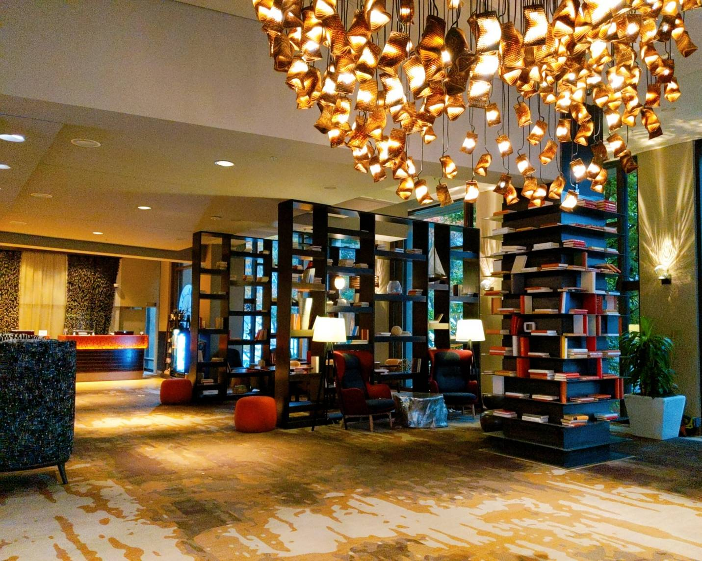
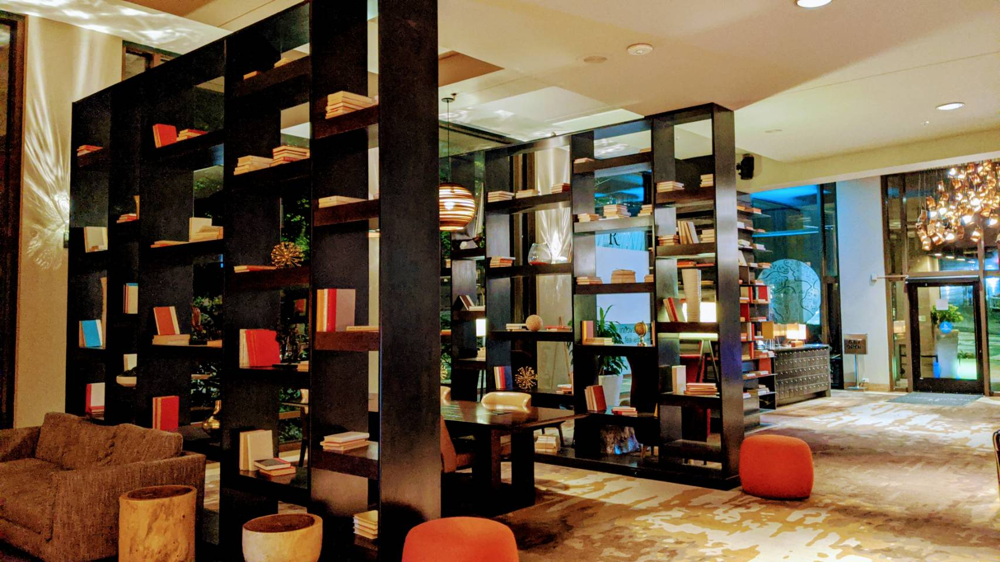
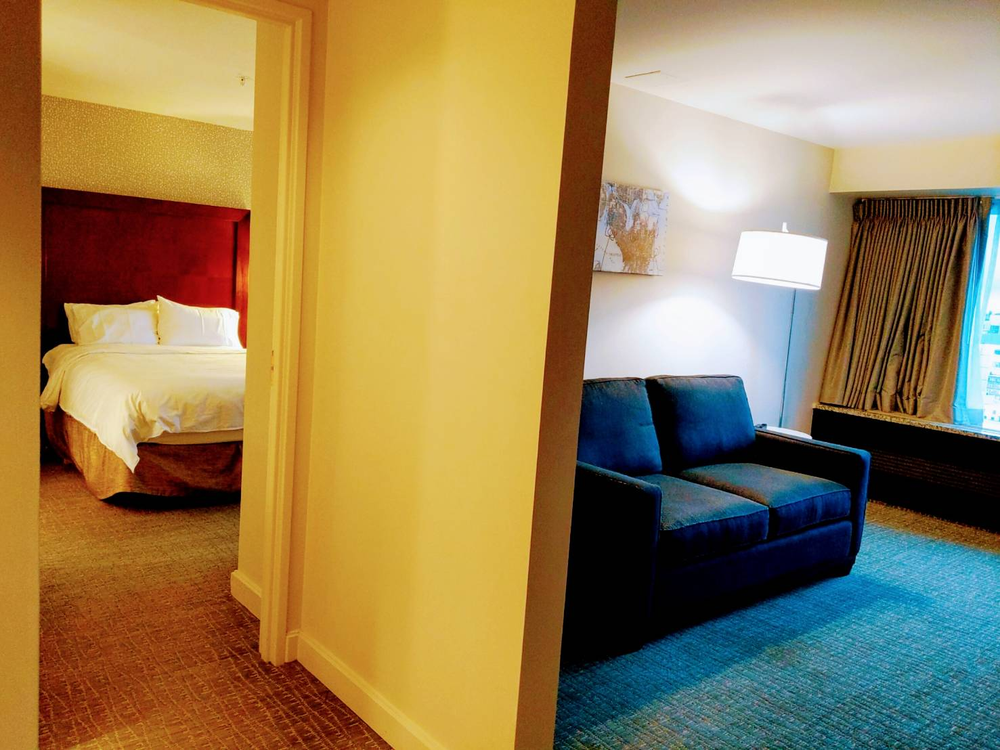
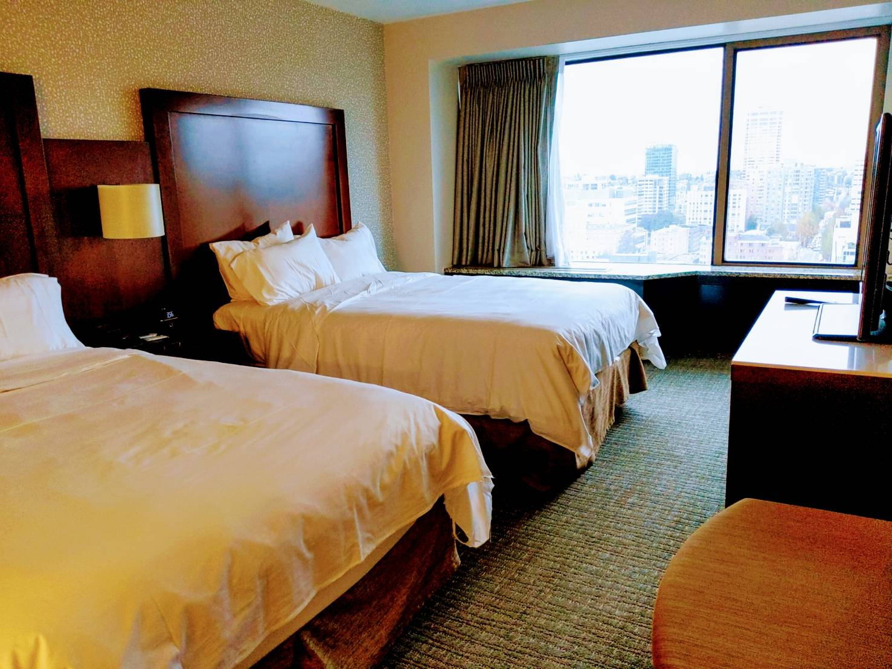
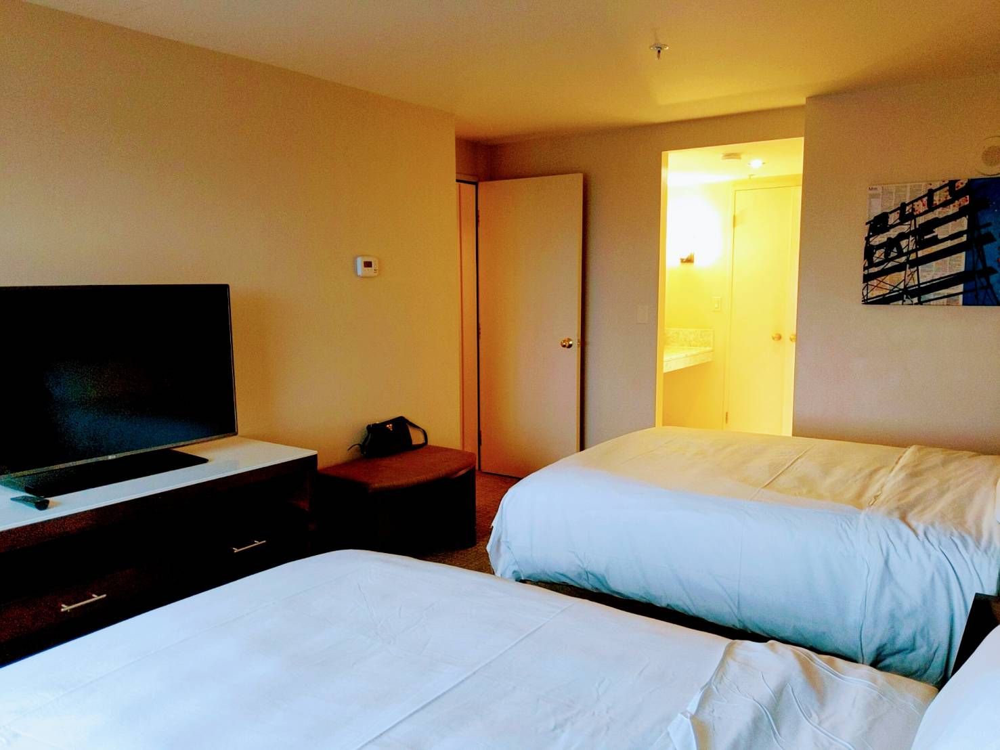
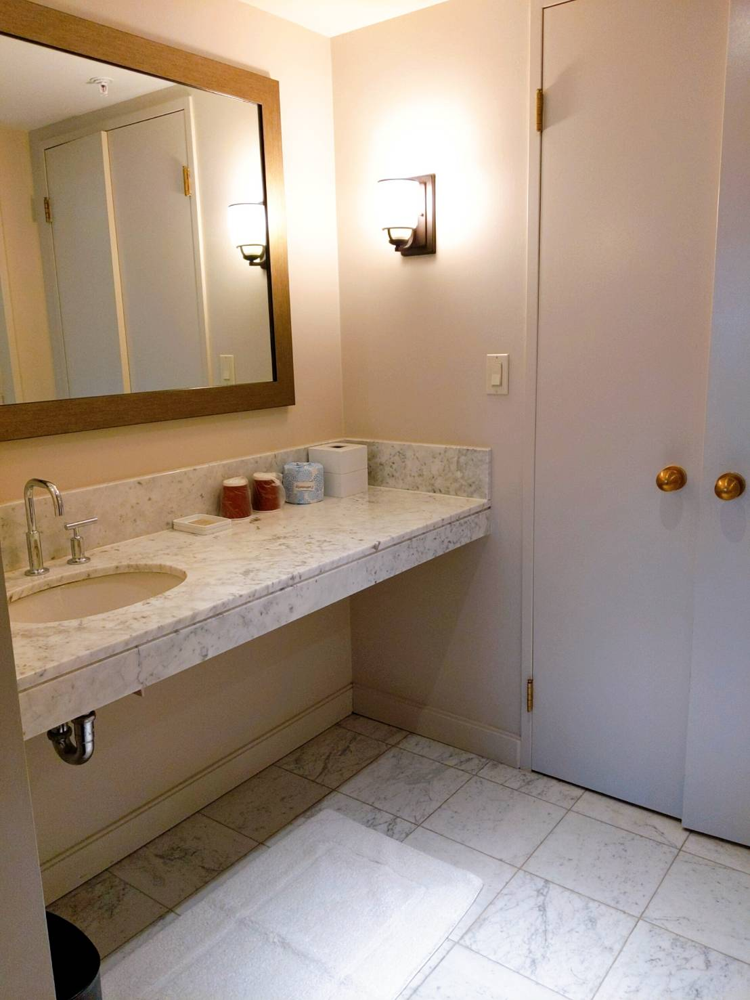
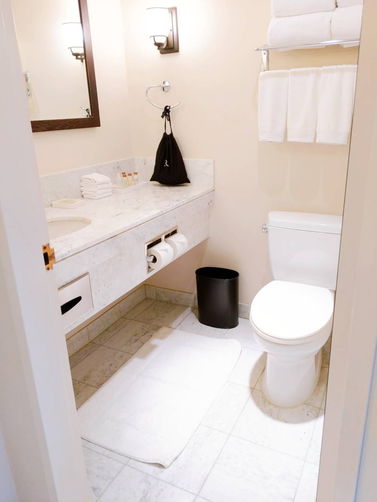
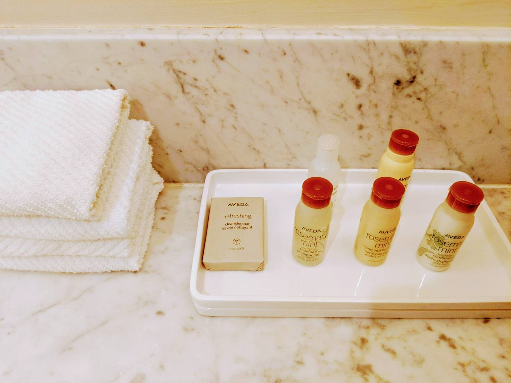

這次西雅圖之旅我們選擇了在 Google 評價上 4.4 顆星（ 2,800+ 評論 ）的萬豪四星酒店 Marriott Renaissance Seattle Hotel。

其實萬豪在西雅圖市區有不少選擇，價位較接近的有：Courtyard by Marriott Seattle Downtown/Pioneer Square（ 3 星 ）與 W Seattle（ 4 星 ）。價位從高到低分別為：W Seattle > Renaissance Seattle > Courtyard by Marriott Seattle。

依據地理位置來選擇的話，我會偏向 Renaissance Seattle 與 W Seattle。雖然 Courtyard 離 Pioneer Square 很近，但若晚上時經過那裡，總會有種覺得危險的感覺，可能是這邊晚上比較暗。最後選擇了 Renaissance Seattle Hotel 是因為受到官網上的 Lobby 照片所吸引。

### 地理位置
Renaissance Seattle Hotel 就位於交流道旁邊，如果是開車來的人會覺得比較方便。但若是走路來的人可能就要考慮一下，西雅圖的地形不能算是平坦，在接近飯店時 有一段陡坡，我每次在走這段時，都在想當初為什麼會選擇 Renaissance。

Renaissance Seattle Hotel 位於第六大道（6th Ave）上。從第六大道要走到熱門景點派克市場（ Pike Place Market ）的第一大道（1th Ave），雖然走路只要 15 分鐘左右。但坡度之陡，會讓你完全不想再走第二遍。

第六大道算是市區中比較高的地方，依序往下到第一大道，高度則越來越低。因此每次出飯店前往其他景點一定都是下坡，但只要想到回來時要經歷這個上坡，就會完全摧毀想走出飯店的念頭。

但好處是距離西雅圖中央圖書館（Seattle Public Library-Central Library）很近，走路只要不到三分鐘就可到達。
中央圖書館獨特的建築特色，不管是在外面或裡面都是個很好拍照的地方。
 

### 大廳
一進入大廳，完全就跟官網的照片一樣，迎面來的書架，讓整個飯店添加了藝術氣息。

一進入大門的角度
 

從 Check In 櫃檯面向大門的角度
 

大廳旁還有工作區及星巴克，可讓人點杯咖啡，帶上筆電就能消磨一整個下午。可惜這次去是在疫情期間，工作區及星巴克都處於關閉狀態，且也沒提供早餐。不過我本身也只是萬豪的金卡會員，無法享受到萬豪的早餐福利。
 

### Check In
當天我們是從希爾頓的 The Charter Hotel Seattle, Curio Collection by Hilton 搬過來 Renaissance，大約早上十點就已經到了櫃檯 Check In，那時想說時間這麼早應該無法 Check In，就詢問櫃台是否能先將行李寄放在這邊。沒想到櫃檯在核對身份後就說我們的房間已經準備好了，隨時都可入住。

猜想可能是疫情期間，住宿的人不多，才可以讓我們在早上就入住。想到這邊，決定趁著這個機會，再禮貌地詢問櫃檯今天是不是有機會可以升級房間，如果現在沒有可升級的房間，我們可以等到下午有的話再 Check In。

沒想到櫃檯居然直接說沒問題，現在就有一間適合我們的房間可以馬上讓我們入住。於是我們就從原本訂的 Guest room, 2 Double 升級成類似 2 Double Beds, City View, Suite 這個房型（猜測的，在官網找不到這個房型）
 

### 房間
之所以會猜測大概是 Suite 房型，是因為一進入房間，就可以看到房間中間有道牆將房間分隔了沙發區及寢室區，且浴室也有二間（但只有一間能沐浴），電視也也是二個區域各一台。

一進入房間
 

房間面向床
 

左邊的門出去是沙發區，右邊亮燈的則是浴室的洗手台
 
 

### 浴室
因為沙發區跟寢室區的浴室是一樣的，這邊就只呈現寢室區的。

雖然這次有二間浴室，但空間其實並不大，也沒有乾濕分離，而是浴缸搭配浴簾的組合。跟前一天住的 Hilton The Charter Hotel Seattle （同為四星飯店）相比之下， The Charter 的浴室雖然只有一間，但空間比 Renaissance 這二間加起來還大，且具備乾濕分離。

讓我選擇的話，我會選擇 Charter。但 Renaissance 在備品方面板回一城，用的是 Aveda 的備品。

浴室外的洗手台
 

浴室內部
 

備品是 Aveda 
 
 

### 後記
目前飯店都不會主動提供牙膏/牙刷，室內拖，熱水壺等設備，但有咖啡積及膠囊/茶包，不確定是否為疫情的關係。但這些不提供的物品都可透過萬豪 App 裡面的 Chat 功能來聯繫櫃檯提供。這點目前希爾頓也一樣。

以這個價位來比較的話，希爾頓的 The Charter 與萬豪的 Renaissance 其實算是同一個等級，也都是四星。若要從中選擇一個的話，我會選擇 The Charter。

儘管這次在 Renaissance 有升級到類似 Suite 的房型，但在房間的內裝上就能感覺 The Charter 贏了 Renaissance 不少。但大廳的話則相反，Renaissance 的大廳真的很漂亮。

不過最大的原因還是 Renaissance 真的太陡了，沒想到這點居然會成為最關鍵的原因。
