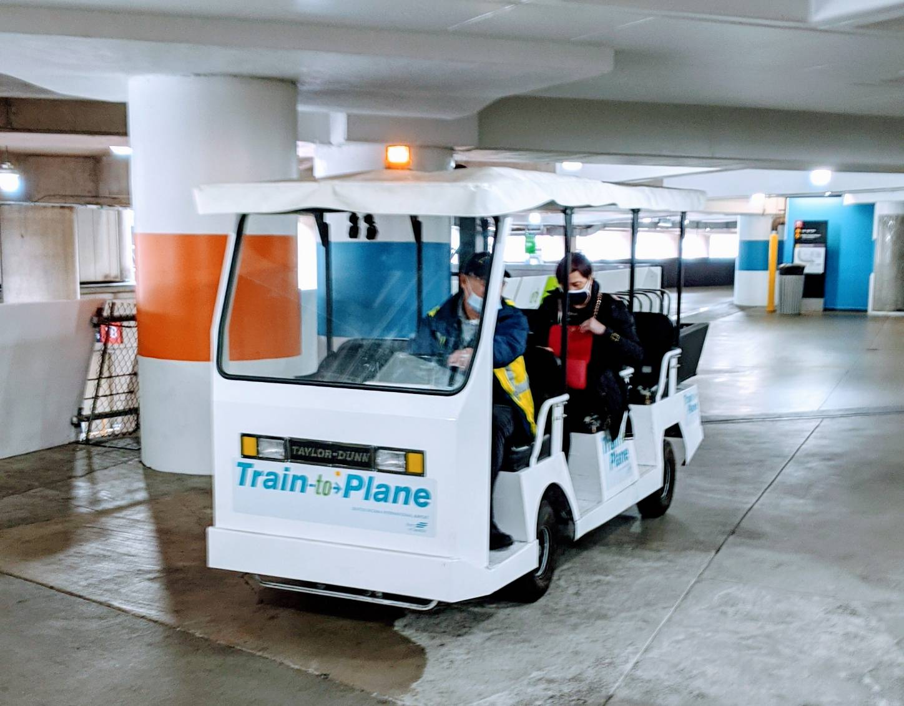
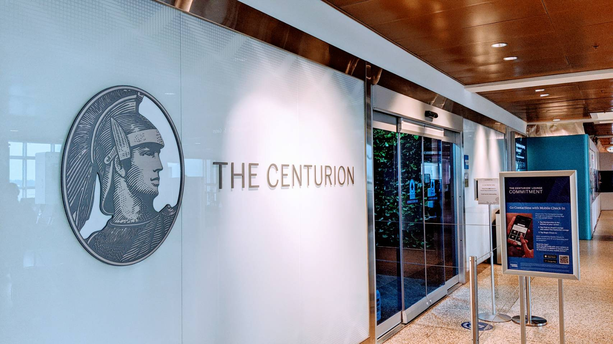
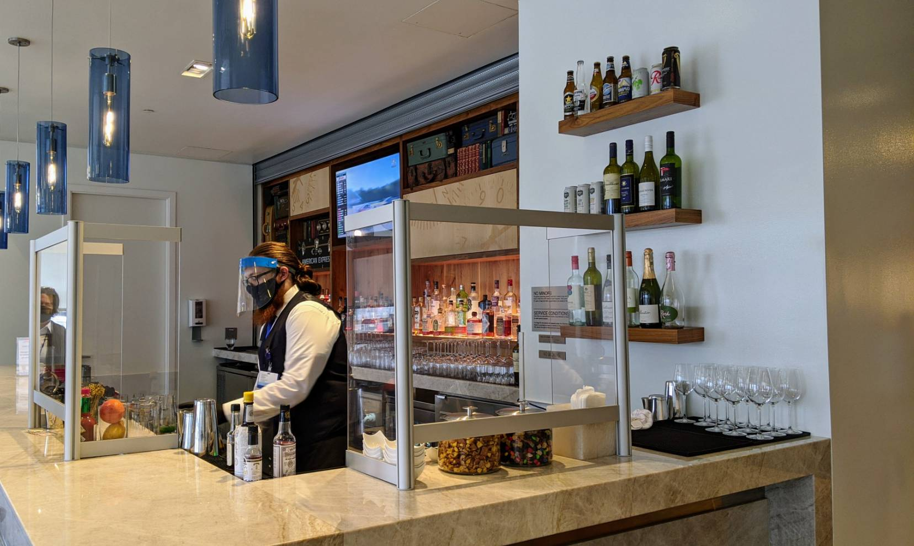
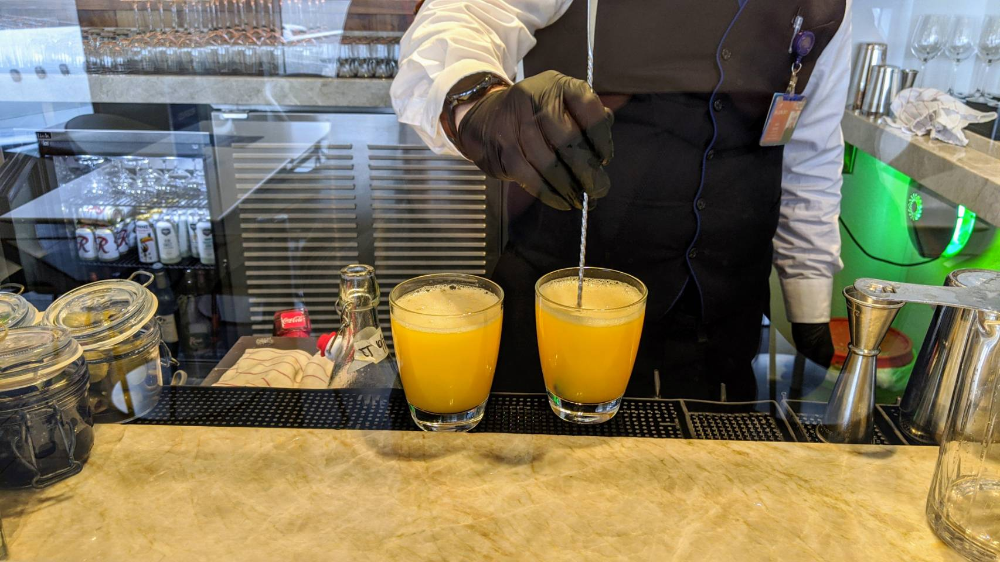
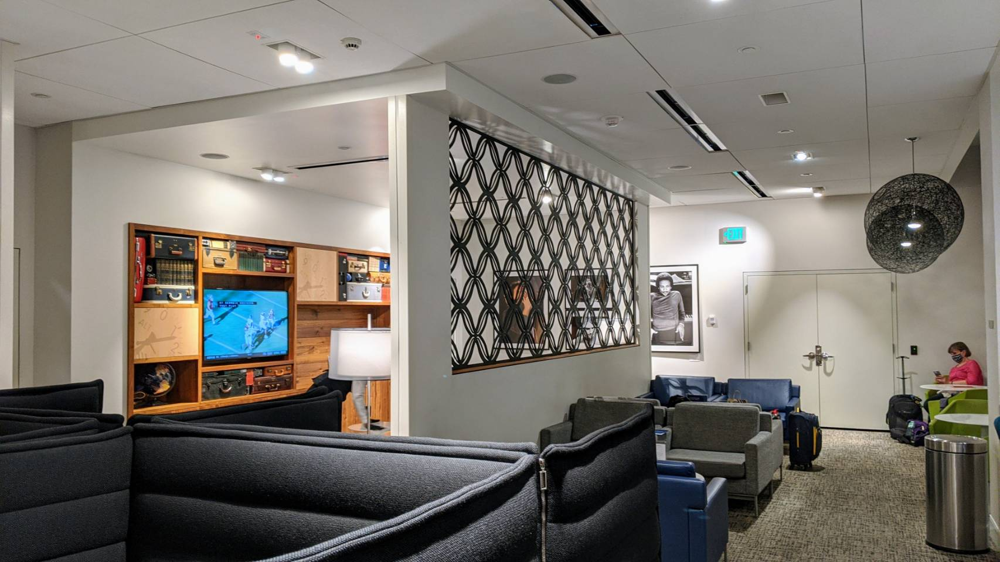
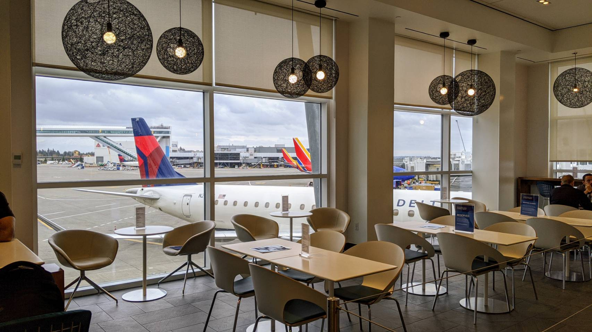
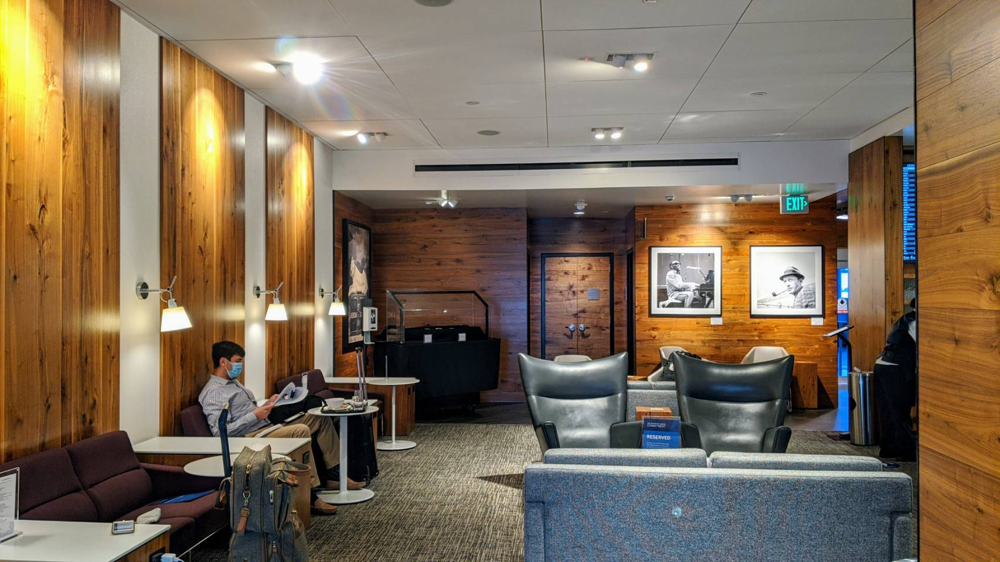
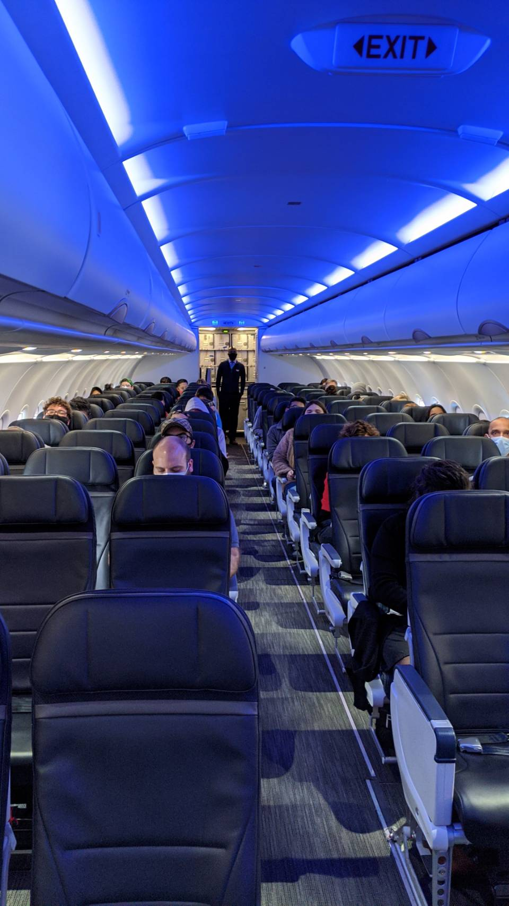
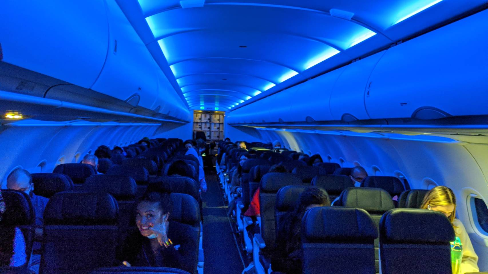
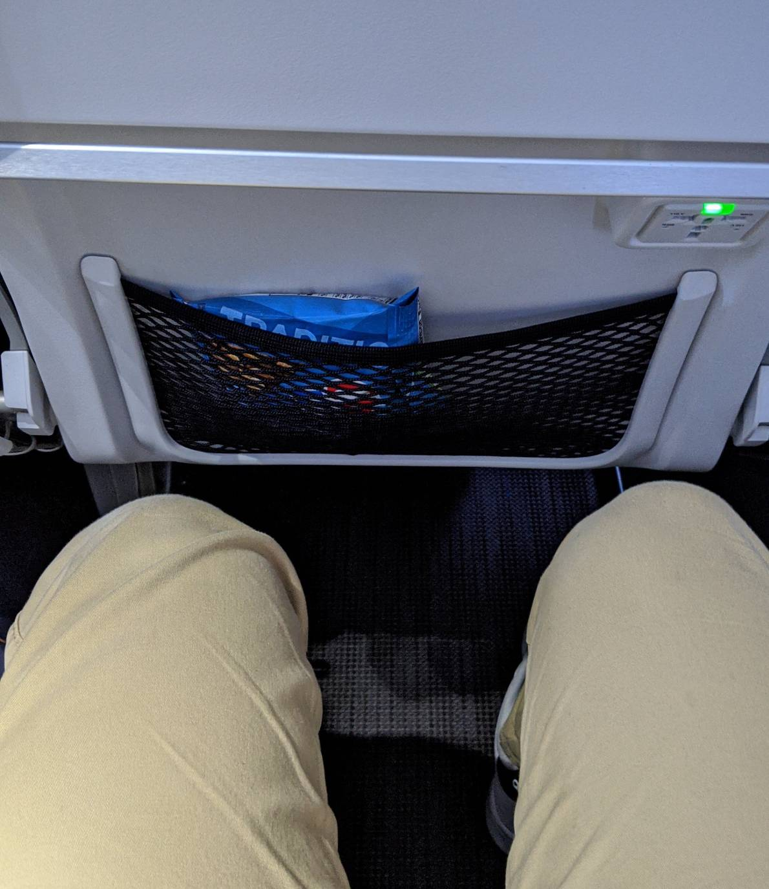

這次搭乘西雅圖（SEA）往紐約（JFK）的阿拉斯加班機，剛好可以利用這次機會體驗位於西雅圖 SEA 機場的美國運通百夫長貴賓室（The Centurion Lounge）。

在出發前往機場時，剛好遇到輕軌某些路段在進行維護，在服務人員的引導下，我們先搭輕軌的接駁車一段時間後，才轉乘輕軌直達機場。

### 剩下八分鐘就要登機了
我們的班機登機時間為 13：55，起飛時間而 14：35。而我們到達輕軌的機場站時已經是 13：47，距離可以登機時間只剩 8 分鐘。

所幸，一下了輕軌後，剛好有看到往返輕軌及登機大廳的小接駁車。讓我們可以節省了 5 - 10 分鐘的走路時間。

謝謝你接駁車（太過著急都來不及對焦）
 

因為還在疫情期間，排隊等待安檢的人並不多。在已經提前用手機 Check IN 的狀態下，我們可以直接前往海關處安檢。

過了安檢後，時間已經來到 14：00，到了可登機的時間，距離飛機起飛只剩半小時。我們的登機門是在 D4，而美國運通貴賓室則是在 B2，估計一下距離，走路大概也是 5-10 分鐘左右。在腦海中想了 3 秒後，覺得如果又去貴賓室的話，應該會趕不上飛機。
所以馬上決定，
要用跑的去貴賓室（本來想用走的）才來得及啊 ！！！衝衝衝，直奔 B2 的百夫長貴賓室。 

### SEA 百夫長貴賓室

在檢查護照，登機證及美國運通白金卡後，就由親切的服務人員帶領進入貴賓室了。
四天前在 JFK 的百夫長貴賓室多了一個量體溫的步驟才可進入，西雅圖這裡這裡居然不用（還好不用量，不然剛跑完一段路的體溫，肯定會過高）。
上網查了一下近七天的 COVID-19 Cases：西雅圖所在的華盛頓州：4,636，紐約市：2,792。
不愧是紐約市，在 CDC 網頁上還有從紐約州獨立出來的 Case 數，難怪那時會需要先量體溫。

西雅圖（SEA）百夫長貴賓室大門
 

西雅圖貴賓室只有一層樓，相比 JFK 的小了許多。食物及調酒也只有一區，JFK 則是上下樓都各有一個食物區及調酒區。

但西雅圖貴賓室在食物的選擇上明顯比 JFK 多了許多，不知道是不是因為中午時段（在 JFK 時是早餐時段）。

為了確保食物的安全，餐點一律都不能自取，而是告知服務人員想要的餐點後，由他們夾取裝盤後再送上來。

調酒人員則除了必要的口罩手套之外，還戴上了面罩，不得不說貴賓室在防疫這塊真的做的很用心。
（不過因為很怕趕不上飛機，進來拍完照喝杯柳橙汁就走了。沒有機會體驗一下看起來很好吃的餐點，也忘了拍餐點區的照片）

不只口罩手套，調酒人員連面罩都有
 

點了柳橙汁加氣泡水
 

沒什麼人的休息區
 

沒什麼人的用餐區
 

沙發區，剛剛跑的好喘，我也想坐下來休息
 

### 後記
這次在貴賓室大概只待了十分鐘，就匆匆趕往登機，而貴賓室人員知道我們很趕時，也很貼心的幫我們打包一些餅乾蜜餞讓我們可以在飛機上吃。

離開貴賓室立馬跑到登機口時，服務人員笑著對我們說，恭喜你們有成功趕上這班飛機（看來我們是最後登機的乘客）。

此時時間距離起飛應該剩下十分鐘左右。上飛機時，大家都已坐訂位。可以很清楚的看出這個航班載客率應該只有50% 左右，在詢問過空少後，他很親切的說我們可以任意選擇喜歡的位置坐。

載客率不高的西雅圖往紐約航班，體格很好的帥哥空少
 

不愧是空姐，還知道要看鏡頭。這手勢難道是暗示我給他號碼嗎？
 

通常位於逃生門旁邊的位置因為前方是空曠的，會成為多數人選擇的熱門位置，有的航空公司甚至還要加錢才能選擇那個位置。

在這個班機居然連這個位置也是沒有人坐的，但因為阿拉斯加的位置其實蠻大的，是我可以把腳伸直的程度，且為了避免跟空姐面對面整路的尷尬，還是選擇了普通的位置。

腳短的好處
 

阿拉斯加航空在紐約-西雅圖這段航線，僅提供飲料及零食，並無機上餐點的服務。且因為疫情的關係，也不提供機上購買。

對於這段五小時的航程，可能有些人會受不了，因此推薦可以在過海關後，自行購買一些食物在飛機上吃（貴賓室的芒果乾好好吃，應該多拿幾包）。

