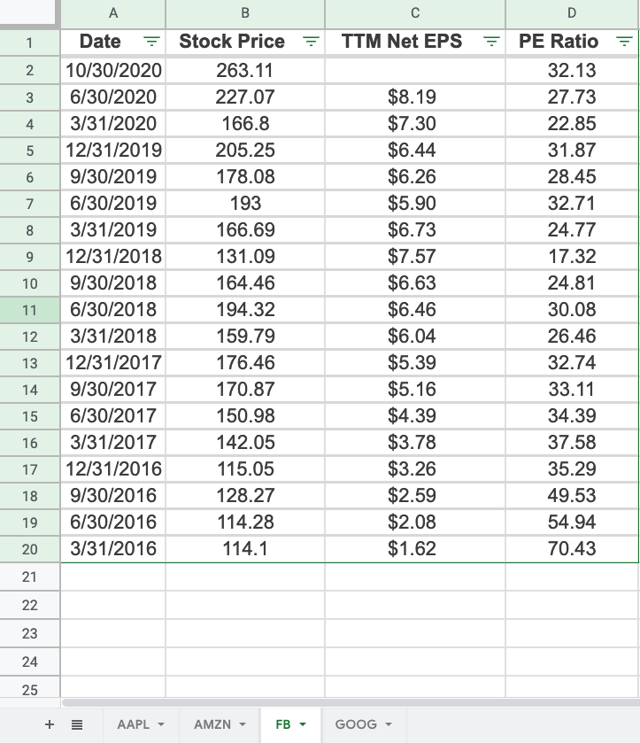
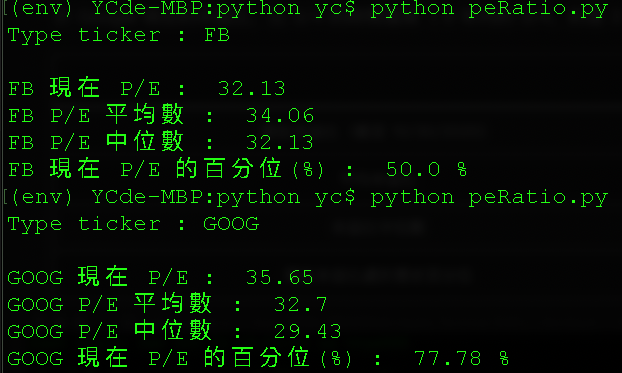

Pandas 與 Numpy 對於要進行統計分析非常的方便，下面來看如何得到股票在五年內的本益比的分布狀況（取得平均數，中位數及百分位數）。
<br/>

### 取得歷史本益比資料
到[ Macrotrends ](https://www.macrotrends.net)來取得股票本益比歷史資料（以 [Facebook 為例](https://www.macrotrends.net/stocks/charts/FB/facebook/pe-ratio)），並將資料貼到 Excel 中。
( 這裡我們只會用到 PE Ratio 這個欄位 )

<br/>

### 讀取 Excel 資料
設定好要讀取的 Excel 路徑後，我們就可以來利用 Pandas 讀取 Excel 中的資料了。
因為我們已經在 Excel 中的不同分頁都存了不同公司的本益比資料，因此這裡用 ```input()``` 來自行輸入想查詢的 Excel 分頁

```python
# Get desktop path
desktop = os.path.join(os.path.join(os.path.expanduser('~')), 'Desktop') 
# Get file
file = desktop + "/python/stock.xlsx"

code = input("Type ticker : ")
ticker = pd.read_excel(file, sheet_name = code)
```
<br/>

### 統計方法
在取得 Excel 中的資料後，可以用 ```mean()``` 與 ```median()``` 分別得到 PE Ratio 的 平均數 跟 中位數。
而若想取得特定的百分位數的話，```np.percentile``` 可幫助我們達成：
- 第一個參數為要讀取的欄位
- 第二個參數為想要的百分位數比例（想知道 百分位數 90% 數值的話就輸入 90，85% 的話就輸入 85）。

想知道每個本益比分別在百分位數的哪個位置，要先用 ```np.argsort``` 取得本益比在列表中的索引值（從小排到大）
例如：[1, 2, 3, 4, 5] 經過 ```np.argsort``` 則會變成 [0 1 2 3 4]，表示 1 是列表中最小的（位於 ```list[0]``` 的位置）
之後在除以列表的長度，乘上 100，就可以得到列表中每個數值的百分位數。

```python
# 平均數
peAvg = ticker['PE Ratio'].mean()

# 中位數
peMed = ticker['PE Ratio'].median()
# 90% 百分位
percentPE = np.percentile(ticker['PE Ratio'], 90)

### 各本益比的百分位
listPercentile = np.argsort(np.argsort(ticker['PE Ratio']) * 100) / (len(ticker['PE Ratio']) - 1)
```
<br/>

最後成果如下：


<br/>

### Source Code
```python
# coding=utf-8 
import pandas as pd
import numpy as np
import os
import xlrd

code = input("Type ticker : ")
# percentageStr = input("Type percentage : ")

# Get desktop path
desktop = os.path.join(os.path.join(os.path.expanduser('~')), 'Desktop') 

# Get file
file = desktop + "/python/stock.xlsx"
ticker = pd.read_excel(file, sheet_name = code)

# 現在本益比
nowPE = ticker['PE Ratio'][0]

# 平均數
peAvg = ticker['PE Ratio'].mean()

# 中位數
peMed = ticker['PE Ratio'].median()

# 百分位
# percentPE = np.percentile(ticker['PE Ratio'], int(percentageStr))

# 各本益比的百分位
listPercentile = np.argsort(np.argsort(ticker['PE Ratio']) * 100) / (len(ticker['PE Ratio']) - 1)

# 現在本益比的百分位
nowPEPercent = listPercentile[0]
print("")
print(code, "現在 P/E : ",  nowPE)
print(code, "P/E 平均數 : ",  round( peAvg, 2))
print(code, "P/E 中位數 : ", round( peMed, 2))
# print(code, "P/E ", str(percentageStr), "% : ", round(percentPE, 2))
print(code, "現在 P/E 的百分位(%) : ", round( nowPEPercent * 100, 2) , "%")
```