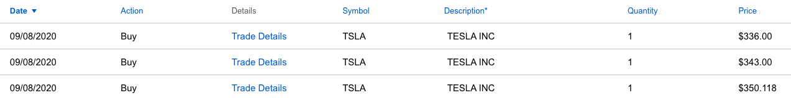

- 上星期， 特斯拉沒有如多數人預期的一樣成為 S&P 500 指數的一份子。消息在週六出來後（09/05）股價馬上下跌 6.41%，星期二（09/08，星期一為國定假日-勞動節）開盤後，股價如預期的一樣大幅度下跌。本週（09/08 - 09/11）特斯拉（TSLA）表現為 -10.9％，科技股為主的納斯達克指數（Nasdaq Index）則是 -4.04%。

### 落選 S&P 500 成分股的首日
- 特斯拉週二（09/08）開盤就直接跌了 18.64％，接著回升到 -12.57%，再繼續往下跌。截至下午四點收盤時，特斯拉當天跌幅為 21.06%（ 從上週五收盤的 418.32 跌到剩 330.21 ）。成交量在當日達到 1.1 億（本週平均成交量為 0.85 億，約比平常多了 22.7%）

- 在經歷上週四週五（09/03 - 09/04）的科技股修正後，那二天特斯拉的表現為 -6.94%，但在盤中均有出現超過 10% 的跌幅，再加上星期一的 -21%，想必讓很多人承受不住這麼大的波動性而紛紛離場。（上週四＆週五平均交易量為 0.99 億）

### 執行上星期設定的買入策略
- 在上篇文章：[拆股一週後的特斯拉與蘋果，是否仍繼續上漲？
](https://ycjhuo.gitlab.io/2020/09/06/Are-TESLA-And-Apple-Still-Going-high-After-Stock-Split/) 提到：

```python
在週四買入前，我先將資金分為三份，現在（$415）先買 1/3，後來又設定了買入價的九折，
也就是到了 $373.5 （415 x 90%）時再買 1/3，最後 1/3 則會在 $336.15 的價位進場。
而特斯拉在週五（09/04）的最低點為 $382.29，因此並沒觸發我的第二個買入價。
```

- 結果週二開盤時，股價直接來到 $340（此時跌了Ｘ%），已經低於上週設定的買入價（$373.5），因此我在這時買入 1 股（其實按照原本的計畫，應該投入原本的預計的第二個 1/3 金額，但因為落選 S&P 500 指數成分股的新聞影響股價太大，因此我決定先買入 1 股再看看情況）。
- 後續我又在 $343, $336 各買入一股，因為 $336 時剛好到達了我在上星期設定的最後 1/3 資金的買入價（$336.15），但因為當天股價跌的太猛烈（收盤時為 $330.21），動搖了我先前設定的策略。那時想著今天跌了這麼多，明天應該會繼續跌，所以我應該留下一些資金隔天再繼續買（沒想到隔天直接上漲了 9%，完全跟前一天預想的不一樣）。

### 大跌時心理很難遵守紀律
- 就算先前已經擬定好了買入策略，遇到了大跌時，還是會不由自己的猶豫起來，例如：現在是不是個好的買點，或是隔天是否能以更低的價格買到。怪不得完全排除人性，嚴格執行交易策略的程式交易在近年來越發火熱。
- 最後總結一下這星期特斯拉的交易情況：

<br/>
<table style="width:100%">
<tr>
<th align="center">設定買入價（一次買入 $1000）</th>
<th align="center">實際買入價（與總買入金額）</th>
</tr>
<tr>
<td align="center">$415</td>
<td align="center">$415 x 2 = 830</td>
</tr>
<tr>
<td align="center">$373.5</td>
<td align="center">$350.12(1) + 343(1) = 693.12</td>
</tr>
<tr>
<td align="center">$336.15</td>
<td align="center">$336(1)</td>
</tr>
</table>
- 原本準備投入 $3000 到特斯拉，拆成各 $1000，分三次進場，最後只投入了 $1859.12，佔了規劃總金額的 62%。
在經歷了週一這個壞消息的後面三天，特斯拉總共上漲了 11.41%（週五收盤價為：$372.72）。看來要再回到星期一的價位，短期間應該不太有機會能再看到了。