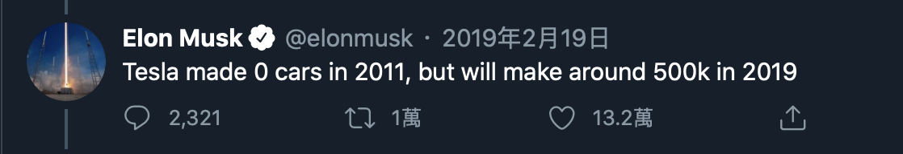
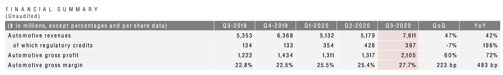
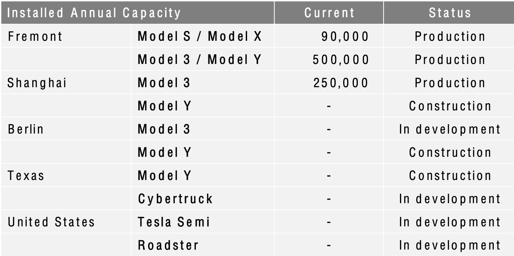

特斯拉（Tesla）於上週三（10/21）盤後公布第三季的季報了，此次交出的成績大幅超過華爾街分析師的預期。堪稱特斯拉創立至今，表現最好的一季也不為過。

### 特斯拉生產及交付量
馬斯克在 2019 說過：特斯拉將可在未來一年內達到年生產 50 萬輛電動車。且在今年 10/07 特斯拉的內部信表示這個目標是可以在今年達成的。

下表為目前特斯拉生產及交車（Tesla 2020 Vehicle Production & Deliveries）的相關數據：
來源：[特斯拉官網](https://ir.tesla.com)

<table style="width:100%">
  <tr>
    <th align="center">Period</th>
    <th align="center">Production Model S/X</th>
    <th align="center">Deliveries Model S/X</th>
    <th align="center">Production Model 3/Y</th>
    <th align="center">Deliveries Model 3/Y</th>
  </tr>
  <tr>
    <td align="center">2020 Q1</td>
    <td align="center">15,390</td>
    <td align="center">12,200</td>
    <td align="center">87,282</td>
    <td align="center">76,200</td>
  </tr>
  <tr>
    <td align="center">2020 Q2</td>
    <td align="center">6,326</td>
    <td align="center">10,600</td>
    <td align="center">75,946</td>
    <td align="center">80,050</td>
  </tr>
  <tr>
    <td align="center">2020 Q3</td>
    <td align="center">16,992</td>
    <td align="center">15,200</td>
    <td align="center">128,044</td>
    <td align="center">124,100</td>
  </tr>
  <tr>
    <td align="center">Total</td>
    <td align="center">38,708</td>
    <td align="center">38,000</td>
    <td align="center">291,272</td>
    <td align="center">280,350</td>
  </tr>
</table>

今年前三季，特斯拉總生產量（Model S/X/3/Y）為 329,980，距離目標的 50 萬輛，還剩下約 17 萬輛。第二季因為疫情的關係，讓生產及交付量都大幅降低。難怪馬斯克那時不惜槓上政府，也不讓工廠停工。

用 Q1 與 Q3 生產量相比的話，Model S/X 增加了約 10.4%，而 Model 3/Y 則是增加了約 47%。以這個比率來推算 Q4 產能的話：Model S/X 約為 19,371，Model 3/Y 約為 188,225。

Model 3/Y 要繼續維持生產量 47% 的成長應該有點困難，Q3 成長這麼多是受益於上海工廠已投產的因素。若要達成年產 50 萬輛的標準，且 Model S/X 繼續維持 10.4% 的增速的話，Model 3/Y 則需要在 Q4 再增加 18% 產量。

### 特斯拉 2020 Q3 季報
[來源](https://tesla-cdn.thron.com/static/4E7BR9_TSLA_Q3_2020_Update_P0Q85U.pdf?xseo=&response-content-disposition=inline%3Bfilename%3D%22TSLA-Q3-2020-Update.pdf%22)

在本次季報中值得注意的是，毛利與上季相比，居然有了 60% 的飛越式成長。毛利率也從 Q2 的 25.4% 成長到 27.7%。
在 10/01 時，特斯拉中國官網針對 Model 3 的不同版本，分別調降了 8-10% 的價格，且這次降價是今年的第二次，在 05/01 時，Model 3 也調降了 10% 左右的價格。

這次季報顯示了，Model 3 再經過二次的降價後，毛利率仍能再上升 2.3%，表示上海廠生產的 Model 3 毛利遠遠高於加州廠（更別說加州廠還有生產毛利更高的 Model S/X/Y 車型），而目前上海只有生產  Model 3。

美中不足的是碳排放積分的收入跟上季比起來下降了 7%，顯示了隨著其他車廠都加快了電動車的生產速度，所以減少了跟特斯拉購買碳排放的需求。

但換個角度想，特斯拉在降低了碳排放積分這部分的獲利時（相當於無本生意，毛利率可接近 100%），毛利率仍能繼續成長，顯示了特斯拉的超級工廠對於生產成本的控制程度更加精準。

EPS 跟上季相比則是上升了 73%，來到了 0.76。但對於還在成長期企業來說，因公司的各項業務都還在快速成長及變動中，因此 EPS 的重要性並不如成熟期的企業重要（也因此本益比這項指標，並不能真正反應成長型企業的股價是否過高）。

相反的，對於成長型企業來說，要注意的其實是自由現金流這項指標，只要自由現金流為正，代表企業就能夠依據自己的商業模式自給自足，而不須透過融資向銀行或其他投資人提供資金來幫助公司度過難關。

而特斯拉在本季的自由現金流相比上一季，成長了 234%，來到了約 14 億。代表特斯拉已經不用在擔心像前幾年一樣會有資金用盡，現金流軋不過來而有破產的狀況。相反的，穩健的現金流來能幫助特斯拉穩定企業以及投資人的情緒來降低股價波動。

### 後記
本次季報可以成為特斯拉在打穩基礎後，穩定向上發展的第一步。在強化了現金流之後，特斯拉就可以不用藉由外部因素的幫助，運用自有的資源來加強軟硬體研發，鞏固自己在電動車產業的護城河。

隨著各項財務指標都大幅度的增長後，顯示了特斯拉的體質獲得了進一步的強化。

上一段雖提到了 EPS 在現階段無法有效的評估特斯拉的價值，但對於特斯拉是否能入選 S&P 500 指數這點，卻是幫助很大的。
在 09/08 這天，特斯拉沒有如大眾所預期的入選 S&P 500 指數，讓特斯拉的股價在當天跌了約 21%。
P.S. 有興趣的可參考我的這篇文章：[未如預期入選 S&P 500 指數成分股的特斯拉（TSLA）
](https://ycjhuo.gitlab.io/2020/09/12/TESLA-Left-Out-Of-The-SP500/)

只要特斯拉的 EPS 一直處在正值，特斯拉就有機會入選 S&P 500 指數。我認為若是在去除碳排放積分這方面的收入，特斯拉仍能夠連續四季繳出 EPS 為正值的成績，那時也就是特斯拉進入 S&P 500 指數的時候。

只是，到那時股價的漲幅也就不會再跟今年上半年一樣因為這個原因而漲了 600%。
P.S. 有興趣的可參考我的這篇文章：[半年漲了六倍的特斯拉（Tesla），是否該考慮賣出
](https://ycjhuo.gitlab.io/2020/08/30/How-Tesla-Soar-600-in-6-month/)

總體來說，目前我仍是看好特斯拉，若是股價有機會回到 $400，我會毫不猶豫地繼續買入。目前我的持有成本從原本 $67，到拆股後的繼續買入，已上升到 $102.5。

特斯拉目前的市值（3,880 千億）已是第二到第七名車廠的總和（3,817 千億）。值得一提的是蔚來汽車（NIO）已經是市值第 6 大（348 億）的車廠，超越了福特（305億）。若以汽車產業市值的排行，前七名電動車就佔了二名（特斯拉及蔚來），顯示了電動車崛起的速度遠遠超越了傳統車廠。

我一直不認為特斯拉是一家僅能依靠賣車來獲利的企業，而是覺得特斯拉在後續幾年勢必能夠像蘋果一樣，除了賣車收入，服務收入也會是也能夠達到總收入的 40% 

只是特斯拉要提高服務收入，勢必要依靠自動駕駛這個軟體服務，但在目前多數政府皆不允許純自動駕車的情形下，要如何跟各國政府協調，讓特斯拉的自駕車能夠符合當地的法規需求，則是特斯拉會面臨到的一大挑戰。