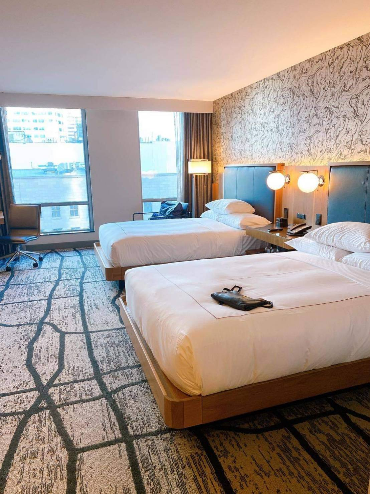

這次待在西雅圖除了入住萬豪 Renaissance 之外，也把握機會體驗一下希爾頓的精品品牌 Curio Collection。

Curio Collection 這個品牌，看官網的敘述感覺像是比較貼近當地文化特色，且較文化氣息的產品線，但在這次入住時，其實感覺不太到有什麼不同。也可能是我本身不是西雅圖人，感受不出差異。

P.S. 對 Renaissance 有興趣的可以參考這篇 [開箱文](https://ycjhuo.gitlab.io/2020/10/23/Renaissance-Seattle-Hotel/)
 
這家希爾頓的四星酒店，在 Google 地圖上有著 4.5 顆星的評價 (300+)，相比 Renaissance 4.4 顆星（ 2,800+ 評論 ），看來評價差不多，只差在評論數的多寡，不知道是否為 Curio Collection 比較新的緣故。

其實這次本來要選擇的是希爾頓的 Embassy Suites by Hilton Seattle Downtown Pioneer Square，因為我們有報名當地的旅行團（瑞尼爾山一日遊的行程），而 Embassy Suites 的位置距離旅行團的接送地點（Chinatown）只要走路 5 分鐘就能到。

但後來研究了一下 Curio Collection 與 Embassy Suites 的差別：Embassy Suites 房型較大，也有小廚房，比較適合小家庭。且保證附早餐，但無法享有升等房間的福利。

那時想說我有希爾頓金卡會員，就算住在希爾頓的其他品牌也能享有早餐福利，更何況在其他品牌還有機會升等房間。因此就沒選擇 Embassy Suites 了。結果因為疫情期間 Curio Collection 沒有提供早餐，但至少享受到了房間升等（雖然看不出來升等後的房間跟原本的房間有什麼差別）。

### 地理位置
The Charter Hotel Seattle 位於第二大道上（2nd Ave.），附近就是商場林立的商圈，有 Saks OFF 5TH，Nordstrom 等。想到超市買點零食飲料的，The Charter 轉角就有一間很大的 H Mart 超市。走路不到 1 分鐘即可到達。且距離星巴克創始店（位於派克市場內）走路只要 5 分鐘以內即可到達。

若是從機場搭乘 Link light Rail 前往市區的，The Charter 距離輕軌站 Westlake Station 也只要走路 5 分鐘就能到。地理位置可說是十分便利。
 

### 大廳
大廳不大，但很明亮，且目前 Check In 櫃檯都有安裝透明隔板，對於服務人員及顧客都有多一層的保護。
這次我們訂的是 2 Queen Beds Deluxe Room with City View 房型，Check In 時看到服務人員的名牌上寫著 General Manager ！不知道是飯店業的 General Manager 很常見，還是因為他們 Lay Off 了一些員工後，變成 General Manager 也要親自上場。

大廳
 

在拿取房卡時，服務人員跟我們說因為疫情期間，目前沒有提供早餐，但會提供點數作補償。看了一下 App 的說明，若沒提供早餐的話，一晚則會給 1000 點，感覺還是早餐比較好呀。但這個期間也不能太過要求。

接著就詢問了一下服務人員，有沒有機會可以讓我們升等房間，畢竟這才是我們選擇 Curio Collection 這個品牌的目的。想說 General Manager 應該權限比較大，讓我們有較高的機會可以升等。結果還真的給我們升等了！！！

交回原本的房卡，服務人員給了我們另一張新房卡。於是我們就滿懷期待的前往房間了。
 

### 房間
一進入房間，右側是浴室，浴室門是一整片的滑動木板，跟左側的衣櫥配色是一樣的，前方則是房間。從裝潢看起來讓人感覺是個蠻新的建物。
浴室很大，左邊是廁所，右邊是淋浴間，且二邊都有做乾濕分離。總體空間算是蠻大的。

跟萬豪一樣，飯店沒有提供牙膏/牙刷/室內拖/熱水壺等設備，但有咖啡機及膠囊/茶包。需要的話可透過希爾頓 App 裡面的 Chat 功能來聯繫櫃檯提供。

房間
 

浴室
 

左右乾濕分離，中間是洗手台
 

打開門後空間不大，但很有質感
 

透明的淋浴間
 

### 後記
這次入住 The Charter，雖然房間不大，但感覺很有質感。不愧是希爾頓旗下的 Curio Collection 品牌。但主打的貼近當地特色這點，我是沒有感受到。飯店頂樓設有 Lounge Bar，在每天的下午五點開放，但因為這次白天都在市區走來走去，回到飯店也就沒再去 Lounge 看看，有點可惜。

這次入住的房型是 2 Queen Beds Deluxe Room with City View，且櫃檯有說幫我們升級，照理說應該會高於這次介紹的房間。但實際上並沒有感覺到有升級。

當初訂的房間還有標明 City View。但進入房間打開窗戶一看，看出去只有停車場以及對面那棟樓。完全沒有 View。不禁想，若是沒有升等，房間會不會還比較好。

但就舒適度及地理位置來說，The Charter 是真的不差，走路 5 分鐘就可到派克市場（Pike Market）（但還是會經歷一段斜坡，畢竟派克市場這一區地勢比較低），離商圈及輕軌站也都在 10 分鐘以內，附近街道也可感覺出比市區的其他區域還乾淨。整體而言，如果再到西雅圖的話，我還是會選擇入住 The Charter。

