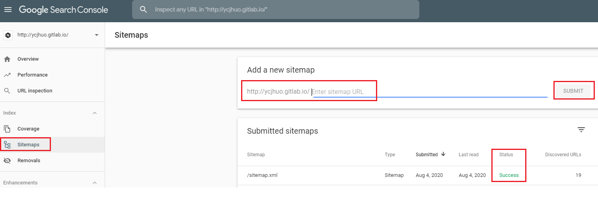
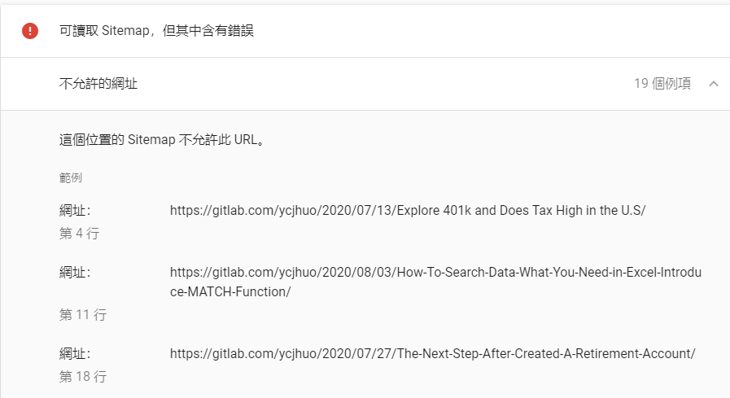

- 建立了網站與 Blog 之後，下一步我們最想要的是讓其他人可以搜尋到我們所寫的文章，除了透過外部連結 ( eg. 在 Facebook 發布貼文來引導他人直接進入網站 ) 之外，大多數的人都是透過搜尋引擎 ( eg. Google, Yahoo, Baidu ) 來找到感興趣的內容

- 在網站建立初期，透過這些搜尋引擎並無法搜尋到自己的文章。主要的原因是搜尋引擎的爬蟲尚未偵測到我們新建立的網站。為了解決這點，我們可以提交自己網站的 sitemap 給 Google，幫助 Google 的爬蟲瞭解我們的網站。

### Sitemaps 是什麼

- Sitemap 可以說是整個網站的地圖，可引導爬蟲在你的網站做全面性的檢索。爬蟲透過 Sitemaps 可更清楚的知道整個網站的架構，就不會漏掉幾個頁面沒爬到，進而讓其他人無法受過搜尋引擎找到該頁面。

- 一般來說 Sitemaps 都是以 XML 格式為主，但沒有限定。

### 是否有需要使用 Sitemap

- Google 有針對是否須使用 Sitemap 列出幾點說明：

    * 網站規模大 ( 若自行更新了部分網頁，Google 可能會無法即時反應 )
    * 網站以內容網頁為主 ( 例如：部落格， 每個頁面關聯性較低 )
    * 以圖片或影片為主的網站

- 我們可以在 Google 搜尋中，打 site:想要看的網址，就能得知目前 Google 爬蟲對這個網站的檢索程度
    * 例如：site:ycjhuo.gitlab.io
    * 就可以看到我自己的網站 ycjhuo.gitlab.io，在 Google 搜尋引擎中可以被找到的頁面

### 如何在 Hexo 中產生 Sitemap

```powershell
# 到 Hexo 所在的資料夾 安裝 hexo-generator-sitemap 套件
$ npm install hexo-generator-sitemap --save

# 接著打開主題裡面 ( 我是用 next ) 的 _config.yml
# 路徑是 XXX(你的 Hexo 資料夾)\themes\next\_config.yml
# 將 sitemap 註解拿掉
menu:
  home: /|| home
  #about: /about/ || user
  tags: /tags/|| tags
  categories: /categories/|| th
  archives: /archives/|| archive
  #schedule: /schedule/ || calendar
  sitemap: /sitemap.xml || sitemap
  #commonweal: /404/ || heartbeat

## 最後執行重新編譯 Hexo 就可以在部落格中看到 sitemap 了
$ hexo g -d

## 也可以在 Hexo 資料夾 -> public 資料夾 -> 找到 sitemap.xml

```

### 有了 Sitemap 後，該如何提交 Sitemap 給 Google

- [Google Search Console](https://search.google.com/search-console/about?hl=en) 是 Google 出的一款工具，可透過這個工具來知道自己網站的狀況以及曝光率 ( 類似 Google Analytics )

- 在 Google Search Console 註冊及驗證完自己的網站後，即可在左側的 Sitemaps 貼上自己網站內的 Sitemap 網址來提交



### 提交 Sitemap 後，可能產生的錯誤訊息

- 在提交後有，若出現這個錯誤：「可讀取 Sitemap，但其中含有錯誤」，表示 sitemap 裡面的網址跟當初在 Google Search Console 註冊的網址有所差異。

- 下面這張圖可以看到：我的部落格網址是：https://ycjhuo.gitlab.io/** ，但上面顯示的卻是 https://gitlab.com/**



### 解決「可讀取 Sitemap，但其中含有錯誤」

- 如果你也是用 Hexo 來建立部落格的話，可以在這個檔案中 _config.yml 修改 URL

- 從 _config.yml 可以看到，原本的 Sitemap 會顯示 https://gitlab.com/* 是受 URL 中的設定影響
    * 第三行是修改前，第四行是修改後

```python
# URL
## If your site is put in a subdirectory, set url as 'http://yoursite.com/child' and root as '/child/'
#url: https://gitlab.com/ycjhuo/
url: https://ycjhuo.gitlab.io
#root: /
root: ""
```

```powershell
# 修改完 URL 後，將 Hexo 重新編譯，就可以看到 sitemap 已經順利的將網址更正了
$ hexo g -d
```

```xml
<!-- Old sitemap-->
<?xml version="1.0" encoding="UTF-8"?>
<urlset xmlns="http://www.sitemaps.org/schemas/sitemap/0.9">
  
  <url>
    <loc>https://gitlab.com/ycjhuo/2020/08/03/How-To-Search-Data-What-You-Need-in-Excel-Introduce-MATCH-Function/</loc>
    
    <lastmod>2020-08-03</lastmod>
    
  </url>
  
  <url>
    <loc>https://gitlab.com/ycjhuo/2020/07/20/beside-401k-is-IRA-a-better-choice/</loc>
    
    <lastmod>2020-07-28</lastmod>

<!--------------------------------------------------------------------------------------->

<!-- New sitemap-->
<?xml version="1.0" encoding="UTF-8"?>
<urlset xmlns="http://www.sitemaps.org/schemas/sitemap/0.9">
  
  <url>
    <loc>https://ycjhuo.gitlab.io/2020/08/03/How-To-Search-Data-What-You-Need-in-Excel-Introduce-MATCH-Function/</loc>
    
    <lastmod>2020-08-03</lastmod>
    
  </url>
  
  <url>
    <loc>https://ycjhuo.gitlab.io/2020/07/20/beside-401k-is-IRA-a-better-choice/</loc>
    
    <lastmod>2020-07-28</lastmod>
```

### 參考資料

[瞭解 Sitemap By Google](https://support.google.com/webmasters/answer/156184?hl=zh-Hant)