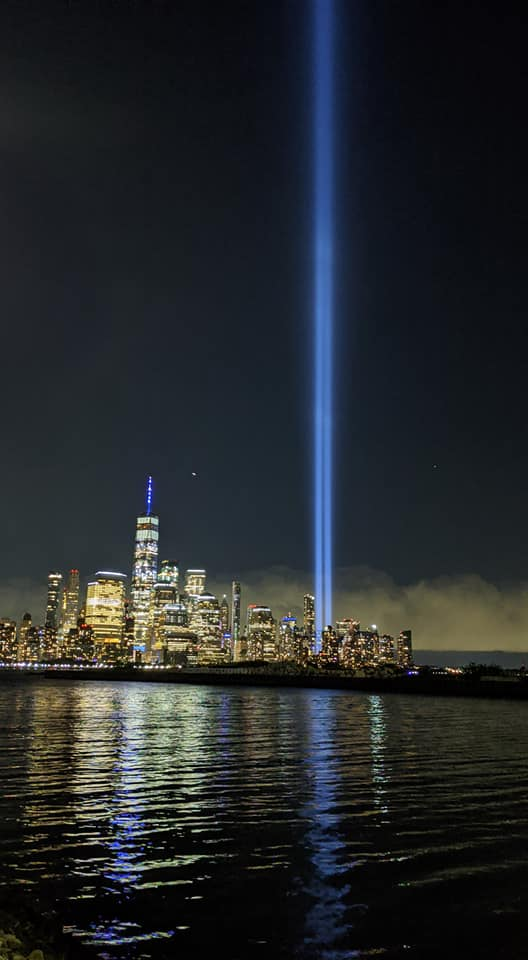
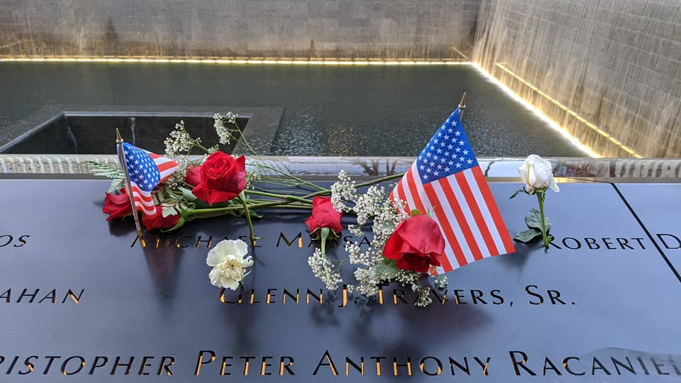
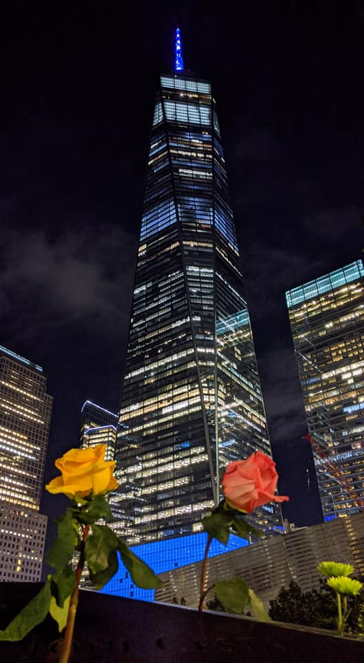

- 一場恐怖攻擊事件，帶走了大約 3000 人。前天（09/12/2020）是 911 恐怖攻擊後的第 19 週年。

### Tribute in Light
- 這項傳統是從 2002 年開始的，儼然已成為紐約市每年的習俗之一。每年的 09/11 晚上到 09/12 的凌晨這段時間，只要抬頭看，都會注意到有二道光直達天際的光。
- 這二道光是由 88 個探照燈排成二列從屋頂上直接將光照向天空，不僅代表著在當時被炸毀的二棟世貿中心大樓（Ｗorld Trade Center）。同時也藉由這二道光，來紀念當時逝去的受害者們。
P.S. 每年雖然 Tribute in Light 只點亮不到一天的時間，但相關的規劃及執行的花費約為 50 萬美元。
- 在今年八月中時，911 紀念博物館宣布因疫情影響，而決定取消今年的 Tribute in Light 活動。後來因 Andrew Cuomo（紐約州州長）及各方人士的介入才又恢復舉辦。
- 本來我也以為今年肯定是取消了，直到上週五（09/04）下班時，抬頭看到那二道劃破天際的光出現，才知道那天正在進行燈光的測試。在天氣晴朗時，大約 100 km 以內的地區都可以看到這二道燈光。

從 Jersey City 看過去的 Tribute in Light

### 9/11 Memorial Pools
- 911 過後，在原世貿中心位址，建造了二個紀念水池，環繞水池的石牆上刻著在 911 事件中受難者的名字。原本的名字排序是採隨機分配，後來改成了依照每一個人彼此之間的關係來排。因此，在名字四周的其他名字代表著他們的關係也很緊密。
- 當天（09/11/2020），這些石碑的名字上均插滿鮮花，照片，以及寫給他們的詩。其中一張照片，看得出來那是在他大學畢業時，穿著學士服所拍的照片。旁邊寫的 1978 - 2001/09/11。那時，我想說 1978 年出生，這個人也太會保養了，看起來這麼年輕，看不出來早我這麼多年出生。後來猛然一想，在 911 事發時，他才 24 歲，在正要開始他的人生時，就不幸命喪在這場意外中。
- 到了現在，也過了 19 年了。他們的親屬及所愛的人，是如何度過這幾年沒有他們的日子呢？在石碑上，飄揚著幾張紙，上面寫滿了對於受難者的思念，且幾乎每張紙都會寫到 Never Forget（永不忘記），表示著即使時間過了這麼久，但他們的家人，朋友們還是沒有一刻忘記他們。

水池的石牆刻著每個受難者的名字，並在這天插滿鮮花

### 現在的世貿中心
- 世貿中心目前已重建完成，在世貿中心一號樓還設有觀景台（One World Observatory），位於102樓，雖然樓層較高，但只能透過玻璃向外看，並不像帝國大廈（Empire State Building）的觀景台一樣是室外的。門票是 $32，小孩及老人另有優惠。
- 旁邊也建有 911 紀念館，裡面擺放著許多在當初開挖出來的物品，門票是 $26，小孩及老人另有優惠。目前的免費參觀時段為每個星期一的 15:30 - 17:00，但須先上網預訂。  

從 9/11 Memorial Pools 仰望世貿中心
