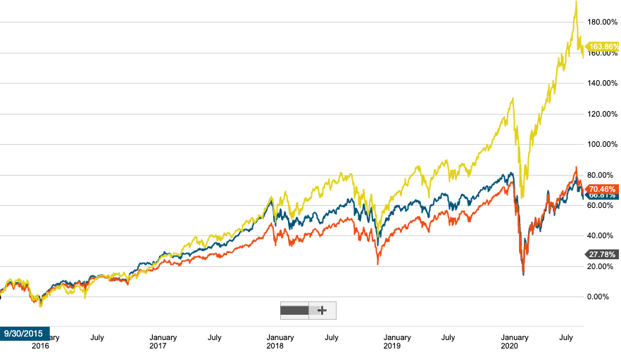

對於新手來說是最好的投資標的之一，是直接購買追蹤整個市場的 ETF。但在美股中有三個市場，我們該如何選擇呢？
上一篇（[ETF 是什麼？投資新手的入門首選](https://ycjhuo.gitlab.io/2020/09/13/What-Is-An-ETF/)）介紹了 ETF 的特性，種類，以及選擇要點。這篇來介紹追蹤美股三大市場的被動型 ETF。
這三個股票市場，分別是道瓊 (Dow Jones)，標普 500（S&P 500）以及納斯達克 (Nasdaq)。

### 三大市場的不同點
- 道瓊 (Dow Jones)：是最早成立的大盤指數，由 30 家公司組成。單純由股價的大小來決定在指數內的權重。因此，像是蘋果拆股後股價變為 1/4，在道瓊指數內的權重也隨之下降。
 - 前三名共佔了 19.6% 的權重：分別為：聯合利華（UNH），約佔 7.18%; 家得寶（DF），約佔 6.52%; 安進（AMGN），約佔 5.9%
 - [點擊看道瓊指數有哪些成份股](https://www.slickcharts.com/dowjones)

- 標普 500（S&P 500）：涵蓋了 500 家公司公司的指數，也是涵蓋範圍最廣的指數。標普 500 指數的權重是以公司的市值來決定，因此若公司進行拆股或是減資等金融操作，均不會影響到在標普指數內的權重。
 - 台灣加權指數也是採用與標普 500 一樣的權重方式。
 - 前三名共佔了 16.97% 的權重：分別為：蘋果（AAPL），約佔 6.47%; 微軟（MSFT），約佔 5.72%; 亞馬遜（AMZN），約佔 4.78%
 - [點擊看標普 500 指數有哪些成份股](https://www.slickcharts.com/sp500)

- 納斯達克 (Nasdaq)：在指數中以科技股的占比最高，通常以 Nasdaq 100 作為指數代表。其中涵蓋了 100 家公司，與標普 500 一樣皆是以市值作為指數的權重。
 - 前三名共佔了 34.8% 的權重：分別為：蘋果（AAPL），約佔 13.14%; 微軟（MSFT），約佔 10.92%; 亞馬遜（AMZN），約佔 10.74%
 - [點擊看納斯達克 100 指數有哪些成份股](https://www.slickcharts.com/nasdaq100)

### 對應指數的 ETF
- 道瓊 (Dow Jones)：股票代號 DIA，每年管理費為 0.16%，每日平均成交量為 330 萬，目前資產規模約 229 億。
- 標普 500（S&P 500）：
 - 股票代號 SPY，每年管理費為 0.09%，每日平均成交量約為 8600 萬，資產規模約 2974 億。
 - SPY 是追蹤 S&P 500 的 ETF 裡面規模最大，成交量最高，成立時間也最早（1993）的，相對的管理費也較貴。
 - 股票代號 IVV，每年管理費為 0.03%，每日平均成交量約為 459 萬，資產規模約 2122 億。
 - 有不少支追蹤 S&P 500 的 ETF 管理費都是 0.03%（最低價），而 IVV 是其中成交量與資產規模較高的。
- 納斯達克 (Nasdaq)：股票代號 QQQ，每年管理費為 0.2%，每日平均成交量為 4098 萬，目前資產規模約 1300 億。

### 推薦哪支 ETF
- ETF 最重要的一點就是涵蓋範圍要廣，這三個市場之中，標普 500 無疑是最好的選擇之一。也因此，追蹤標普 500 的 ETF 也是選擇性最多的（道瓊＆納斯達克 皆只有一隻 ETF 在追蹤它們）。

- 因此，我會選擇購買追蹤標普 500 的 ETF。而因為我們資產並不像公司法人這麼多，不需要為了追求更高的成交量而選擇管理費多了三倍的 SPY。這麼篩選下來，IVV 無疑是新手的最佳選擇。不僅涵蓋了 500 支公司，管理費又低。讓我們不須擔心選錯股票，遇到公司下市或是經營不善的風險。

- 從下圖可以看到，若我們在五年前購買了 DIA（追蹤道瓊-藍線）或是 SPY（追蹤標普 500-橘線），到今天可以獲得約 70% 的報酬率。而若是買了 QQQ (追蹤納斯達克-黃線) 則可以獲得約 160% 的報酬率。

- 這幾年來科技股都表現不錯，也因此納斯達克能夠遠遠超越其他二個市場。若是對科技股有信心的人，也可以選擇配置一部分的 QQQ 到自己的投資組合中。我因為自己有投資幾支個股，因此在 ETF 方面就沒有特別選擇 QQQ。

