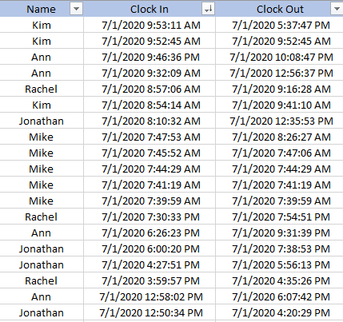
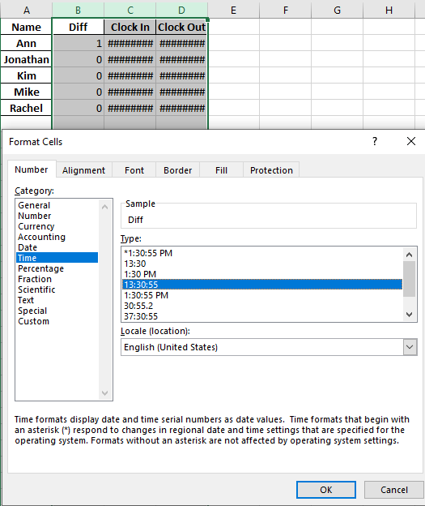
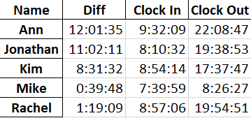

最近需要統計 Excel 中每個人每天的打卡紀錄，但因為檔案中的格式不是日期，沒辦法直接將時間相減，就想說用 Pandas 這個 Python 套件來解決這個問題。

從下表可看出，每個人每天都會有多次的打卡時間，要將每一次的工作時間依照打卡時間相減，再統計出總工作時間，也是件麻煩事，剛好 Pandas 也有個功能 ( group ) 可以幫我們整理好。



  
### import 套件
- 一開始先引入需要的套件

```python
# 匯入需要的套件
import pandas as pd
import openpyxl
from datetime import datetime, timedelta
from openpyxl import load_workbook

# 讀取檔案 (貼上要讀取檔案的路徑)
readFile = r"C:\Users\Desktop\Clocks records.xlsx"

# 使用 pandas 套件讀取檔案
df = pd.read_excel(readFile)
```

<br/>

### 轉換 Excel 格式
- 接下來要將 excel 裡面的 ```Clock in / Clock Out``` 這二個欄位 轉換成時間格式
    - 前面有空一格是因為在檔案中，這二個欄位前方有一個空格 ( " 7/1/2020 9:53:11 AM" )
    - %I 是 12 小時制，如果是 24 小時制要改為 %H，%p 是則將 AM / PM 轉為 24 小時制

```python
# 轉換前的 Clock in / Out 日期的格式
strToTime = ' %m/%d/%Y %I:%M:%S %p'

clockIn = df['Clock In']
clockOut = df['Clock Out']

df['Clock In'] = pd.to_datetime(clockIn, format = strToTime)
df['Clock Out'] = pd.to_datetime(clockOut, format = strToTime)
```

<br/>

### 加總時數
- 將 Clock in / Clock Out 這二個欄位轉換為時間格式後，進行相減，可以取得每次打卡的工作時間。再利用 ```groupby``` 這個功能將每個人 (依姓名) 的工作時間相加，來取得當天的工作總時數

```python
# 記錄每人打卡中間的間隔
diff = df['Clock Out'] - df['Clock In']
df['Diff'] = diff

# 總計每人每天的上班時間
sumHours = df.groupby('Name')['Diff'].sum()

# 取得每人每天 最早 與 最晚 的打卡紀錄
getMaxMinTime = df.groupby('Name').agg( {'Clock In' : 'min', 'Clock Out' : 'max'} )

# 將統計時間 跟 最早 與 最晚的打卡紀錄合併成一個表格 (df2)
df2 = pd.merge(sumHours, getMaxMinTime, how='left', on='Name')
```

<br/>

### 儲存表格及匯出
- 最後則是將我們整理好的表格 df2 存到原本的 excel 中，並設定新的分頁名稱為 Sheet2

```python
# 將該表格輸出到原本的 excel 中，分頁名稱設定為 Sheet2'
writer = pd.ExcelWriter(readFile, engine='openpyxl')

def saveDfToExcel(dataframe,excelWriter,sheet_name):
       book = load_workbook(excelWriter.path)
       excelWriter.book = book
       dataframe.to_excel(excelWriter, sheet_name)
       excelWriter.close()

saveDfToExcel(df2, writer, 'Sheet2')
print ("job is done")
```

- 寫完後執行該 Python 檔，就會在原本的 excel 中發現一個新分頁 (Sheet2)
點進去會看到如下圖，因為格式不對所以我們需要再將 B C D 欄的儲存格改為 Time 格式。


<br>
- 按下確定後，即可得到我們想要的結果囉。



<br>

### Source Code
- 完整程式碼

```python
# 匯入需要的套件
import pandas as pd
import openpyxl
from datetime import datetime, timedelta
from openpyxl import load_workbook

# 讀取檔案 (貼上要讀取檔案的路徑)
readFile = r"C:\Users\Desktop\Clocks records.xlsx"

# 使用 pandas 套件讀取檔案
df = pd.read_excel(readFile)

# 轉換前的日期格式
strToTime = ' %m/%d/%Y %I:%M:%S %p'

clockIn = df['Clock In']
clockOut = df['Clock Out']

# 將 Clock In & Clock Out 這二個欄位 轉成日期格式
df['Clock In'] = pd.to_datetime(clockIn, format = strToTime)
df['Clock Out'] = pd.to_datetime(clockOut, format = strToTime)

# 記錄每人打卡中間的間隔
diff = df['Clock Out'] - df['Clock In']
df['Diff'] = diff

# 統計每人每天的上班時間
sumHours = df.groupby('Name')['Diff'].sum()

# 取得每人每天 最早 與 最晚 的打卡紀錄
getMaxMinTime = df.groupby('Name').agg( {'Clock In' : 'min', 'Clock Out' : 'max'} )

# 將統計時間跟 最早 與 最晚的打卡紀錄合併成一個表格
df2 = pd.merge(sumHours, getMaxMinTime, how='left', on='Name')

# 將該表格輸出到原本的 excel 中，分頁名稱設定為 Sheet2'
writer = pd.ExcelWriter(readFile, engine='openpyxl')

def saveDfToExcel(dataframe,excelWriter,sheet_name):
       book = load_workbook(excelWriter.path)
       excelWriter.book = book
       dataframe.to_excel(excelWriter, sheet_name)
       excelWriter.close()

saveDfToExcel(df2, writer, 'Sheet2')
print ("job is done")
```