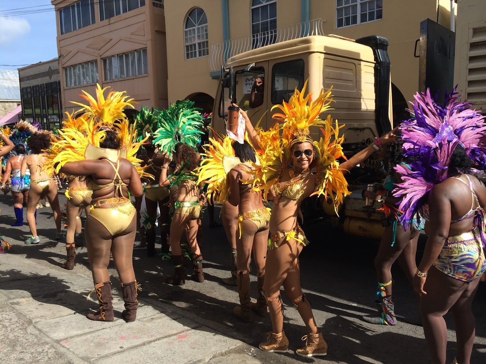
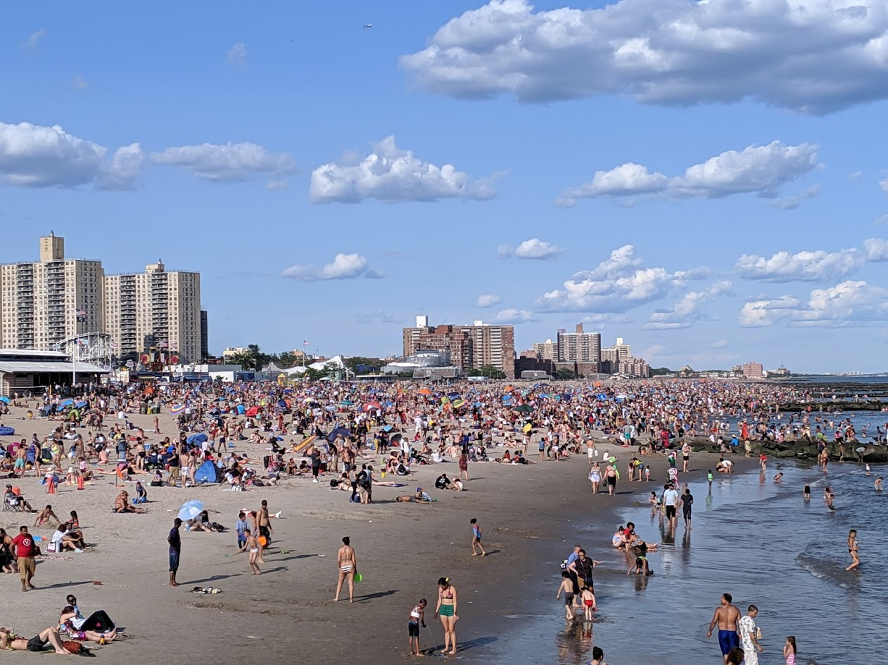

- 今天（09/07）是美國的勞動節（Labor Day），聯邦的國定假日（Federal Holiday）。每年的勞動節日期都不一樣，但都是在九月的第一個星期一（P.S.加拿大也是），來讓大家可以有個三天（六、日、一）的長週末（Long Weekend）可以出遊。

### 美國的國定假日多嗎？
- 美國的國定假日一年只有十天左右，多數都是在星期五或是星期一，剛好讓大家能有個放連假的感覺。相比台灣，光是春節就有七天連假，以及近年來政府多會實施彈性放假，來讓大家可以享受到更長的連續假期（雖然星期六還是要補班）。
- 多數人會有美國人假很多的感覺，其實是因為他們請的是自己的年假而不是因為國定假日很多的關係。
- P.S. 美國的銀行業不能連續三天沒有開門營業，且在某些區域的分行星期六也是有營業的（例如：紐約的中國城）

### 夏天的結束？
- 在勞動節這天其實也是在告訴大家夏天已經要結束了，過了這天後就正式進入秋天。多數學校也都是選擇在勞動節之後開學，所以家長都會趕在勞動節前的一個星期，安排一個星期的小旅遊帶小孩到處走走。
- 也因此，勞動節，對於學生的另一層意義，也表示著快樂的暑假已經結束，是時候回到學校上課了。
- P.S. 與勞動節相反的是，獨立日（Independence Day）07/04，在這天，通常代表著夏天的開始。

### 超級購物日？
- 因為勞動節過後就是學生們要回到學校上課的日子，因此許多商家都會在這時舉辦促銷活動（Labor Day Sale），通常都會有八折以上的折扣，吸引家長們趁這機會採購。因此勞動節也被認為是一年當中僅次於黑色星期五的銷售日。

### 勞動節在紐約
- 勞動節這天，位於布魯克林的皇冠高地（Crown Heights）會舉辦西印度遊行（West Indian Carnival），有很多來自加勒比海國家的人們也會參加。可以看到他們穿著精心製作的服飾參加遊行。但今年因疫情的關係已改成線上舉辦。服裝有點類似下面這張圖，但這是我在加勒比海的島國聖文森（St.Vincent and the Grenadines）拍的

加勒比海的聖文森遊行（Parade in St.Vincent and the Grenadines）

- 在這夏天的最後一天，很多人會到康尼島（Coney Island）海灘曬曬太陽，渡過悠閒的一天。雖然名稱叫做康尼島，但它其實不是一個島，而是一個附近聚集了很多遊樂設施的海灘。
- 康尼島算是紐約人夏天必去的景點之一，通常在從獨立日開始（07/04）到勞動節（09/07）的這段期間，每個週五晚上都會有煙火秀可以看。

疫情前的康尼島（Coney Island）

